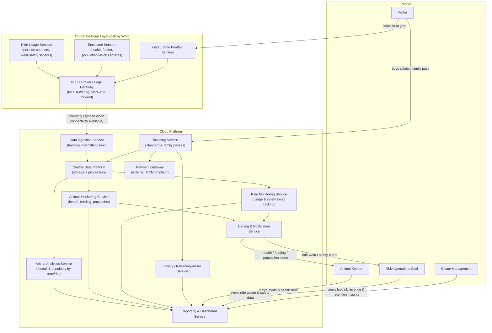

# High Level Context

> This page describes the high level context of the problem. It lists down what all different services will be required to make the solution work. It breaks down the services into categories to be focused into.

The solution covers follow categories:

**People Layer** : They are vistiors, ground staff(queue mgmt team,animal keeper, ride operator etc), Back office staff(Data team, operation team etc), Management.

**Edge Layer** : These are sensors on gates, enclosures etc

**Cloud Layer** : This is the platform where all data ingestion, processing, notification, Dashboarding, website etc will run.

---

### High level intraction between these layers and the service running in these layers are depicted below.

---

