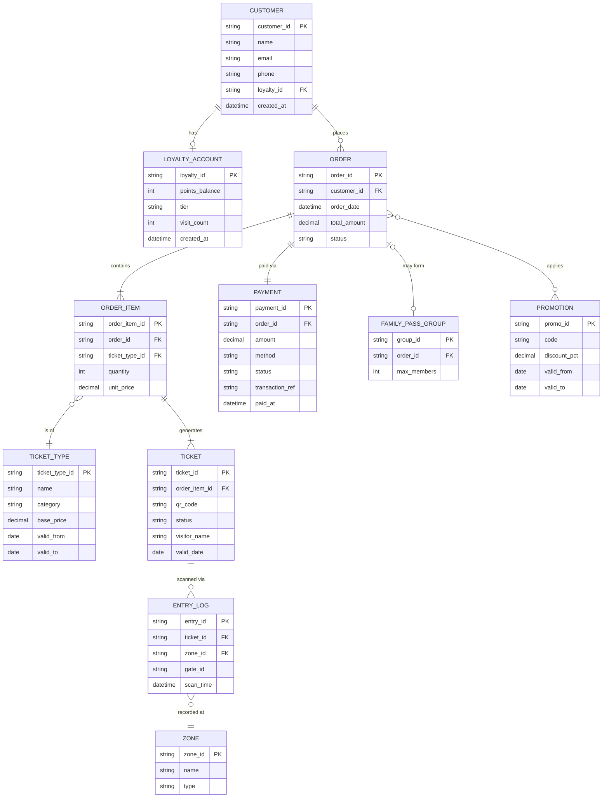

# Schema

> This doc describes the ER Diagram for used  for ticketing system.

```mermaid
erDiagram

    CUSTOMER ||--o| LOYALTY_ACCOUNT : has
    CUSTOMER ||--o{ "ORDER" : places
    "ORDER" ||--|{ ORDER_ITEM : contains
    "ORDER" ||--|| PAYMENT : "paid via"
    "ORDER" |o--o| FAMILY_PASS_GROUP : "may form"
    "ORDER" }o--o{ PROMOTION : "applies"
    ORDER_ITEM }o--|| TICKET_TYPE : "is of"
    ORDER_ITEM ||--|{ TICKET : generates
    TICKET ||--o{ ENTRY_LOG : "scanned via"
    ENTRY_LOG }o--|| ZONE : "recorded at"

    CUSTOMER {
        string customer_id PK
        string name
        string email
        string phone
        string loyalty_id FK
        datetime created_at
    }

    LOYALTY_ACCOUNT {
        string loyalty_id PK
        int points_balance
        string tier
        int visit_count
        datetime created_at
    }

    "ORDER" {
        string order_id PK
        string customer_id FK
        datetime order_date
        decimal total_amount
        string status
    }

    ORDER_ITEM {
        string order_item_id PK
        string order_id FK
        string ticket_type_id FK
        int quantity
        decimal unit_price
    }

    TICKET_TYPE {
        string ticket_type_id PK
        string name
        string category
        decimal base_price
        date valid_from
        date valid_to
    }

    TICKET {
        string ticket_id PK
        string order_item_id FK
        string qr_code
        string status
        string visitor_name
        date valid_date
    }

    FAMILY_PASS_GROUP {
        string group_id PK
        string order_id FK
        int max_members
    }

    PAYMENT {
        string payment_id PK
        string order_id FK
        decimal amount
        string method
        string status
        string transaction_ref
        datetime paid_at
    }

    PROMOTION {
        string promo_id PK
        string code
        decimal discount_pct
        date valid_from
        date valid_to
    }

    ENTRY_LOG {
        string entry_id PK
        string ticket_id FK
        string zone_id FK
        string gate_id
        datetime scan_time
    }

    ZONE {
        string zone_id PK
        string name
        string type
    }
```
