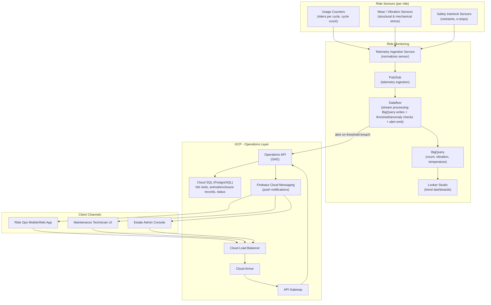

# Infra

> This file contains the cloud infra components needed to run the microservice for operating the ride monitoring service.

## Infrastructure Components Inventory

| # | Area | Component Name | Usages |
|---|------|-----------------|--------|
| 1 | Ride Sensors | Usage Counters | Track riders per cycle and total cycle counts |
| 2 | Ride Sensors | Wear / Vibration Sensors | Monitor structural and mechanical stress indicators |
| 3 | Ride Sensors | Safety Interlock Sensors | Monitor restraint status and e-stop triggers |
| 4 | Ride Monitoring | Telemetry Ingestion Service | Normalize and aggregate sensor data streams |
| 5 | Ride Monitoring | Pub/Sub | Stream telemetry events to downstream processors |
| 6 | Ride Monitoring | Dataflow | Process streams, write to BigQuery, check thresholds, emit alerts |
| 7 | Ride Monitoring | BigQuery | Persist historical count, vibration, and temperature data |
| 8 | Ride Monitoring | Looker Studio | Create trend dashboards for monitoring |
| 9 | Operations Layer | Cloud Load Balancer | Distribute incoming traffic from users |
| 10 | Operations Layer | Cloud Armor | Provide DDoS protection and security policies |
| 11 | Operations Layer | API Gateway | Route and authenticate API requests |
| 12 | Operations Layer | Operations API (GKE) | Manage operations and dispatch alerts |
| 13 | Operations Layer | Cloud SQL (PostgreSQL) | Persist vet visits, animal/enclosure records, and status |
| 14 | Operations Layer | Firebase Cloud Messaging | Send push notifications to mobile clients |
| 15 | Client Channels | Ride Ops Mobile/Web App | Access ride data and receive notifications |
| 16 | Client Channels | Maintenance Technician UI | Access maintenance data and receive notifications |
| 17 | Client Channels | Estate Admin Console | Access system data and receive notifications |

**Digramatic View of Compotents and Connection between them**

---

