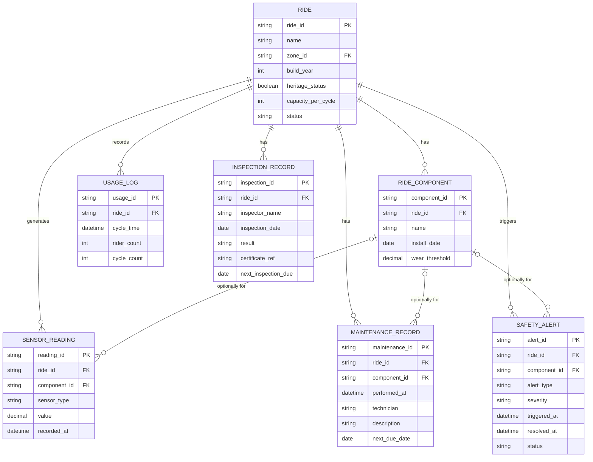

# Schema

> This file contains the ER diagram for running the ride monitoring service.

```mermaid
erDiagram

    RIDE ||--o{ RIDE_COMPONENT : has
    RIDE ||--o{ USAGE_LOG : records
    RIDE ||--o{ SENSOR_READING : generates
    RIDE_COMPONENT |o--o{ SENSOR_READING : "optionally for"
    RIDE ||--o{ MAINTENANCE_RECORD : has
    RIDE_COMPONENT |o--o{ MAINTENANCE_RECORD : "optionally for"
    RIDE ||--o{ INSPECTION_RECORD : has
    RIDE ||--o{ SAFETY_ALERT : triggers
    RIDE_COMPONENT |o--o{ SAFETY_ALERT : "optionally for"

    RIDE {
        string ride_id PK
        string name
        string zone_id FK
        int build_year
        boolean heritage_status
        int capacity_per_cycle
        string status
    }

    RIDE_COMPONENT {
        string component_id PK
        string ride_id FK
        string name
        date install_date
        decimal wear_threshold
    }

    USAGE_LOG {
        string usage_id PK
        string ride_id FK
        datetime cycle_time
        int rider_count
        int cycle_count
    }

    SENSOR_READING {
        string reading_id PK
        string ride_id FK
        string component_id FK
        string sensor_type
        decimal value
        datetime recorded_at
    }

    MAINTENANCE_RECORD {
        string maintenance_id PK
        string ride_id FK
        string component_id FK
        datetime performed_at
        string technician
        string description
        date next_due_date
    }

    INSPECTION_RECORD {
        string inspection_id PK
        string ride_id FK
        string inspector_name
        date inspection_date
        string result
        string certificate_ref
        date next_inspection_due
    }

    SAFETY_ALERT {
        string alert_id PK
        string ride_id FK
        string component_id FK
        string alert_type
        string severity
        datetime triggered_at
        datetime resolved_at
        string status
    }
```
