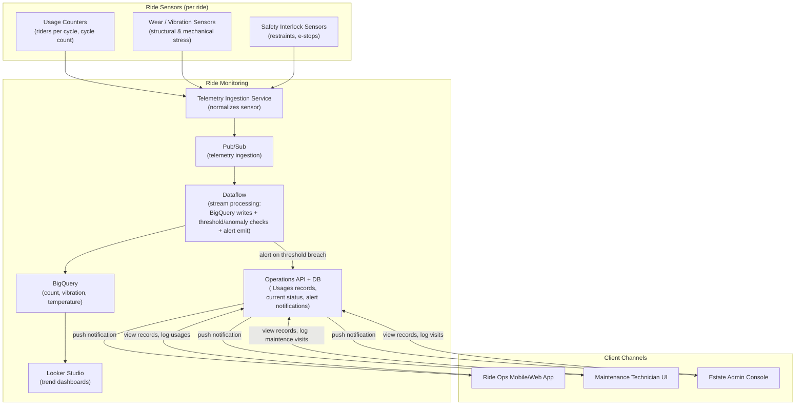

# Services

> This file contains various microservices needed to operate the ride monitoring system.

## Service Inventory

| # | Area | Service Name | Usages |
|---|------|--------------|--------|
| 1 | Sensors | Usage Counters | Track riders per cycle and total cycle counts |
| 2 | Sensors | Wear / Vibration Sensors | Monitor structural and mechanical stress indicators |
| 3 | Sensors | Safety Interlock Sensors | Monitor restraint status and e-stop triggers |
| 4 | Core | Telemetry Ingestion Service | Normalize and aggregate sensor data streams |
| 5 | Core | Pub/Sub | Stream telemetry events to downstream processors |
| 6 | Core | Dataflow | Process streams, write to BigQuery, check thresholds, emit alerts |
| 7 | Core | BigQuery | Persist historical count, vibration, and temperature data |
| 8 | Core | Looker Studio | Create trend dashboards for monitoring |

**Below diagram shows the services and connections between them.**

---

