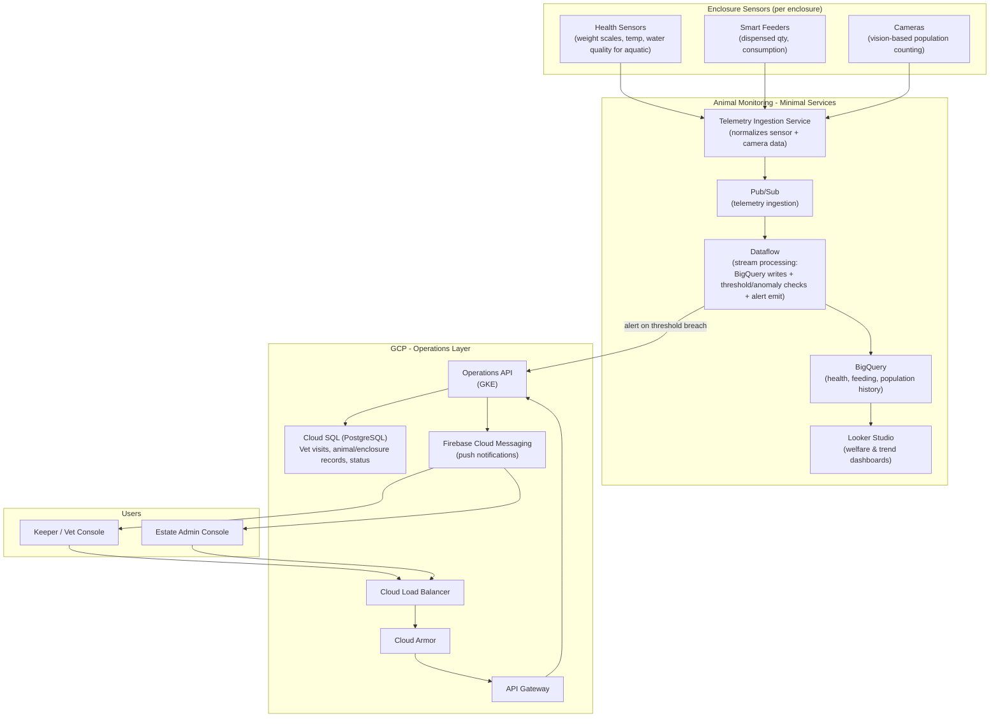

# Infra

> This file contains the GCP infra required to run the Animal health monitoring system.

## Infrastructure Components Inventory

| # | Area | Component Name | Usages |
| --- | --- | --- | --- |
| 1 | Enclosure Sensors | Health Sensors | Monitor weight, temperature, water quality per enclosure |
| 2 | Enclosure Sensors | Smart Feeders | Track food dispensed quantity and consumption rates |
| 3 | Enclosure Sensors | Cameras | Capture video for vision-based population counting |
| 4 | Core | Telemetry Ingestion Service | Normalize and aggregate sensor and camera data |
| 5 | Core | Pub/Sub | Stream telemetry events to downstream processors |
| 6 | Core | Dataflow | Process streams, write to BigQuery, check thresholds, emit alerts |
| 7 | Core | BigQuery | Persist historical health, feeding, and population data |
| 8 | Core | Looker Studio | Create welfare and trend dashboards for monitoring |
| 9 | Operations Layer | Cloud Load Balancer | Distribute incoming traffic from users |
| 10 | Operations Layer | Cloud Armor | Provide DDoS protection and security policies |
| 11 | Operations Layer | API Gateway | Route and authenticate API requests |
| 12 | Operations Layer | Operations API (GKE) | Manage vet visits, animal/enclosure records, dispatch alerts |
| 13 | Operations Layer | Cloud SQL (PostgreSQL) | Persist vet visits, animal/enclosure records, current status |
| 14 | Operations Layer | Firebase Cloud Messaging | Send push notifications to mobile clients |
| 15 | Users | Keeper / Vet Console | Access health data, log vet visits, receive notifications |
| 16 | Users | Estate Admin Console | Access health data, log vet visits, receive notifications |

---

**Diagramatic presentation of the Components and their Connection**

---

