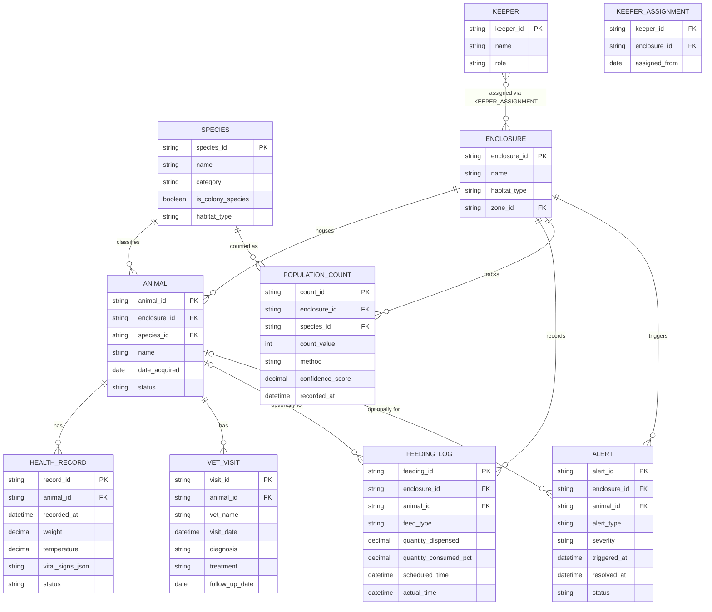

# Schema

> This file contains the ER diagram of the tables used by the microservices used for running the Animal Health Monitoring System.

```mermaid
erDiagram

    SPECIES ||--o{ ANIMAL : classifies
    ENCLOSURE ||--o{ ANIMAL : houses
    ANIMAL ||--o{ HEALTH_RECORD : has
    ANIMAL ||--o{ VET_VISIT : has
    ANIMAL |o--o{ FEEDING_LOG : "optionally for"
    ENCLOSURE ||--o{ FEEDING_LOG : records
    ENCLOSURE ||--o{ POPULATION_COUNT : tracks
    SPECIES ||--o{ POPULATION_COUNT : "counted as"
    ENCLOSURE ||--o{ ALERT : triggers
    ANIMAL |o--o{ ALERT : "optionally for"
    KEEPER }o--o{ ENCLOSURE : "assigned via KEEPER_ASSIGNMENT"

    SPECIES {
        string species_id PK
        string name
        string category
        boolean is_colony_species
        string habitat_type
    }

    ENCLOSURE {
        string enclosure_id PK
        string name
        string habitat_type
        string zone_id FK
    }

    ANIMAL {
        string animal_id PK
        string enclosure_id FK
        string species_id FK
        string name
        date date_acquired
        string status
    }

    HEALTH_RECORD {
        string record_id PK
        string animal_id FK
        datetime recorded_at
        decimal weight
        decimal temperature
        string vital_signs_json
        string status
    }

    VET_VISIT {
        string visit_id PK
        string animal_id FK
        string vet_name
        datetime visit_date
        string diagnosis
        string treatment
        date follow_up_date
    }

    FEEDING_LOG {
        string feeding_id PK
        string enclosure_id FK
        string animal_id FK
        string feed_type
        decimal quantity_dispensed
        decimal quantity_consumed_pct
        datetime scheduled_time
        datetime actual_time
    }

    POPULATION_COUNT {
        string count_id PK
        string enclosure_id FK
        string species_id FK
        int count_value
        string method
        decimal confidence_score
        datetime recorded_at
    }

    ALERT {
        string alert_id PK
        string enclosure_id FK
        string animal_id FK
        string alert_type
        string severity
        datetime triggered_at
        datetime resolved_at
        string status
    }

    KEEPER {
        string keeper_id PK
        string name
        string role
    }

    KEEPER_ASSIGNMENT {
        string keeper_id FK
        string enclosure_id FK
        date assigned_from
    }
```
