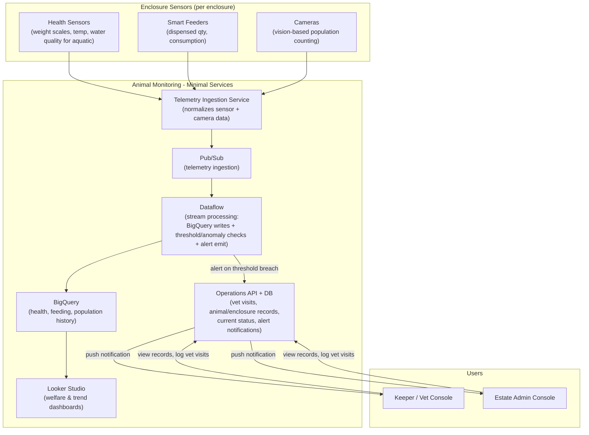

# Services

> This file contains the services required to run the Animal Monitoring System.

## Service Inventory

| # | Area | Service Name | Usages |
| --- | --- | --- | --- |
| 1 | Enclosure Sensors | Health Sensors | Monitor weight, temperature, water quality per enclosure |
| 2 | Enclosure Sensors | Smart Feeders | Track food dispensed quantity and consumption rates |
| 3 | Enclosure Sensors | Cameras | Vision-based population counting and behavior monitoring |
| 4 | Core | Telemetry Ingestion Service | Normalize and aggregate sensor and camera data streams |
| 5 | Core | Pub/Sub | Stream telemetry events to downstream processors |
| 6 | Core | Dataflow | Process streams, evaluate thresholds, detect anomalies, emit alerts |
| 7 | Core | BigQuery | Persist historical health, feeding, and population data |
| 8 | Core | Looker Studio | Create welfare and trend dashboards for monitoring |
| 9 | Core | Operations API + DB | Manage vet visits, animal/enclosure records, alert notifications |
| 10 | Users | Keeper / Vet App | View records, log vet visits, receive push notifications |
| 11 | Users | Estate Admin Console | View records, log vet visits, receive push notifications |

---

**Diagramatic View of the services and the connections**

---

