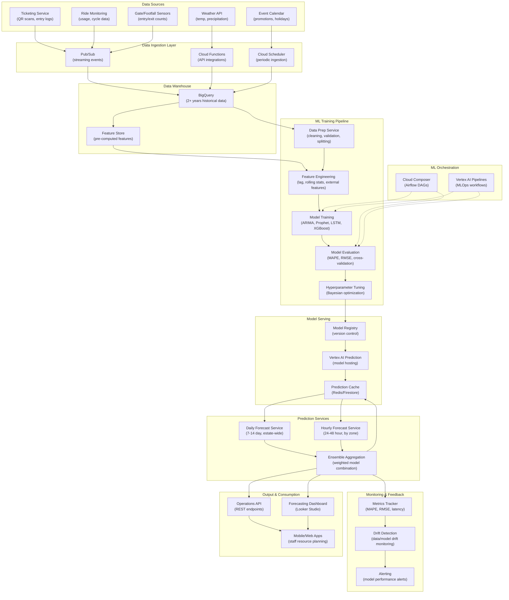

# Demand Forecasting for Estate Visitor Traffic

> This document outlines the ML solution for forecasting visitor demand across the estate. This enables optimized staffing, resource allocation, and revenue planning as the estate scales from 5,000 to 15,000+ daily visitors.

---

## 1. ML Problem Statement

### Business Context
The estate needs to accurately predict visitor demand to:
- Optimize staffing levels across rides, animal enclosures, and queue management
- Allocate operational resources efficiently
- Identify peak times to maximize revenue and visitor experience
- Plan capacity constraints and crowd management

### Problem Definition
**Primary Objective**: Forecast daily and hourly visitor traffic at estate-wide and zone-specific levels

**Key Prediction Targets**:
- **Daily forecast**: Total visitor count for the next 7-14 days (strategic planning)
- **Hourly forecast**: Visitor count by hour for the next 24-48 hours (operational decisions)
- **Zone-level forecast**: Demand at specific rides and animal enclosures (resource deployment)

### Problem Characteristics
- **Time series prediction**: Historical patterns exist (weekends vs weekdays, seasonal variations)
- **Multi-granularity**: Predictions needed at estate-wide, zone, and ride levels
- **Multiple features**: Day of week, holidays, weather, special events, school terms
- **Growth trend**: Expected 3x growth in 3 years requires model retraining
- **Stakeholder groups**: Management (strategic), Operations staff (tactical), ML team (technical)

### Success Metrics
| Metric | Target | Description |
|--------|--------|-------------|
| MAPE (Daily) | < 10% | Mean Absolute Percentage Error for daily forecasts |
| RMSE (Hourly) | < 50 visitors | Root Mean Squared Error for hourly forecasts |
| Zone-level MAPE | < 15% | Accuracy for zone-specific predictions |
| Forecast latency | < 5 minutes | Time to generate daily forecast |
| Model refresh | Daily | Retraining frequency to capture trends |

---

## 2. ML Solution

### Architecture Overview
The demand forecasting solution uses an ensemble approach combining multiple techniques:

#### 2.1 Core Models

**Model 1: ARIMA/SARIMA (Seasonal AutoRegressive Integrated Moving Average)**
- Captures seasonal patterns and auto-regressive dependencies
- Best for: Weekly seasonality, established patterns
- Strengths: Interpretable, fast inference
- Weakness: Requires stationary series, may struggle with abrupt changes

**Model 2: Prophet (Facebook's Time Series Library)**
- Handles seasonality, trend changes, and holiday effects
- Best for: Capturing holidays, special events, trend shifts
- Strengths: Robust to missing data, easy to add external regressors
- Weakness: May overfit on short-term anomalies

**Model 3: LSTM/RNN (Deep Learning)**
- Captures complex temporal dependencies and patterns
- Best for: Non-linear relationships, zone-level demand patterns
- Strengths: High flexibility, can learn zone-specific behaviors
- Weakness: Requires more data, longer training time

**Model 4: XGBoost/Gradient Boosting**
- Ensemble method using engineered temporal features
- Best for: Incorporating external features (weather, events, promotions)
- Strengths: Feature importance insights, handles multiple feature types
- Weakness: Risk of overfitting without careful regularization

#### 2.2 Ensemble Strategy
```
Final Forecast = 0.3 × ARIMA + 0.3 × Prophet + 0.2 × LSTM + 0.2 × XGBoost
```
Weighted ensemble reduces individual model weaknesses and improves robustness.

#### 2.3 Prediction Approach

**Daily Forecast** (7-14 day horizon):
- Use ARIMA/Prophet with longer-term trend
- Input: Historical daily visitor counts (2+ years)
- Output: Daily visitor count with 95% confidence interval

**Hourly Forecast** (24-48 hour horizon):
- Use LSTM + XGBoost with intra-day patterns
- Input: Hourly visitor counts (1+ year), gate entry logs
- Output: Hourly visitor count distribution

**Zone-level Forecast**:
- Apply zone-specific models trained on ride/enclosure entry logs
- Use hierarchical forecasting approach to reconcile with estate-wide forecast
- Allows staff deployment decisions at zone level

#### 2.4 External Regressors
- **Calendar features**: Day of week, holiday indicators, school term calendars
- **Weather data**: Temperature, precipitation (from external weather API)
- **Special events**: Promotional events, maintenance days, special animal exhibits
- **Promotions**: Pricing changes, family pass campaigns, loyalty offers
- **Ride/Animal status**: Closed rides/enclosures affecting demand distribution

---

## 3. Data Requirement

### 3.1 Primary Data Sources

**Source 1: Ticketing System**
| Data Point | Collection Method | Frequency | Granularity |
|------------|-------------------|-----------|------------|
| Entry timestamp | QR code scan at gate | Per entry | Ticket-level |
| Zone/Enclosure scan | QR code scan validation | Per entry | Location-specific |
| Ticket type | Ticketing system | Per order | Customer segment |
| Visitor count | Aggregate entry logs | Hourly | Hourly aggregation |

**Source 2: Ride Monitoring System**
| Data Point | Collection Method | Frequency | Granularity |
|------------|-------------------|-----------|------------|
| Usage per cycle | Ride usage sensors | Per cycle | Per ride |
| Rider count | Capacity tracking | Per cycle | Per ride |
| Cycle count | Counter sensors | Per cycle | Per ride |
| Maintenance downtime | Sensor alerts | Real-time | Per ride component |

**Source 3: Gate/Footfall Sensors**
| Data Point | Collection Method | Frequency | Granularity |
|------------|-------------------|-----------|------------|
| Entry count | Footfall sensors at gates | Hourly aggregate | Entry point |
| Exit count | Footfall sensors at gates | Hourly aggregate | Exit point |
| Dwell time | Movement between zones | Derived | Zone-level |

**Source 4: External Data**
| Data Point | API/Source | Update Frequency | Usage |
|------------|------------|------------------|--------|
| Weather (temp, rain) | OpenWeather/WeatherAPI | Hourly | Feature engineering |
| School holiday calendar | Government/Education APIs | Annual | Holiday flagging |
| Public holidays | Local government data | Annual | Holiday flagging |

### 3.2 Data Specifications

**Time Series Data**
- **Minimum historical data**: 2 years (24 months) of daily visitor counts
- **Ideal range**: 3-5 years for seasonal pattern capture
- **Temporal granularity**: 
  - Daily: Aggregate from hourly data
  - Hourly: Direct from entry logs (required for operational forecasts)
  - 15-minute: Optional, for fine-grained analysis

**Data Quality Requirements**
| Requirement | Target | Approach |
|-------------|--------|----------|
| Completeness | 98%+ | Forward-fill for gaps < 6 hours; exclude days > 6 hour gaps |
| Accuracy | ±2% | Cross-validate gate counts with ticketing data |
| Freshness | Updated daily | Ingestion pipeline runs nightly |
| Consistency | No outliers without cause | Anomaly detection; manual review for unexplained spikes |

### 3.3 Feature Engineering

**Temporal Features**:
- Day of week (0-6), Week of year, Month
- Is weekend, Is holiday, Days to/from holiday
- School term indicator, Vacation period
- Lag features: Visitor count (lag 1, 7, 14, 365 days)
- Rolling statistics: 7-day, 30-day moving averages

**External Features**:
- Mean daily temperature, Max temperature, Precipitation
- Event indicator (special animal exhibit, promotion active)
- Ride maintenance indicator (ride closed count)
- Promotional pricing active

**Aggregation Levels**:
- Estate-wide demand
- Zone-level (40 rides, 55 animal enclosures)
- Visitor segment (singles, family pass groups, loyalty members)

### 3.4 Data Storage & Pipeline

**Data Storage** (in GCP):
- **BigQuery**: Historical time series (2+ years), feature store
- **Cloud Storage**: Raw entry logs, external API responses
- **Datastore**: Feature cache for real-time predictions

**Data Ingestion Pipeline**:
```
Ticketing DB → Cloud Function → BigQuery
Entry Sensors → Pub/Sub → Dataflow → BigQuery
Weather API → Cloud Scheduler → Cloud Function → BigQuery
External Events → Manual upload → Cloud Storage → BigQuery
```

---

## 4. Infra Mermaid of Solution



### Infrastructure Components

| Component | GCP Service | Purpose | Scaling |
|-----------|------------|---------|---------|
| **Ingestion** | Pub/Sub | Stream visitor events from sensors | Auto-scaling, 1M+ msg/sec |
| **Processing** | Dataflow | Real-time data aggregation | Autoscaling pipelines |
| **Storage** | BigQuery | Time series & feature data | 100GB+ datasets |
| **ML Training** | Vertex AI Training | Model training & evaluation | GPU-enabled, 8vCPU standard |
| **Model Registry** | Vertex AI Model Registry | Version control & deployment | 100+ model versions |
| **Serving** | Vertex AI Prediction | Real-time inference | Auto-scaling endpoints |
| **Caching** | Cloud Memorystore (Redis) | Cache predictions & features | 6GB+ instance |
| **Orchestration** | Cloud Composer (Airflow) | Daily training & redeployment | 1 DAG = daily schedule |
| **Monitoring** | Cloud Monitoring + Logging | ML performance tracking | Custom metrics |
| **API** | Cloud Run / GKE | REST API for predictions | Auto-scaling containers |

---

## 5. ML Ops

### 5.1 Model Training Pipeline

**Training Schedule**:
- **Frequency**: Daily (overnight batch training)
- **Trigger**: 02:00 UTC (off-peak hours)
- **Duration**: ~30-60 minutes end-to-end
- **Automatic redeployment**: If new model MAPE < previous model by 2%+

**Training Process**:

1. **Data Fetch & Preparation** (Cloud Composer DAG):
   ```
   - Fetch last 2 years of historical data from BigQuery
   - Validate data completeness (98%+ non-null records)
   - Detect & handle outliers using z-score method (|z| > 3)
   - Forward-fill gaps < 6 hours; exclude days with larger gaps
   ```

2. **Feature Engineering**:
   ```
   - Generate lag features (t-1, t-7, t-14, t-365)
   - Compute rolling statistics (7-day, 30-day MA)
   - Encode calendar features (day-of-week, is_holiday, month)
   - Fetch weather data and merge
   - Normalize features using StandardScaler
   ```

3. **Train-Test Split**:
   ```
   - 80% training (first 1.6 years)
   - 10% validation (next 0.2 years)
   - 10% test (last 0.2 years)
   - Use time-based split (no randomization) for time series integrity
   ```

4. **Model Training** (in parallel):
   ```
   Parallel Task 1: Train ARIMA model
   Parallel Task 2: Train Prophet model with external regressors
   Parallel Task 3: Train LSTM/RNN model (GPU-accelerated)
   Parallel Task 4: Train XGBoost model
   ```

5. **Model Evaluation**:
   ```
   - Compute MAPE, RMSE, MAE on validation set
   - Cross-validation: 5-fold time-series cross-validation
   - Generate residual analysis & diagnostic plots
   - Log metrics to Cloud Logging
   ```

6. **Hyperparameter Tuning** (if model MAPE > threshold):
   ```
   - Use Bayesian Optimization via Vertex AI Hyperparameter Tuning
   - 10-20 trial configurations
   - Optimize for MAPE on validation set
   ```

7. **Ensemble Construction**:
   ```
   - Weight models: 0.3×ARIMA + 0.3×Prophet + 0.2×LSTM + 0.2×XGBoost
   - Validate ensemble MAPE on test set
   - Ensure ensemble MAPE < 10% target
   ```

8. **Model Registration**:
   ```
   - Save model artifacts to Cloud Storage
   - Register in Vertex AI Model Registry
   - Tag with version, metrics, training date
   - Mark as "candidate" (not yet deployed)
   ```

### 5.2 Model Deployment

**Deployment Gate**:
```
IF new_model.MAPE < previous_model.MAPE - 2% THEN
  Deploy new model to Vertex AI Prediction endpoint
  Update prediction cache
  Log deployment event
ELSE
  Keep current model active
  Alert ML team for manual review
END
```

**Deployment Strategy**:
- **Canary Deployment**: Route 10% traffic to new model for 2 hours
- **Validation**: Compare predictions (new vs current model)
- **Full Rollout**: If variation < 5%, route 100% traffic to new model
- **Rollback**: Automatic rollback if MAPE increases by 5%+

**Serving Setup** (Vertex AI Prediction):
- **Replicas**: 3-5 minimum for HA
- **Autoscaling**: Min=3, Max=20 (based on prediction load)
- **Timeout**: 30 seconds per request
- **Batch Prediction**: 
  - Daily batch job for next 7 days (low-latency requirement)
  - Results cached in Cloud Memorystore (Redis)

### 5.3 Monitoring & Alerting

**Real-time Metrics** (Cloud Monitoring dashboard):
```
Prediction Latency: P50, P95, P99 (target: <500ms)
Prediction Volume: Requests/sec (track demand spikes)
Model Serving Status: Endpoint health, replica status
Cache Hit Rate: % predictions served from cache (target: >80%)
API Error Rate: 4xx, 5xx error %, target <0.1%
```

**Model Performance Metrics** (daily reporting):
```
Daily MAPE: Difference vs actual visitor counts (target <10%)
Zone-level MAPE: Accuracy by ride/enclosure (target <15%)
Hourly RMSE: Forecast error for hourly predictions (target <50)
Forecast Bias: Tendency to over/under-predict (target: |bias| <2%)
```

**Data Drift Detection**:
```
- Compare training vs production data distributions (Kolmogorov-Smirnov test)
- Alert if p-value < 0.05 (significant distribution shift)
- Trigger immediate manual review + optional retraining
- Common drift sources: Seasonal change, special events, new attractions
```

**Model Drift Detection**:
```
- Track prediction residuals over time
- Alert if MAPE increases >5% vs baseline
- Alert if RMSE increases >15% vs baseline
- Typical drift causes: Growing visitor base, new rides opened, route changes
```

**Alerting Thresholds**:
| Alert Type | Threshold | Action |
|-----------|-----------|--------|
| High Latency | P95 > 2s | Page on-call engineer |
| High Error Rate | Error% > 1% | Auto-rollback to previous model |
| Model MAPE | MAPE > 12% | Alert ML team, trigger retraining |
| Data Drift | p-value < 0.05 | Alert ML team for investigation |
| Endpoint Down | Unavailable > 5min | Auto-restart replicas |

### 5.4 Retraining & Continuous Improvement

**Scheduled Retraining**:
- **Daily**: Automatic retraining with latest data (Cloud Composer)
- **Weekly**: Manual review of metrics, model analysis
- **Monthly**: A/B testing new features or model architectures
- **Quarterly**: Major model architecture updates (e.g., new LSTM layers)

**Performance Degradation Response**:
```
IF MAPE > 12% THEN
  1. Check for data quality issues → Data team
  2. Check for special events/anomalies → Operations team
  3. Retrain with expanded feature set → ML team
  4. If MAPE still > 12%, revert to previous model
  5. Create incident ticket for root cause analysis
END
```

**Adding New Training Data**:
```
When new zone/ride opens:
  1. Start with ARIMA/Prophet models (no LSTM historical data)
  2. Collect 3-6 months of data
  3. Transition to ensemble after sufficient data
  4. Hierarchical forecasting to reconcile with estate-wide forecast
```

**Feedback Loop** (Operational Insights):
```
- Track actual vs forecasted visitor counts (ground truth)
- Collect feedback from staff on forecast accuracy
- Identify patterns in forecast errors (e.g., weather sensitivity)
- Update feature engineering accordingly
- Retrain models with improved features
```

---

## 6. Caveats to Consider

### 6.1 Data Challenges

| Challenge | Impact | Mitigation |
|-----------|--------|-----------|
| **Incomplete WiFi coverage** | Delayed sensor data ingestion | Use edge MQTT broker for local buffering; sync when connectivity available |
| **Missing/Corrupted data** | Training data gaps | Forward-fill gaps <6h; exclude days with larger gaps from analysis |
| **Entry log inconsistency** | Gate scan counts ≠ actual visitors | Cross-validate ticketing vs sensor counts; investigate discrepancies |
| **Timezone issues** | Hourly aggregation errors | Standardize all timestamps to UTC; convert display timestamps at end-points |
| **External API failures** | Weather data gaps | Cache previous day's weather; use average historical weather if unavailable |

### 6.2 Model Limitations

| Limitation | Effect | Workaround |
|-----------|--------|-----------|
| **Seasonality assumption** | Models assume repeating patterns | Rebalance weights if seasonality changes (e.g., new annual events) |
| **Black swan events** | Sudden spikes/drops unexplained (pandemic, disaster) | Manual intervention mechanism for event-based forecasts; alert ops team |
| **Abrupt trend changes** | Model lags when visitor patterns shift | Use Prophet's changepoint detection; manual feature engineering for known changes |
| **Zone interdependencies** | Demand at one ride affects others (queue spillover) | Zone models are independent; use correlation matrix to identify spillovers |
| **LSTM overfitting** | Model learns noise instead of patterns | Use early stopping, dropout layers, L2 regularization, validation monitoring |
| **Ensemble weights fixed** | Different seasons may need different weights | Quarterly review of weights; consider dynamic weighting based on season |

### 6.3 Operational Constraints

| Constraint | Issue | Action |
|-----------|-------|--------|
| **Staff availability** | Forecast says more staff needed but unavailable | Reconcile forecast with staffing schedules; alert management of gaps |
| **Ride/Enclosure closures** | Unplanned downtime redirects demand elsewhere | Adjust forecasts manually for closure periods; update zone-level predictions |
| **Weather volatility** | Heavy rain/storms can reduce attendance 20-40% | Add weather interaction terms; create weather-based adjustment factors |
| **School holidays/term changes** | Regional holiday calendars vary | Incorporate multiple calendar sources; flag uncertainty during variable periods |
| **Special events** | Concert, festival, new animal exhibit drives demand | Requires manual event flagging; LSTM may not generalize to new event types |
| **Marketing campaigns** | New ad campaign increases awareness | Requires lag-time modeling (3-7 days); promotional flag in features |

### 6.4 Scaling & Performance Issues

| Issue | Consequence | Solution |
|-------|-------------|----------|
| **Forecast latency grows** | >5 min latency violates SLA | Pre-compute daily forecasts; cache hourly predictions; use batch prediction |
| **Inference costs increase** | Model serving cost grows 3x with visitor growth | Use smaller ensemble (2-3 models); quantize LSTM model; batch predictions |
| **BigQuery costs** | Exponential growth in data scanned | Partition tables by date; use time-windowed queries; archive old data |
| **Model training time increases** | Daily retraining becomes unfeasible | Use incremental learning (ARIMA statsmodels); sample data; distributed training |
| **Model registry bloat** | Hundreds of model versions accumulate | Auto-delete versions >30 days old; keep only last 10 best models |

### 6.5 Business & Stakeholder Risks

| Risk | Mitigation |
|------|-----------|
| **Forecast inaccuracy → Over/understaffing** | Provide confidence intervals; alert ops if forecast ±15%; combine with manual planning |
| **Model bias against new zones** | Zone-specific models require 3-6 months; use warm-start from similar zones |
| **Staff doesn't trust model** | Bi-weekly interpretation sessions; explain prediction reasoning; track actual vs forecast |
| **Changing visitor behavior post-growth** | Model trained on 5K visitors applied to 15K may degrade; quarterly retraining cadence |
| **Dependency on external data** | Weather API downtime, calendar data unavailability | Have fallback models (ARIMA without external regressors) |

### 6.6 Technical Debt & Maintenance

| Area | Consideration |
|------|-------------------|
| **Model versioning** | Archive training scripts, hyperparameters, data snapshots with each model version |
| **Drift monitoring infrastructure** | Requires ongoing maintenance; budget for monitoring setup cost (~2-3 weeks eng effort) |
| **Feature engineering pipeline** | Update feature definitions as zones evolve; document feature change history |
| **Cross-team coordination** | Ops team, Analytics team, ML team need shared understanding of forecasts |
| **Retraining infrastructure costs** | Daily retraining × 4 models = significant compute; budget for Vertex AI training costs |

### 6.7 Recommendation Priorities

**Immediate (MVP)**:
1. ✅ Deploy ARIMA + Prophet ensemble (simple, interpretable)
2. ✅ Daily retraining pipeline
3. ✅ Dashboard for actual vs forecasted metrics
4. ✅ Alert system for forecast accuracy degradation

**Phase 2 (3-6 months)**:
1. Add LSTM model (requires 6+ months of hourly data)
2. Implement data drift detection
3. Zone-level forecasting with hierarchy reconciliation
4. External weather & event features integration

**Phase 3 (6-12 months)**:
1. Add XGBoost with feature importance insights
2. Multi-step ahead forecasting (14-day detailed predictions)
3. Confidence interval calibration
4. A/B testing framework for model updates

---

## 7. Success Criteria & Rollout Plan

### Rollout Phases

**Phase 0: Foundation** (Weeks 1-2)
- Set up BigQuery time series dataset (2 years historical data)
- Implement daily data ingestion pipeline
- Verify data quality (98%+ completeness, consistency checks)

**Phase 1: MVP Forecast** (Weeks 3-6)
- Deploy ARIMA + Prophet ensemble
- Daily retraining pipeline (automated)
- Looker dashboard for predictions
- API for operations team consumption

**Phase 2: Operational Integration** (Weeks 7-12)
- Mobile app integration for staff resource planning
- Hourly forecasts for 24-48 hour operational decisions
- Confidence intervals for all predictions
- Model performance monitoring dashboard

**Phase 3: Advanced ML** (Weeks 13-24)
- LSTM + XGBoost models in ensemble
- Zone-level forecasting
- External feature integration (weather, events, promotions)
- Automated drift detection & alerting

### KPIs to Track

| KPI | Target | Timeline |
|-----|--------|----------|
| Forecast MAPE (daily) | < 10% | Week 8 (Phase 1) |
| Forecast MAPE (hourly) | < 15% | Week 16 (Phase 2) |
| Zone-level MAPE | < 20% | Week 24 (Phase 3) |
| Prediction API latency (P95) | < 500ms | Week 6 (MVP) |
| Staff utilization improvement | +10-15% | Week 12 (Phase 2) |
| Unplanned overtime reduction | -20% | Week 16 (Phase 2) |
| Revenue optimization opportunity | +5-8% | Week 24 (Phase 3) |

