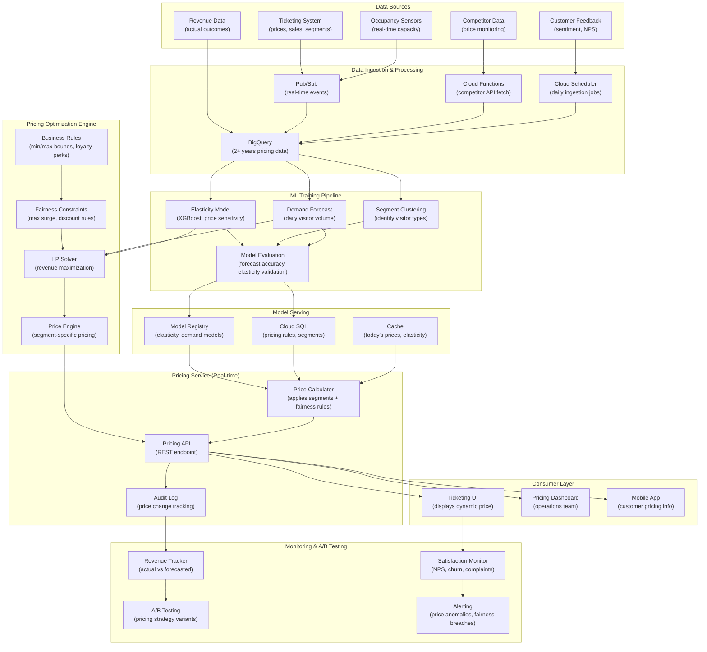

# Dynamic Pricing Strategy for Estate Tickets

> This document outlines the ML solution for optimizing ticket pricing in real-time. Dynamic pricing maximizes revenue while maintaining visitor satisfaction across high-demand and low-demand periods.

---

## 1. ML Problem Statement

### Business Context
The estate needs to maximize revenue without alienating visitors through excessive pricing. Traditional fixed pricing leaves money on the table during peak seasons while failing to optimize occupancy during slow periods.

### Problem Definition
**Primary Objective**: Determine optimal ticket prices in real-time based on demand, capacity, and visitor behavior

**Key Prediction Targets**:
- **Daily pricing**: Recommended ticket price for next day (updated nightly)
- **Dynamic adjustments**: Real-time price updates during the day (every 2 hours)
- **Segment-based pricing**: Different prices for families, individuals, groups, loyalty members
- **Zone-specific pricing**: Different pricing for premium rides/enclosures vs standard attractions

### Problem Characteristics
- **Revenue optimization problem**: Maximize profit = (Price × Demand) - Operational costs
- **Demand elasticity**: Price changes affect visitor volume (lower price → more visitors)
- **Capacity constraints**: 15,000 max daily visitors; 40 rides with individual capacities
- **Fairness concerns**: Avoid extreme price gouging that damages brand reputation
- **Multiple segments**: Price sensitivity varies by visitor type (families vs tourists)
- **Competitive landscape**: Priced against alternative attractions and entertainment

### Success Metrics
| Metric | Target | Description |
|--------|--------|-------------|
| Revenue increase | +12-15% | vs fixed pricing baseline |
| Occupancy rate | 75-85% | Optimal utilization without overcrowding |
| Customer satisfaction | >= 4.0/5.0 | No perception of unfair pricing |
| Price elasticity | Estimated | Understanding demand sensitivity to price |
| Daily RMSE | < 5% revenue | Forecast accuracy of optimal price |
| Churn rate | < 3% | Loyalty program attrition due to pricing |

---

## 2. ML Solution

### Architecture Overview
A multi-component system combining demand forecasting, price elasticity modeling, and revenue optimization.

#### 2.1 Core Components

**Component 1: Demand Elasticity Model (XGBoost)**
- Estimates price sensitivity: % change in demand per % price change
- Best for: Non-linear elasticity curves, segment-specific behavior
- Inputs: Historical price, demand, visitor segment, day-of-week, weather
- Output: Price elasticity coefficient per segment

**Component 2: Price Optimization Engine (Linear Programming)**
- Solves optimization problem: Maximize Revenue subject to constraints
- Best for: Real-time price calculation with business rules
- Constraints: Min/max price bounds, fairness (family vs individual), capacity
- Output: Recommended ticket price

**Component 3: Segment-Based Pricing (Clustering + Regression)**
- Identifies visitor segments with different price sensitivity
- Segment 1: Budget-conscious families (elastic demand)
- Segment 2: Tourists/premium visitors (inelastic demand)
- Segment 3: Loyalty members (price-sensitive retention)

**Component 4: Demand Forecasting (Prophet)**
- Predicts next-day demand at zone/attraction level
- Feeds into revenue optimization engine
- Accounts for holidays, events, weather

#### 2.2 Pricing Algorithm

```
For each day D and time period T:
  
  1. Forecast demand = DemandForecasting_Model(D, T)
  2. Calculate current occupancy = Actual_visitors / Capacity
  3. Calculate utilization_score = current_occupancy / optimal_occupancy (75%)
  
  4. FOR each visitor segment S:
       elasticity[S] = ElasticityModel(S, D, T, other_features)
       base_price = HistoricalPrice[S]
       
       5. Calculate optimal price using Linear Programming:
          max_revenue = base_price * forecast_demand[S]
          
          SUBJECT TO:
            - price >= MIN_PRICE[S] (fairness lower bound)
            - price <= MAX_PRICE[S] (fairness upper bound)
            - price <= dynamic_surge_factor * base_price (surge limit)
            - demand_elasticity * (price - base_price) constraint
            - visitor_satisfaction_score >= threshold
  
       6. recommended_price[S] = Solve_LP()
  
  7. Adjust for fairness:
     - Ensure family_pass_discount >= 15% vs individual tickets
     - Loyalty member_discount >= 10%
  
  8. Return pricing_recommendations
```

#### 2.3 Pricing Strategy by Demand Level

**Low Demand Period** (Occupancy < 40%):
```
- Discount 15-25% below base price
- Promote family packages aggressively
- Offer group discounts (10+ visitors)
- Push loyalty program offers
```

**Normal Demand Period** (Occupancy 40-75%):
```
- Price at or slightly above base price (±5%)
- Standard family/group discounts
- Loyalty perks maintained
```

**High Demand Period** (Occupancy 75-90%):
```
- Premium pricing: +10-20% above base
- Reduce discount offerings
- Prioritize high-value segments (premium tourists)
- Encourage off-peak visits via discounts
```

**Overcapacity Period** (Occupancy > 90%):
```
- Maximum surge pricing: +30-40% above base
- Minimal discounts offered
- Loyalty members get priority access at base price
- Timed entry reservations encouraged
```

---

## 3. Data Requirement

### 3.1 Primary Data Sources

**Source 1: Historical Transaction Data (Ticketing System)**
| Data Point | Collection Method | Frequency | Granularity |
|------------|-------------------|-----------|------------|
| Ticket price | Ticketing DB | Per transaction | Transaction-level |
| Quantity sold | Order processing | Per order | Order-level |
| Visitor type | Customer profile | Per ticket | Individual segment |
| Timestamp | POS system | Per transaction | Transaction-time |
| Conversion rate | Analytics tracking | Daily | Daily aggregate |

**Source 2: Competitor Pricing Data**
| Data Point | Collection Method | Frequency | Granularity |
|------------|-------------------|-----------|------------|
| Competitor prices | Web scraping / APIs | Daily | Per competitor |
| Competitor promotions | Manual monitoring | Weekly | Aggregate |
| Market share | Industry reports | Monthly | Regional |

**Source 3: Occupancy & Capacity Data**
| Data Point | Collection Method | Frequency | Granularity |
|------------|-------------------|-----------|------------|
| Hourly visitors | Gate sensors + ticketing | Hourly | Zone-level |
| Ride/enclosure capacity | Static data | Updated on changes | Per attraction |
| Queue times | Mobile app / sensors | Real-time | Per ride |

**Source 4: Customer Sentiment Data**
| Data Point | Collection Method | Frequency | Granularity |
|------------|-------------------|-----------|------------|
| Review ratings | Feedback surveys | Post-visit | Customer segment |
| Price feedback | NPS surveys | Monthly | Segment-level |
| Churn signals | Loyalty program | Real-time | Customer-level |

### 3.2 Data Specifications

**Historical Data Requirements**:
- **Minimum**: 2 years of transaction data (price, quantity, visitor segment)
- **Ideal**: 3-5 years to capture seasonal and economic cycles
- **Granularity**: Daily aggregation at minimum; hourly for intra-day pricing

**Segment Identification Data**:
- **Visitor demographics**: Age, group size, origin (local vs tourist)
- **Purchase history**: Previous purchases, loyalty tier, visit frequency
- **Behavior signals**: Advanced booking vs day-of, repeat visitor flag

**Feature Engineering Data**:
| Category | Features | Source |
|----------|----------|--------|
| Temporal | Day-of-week, holiday, school term, season | Calendar |
| Occupancy | Current occupancy %, queue lengths, ride downtime | Sensors |
| Weather | Temperature, precipitation, wind | Weather API |
| Demand | Forecasted visitor count (from Demand Forecasting model) | ML pipeline |
| Competition | Competitor pricing, promotions | Market data |
| Sentiment | Customer review sentiment, price complaints | NPS/Reviews |

### 3.3 Data Quality Standards

| Requirement | Target | Method |
|-------------|--------|--------|
| Completeness | 99%+ | Cross-validate ticketing, sensors, entry logs |
| Accuracy | ±1% | Reconcile daily revenue vs system totals |
| Consistency | No duplicates | Dedup by transaction_id, timestamp |
| Freshness | Updated hourly | Real-time ingestion from Pub/Sub |
| Privacy | PII anonymized | Hash customer IDs; aggregate by segment |

### 3.4 Data Storage & Pipeline

**BigQuery Dataset Structure**:
```
- pricing_transactions: Transaction-level pricing data (2+ years)
- elasticity_features: Pre-computed elasticity features
- segment_profiles: Customer segment profiles
- competitor_pricing: External competitor price tracking
- revenue_actuals: Actual revenue per day/segment
```

**Daily Data Pipeline**:
```
Ticketing System → Pub/Sub → BigQuery
Competitor APIs → Cloud Functions → BigQuery
Customer Feedback → Cloud Storage → BigQuery
Occupancy Sensors → Dataflow → BigQuery
```

---

## 4. Infra Mermaid of Solution



### Infrastructure Components

| Component | GCP Service | Purpose | Scaling |
|-----------|------------|---------|---------|
| **Data Ingestion** | Pub/Sub | Real-time ticketing events | 100K+ events/sec |
| **Data Processing** | Dataflow | Stream aggregation | Auto-scaling pipelines |
| **Storage** | BigQuery | 2+ years transaction data | 50GB+ datasets |
| **Elasticity Model** | Vertex AI Training | Train XGBoost model | 8vCPU, GPU-capable |
| **Segmentation** | Vertex AI AutoML | Cluster customer segments | Managed service |
| **LP Solver** | OR-Tools / Gurobi | Real-time optimization | Sub-500ms solve |
| **Pricing Cache** | Memorystore (Redis) | Cache segment prices | 2GB+ instance |
| **Rules Engine** | Cloud SQL (PostgreSQL) | Store fairness rules | 32GB RAM, auto-backup |
| **API Service** | Cloud Run / GKE | REST pricing endpoint | Auto-scaling containers |
| **Audit Logging** | Cloud Logging + BigQuery | Track price changes | Real-time ingestion |

---

## 5. ML Ops

### 5.1 Model Training & Retraining

**Training Schedule**:
- **Elasticity Model**: Weekly (Monday 02:00 UTC)
- **Segment Clustering**: Monthly (1st of month)
- **Demand Forecast**: Daily (02:00 UTC)
- **Fairness Rules**: Manual updates (as policy changes)

**Elasticity Model Training** (Weekly):
```
1. Fetch 2 years of transaction data from BigQuery
2. Filter by ticket_type, visitor_segment, date
3. Compute price variance, demand variance
4. Feature engineering:
   - Lagged demand
   - Price changes
   - Competition pricing
   - Occupancy %
   - Weather features
5. Train XGBoost model: demand ~ price + features
6. Extract coefficients: elasticity = ∂demand/∂price
7. Validate on holdout set (last 4 weeks)
8. If model R² > 0.75 on validation, deploy
```

**Segment Clustering** (Monthly):
```
1. Aggregate customer behavior data (last 90 days)
2. Features: age group, group_size, advance_booking_days, 
            loyalty_tier, price_sensitivity, visit_frequency
3. K-means clustering (k=3-5)
4. Label clusters: Budget Families, Premium Tourists, Loyal Members
5. Compute elasticity per segment
6. Update pricing rules for each segment
```

### 5.2 Real-time Pricing Pipeline

**Pricing Decision Flow** (every 2 hours or on demand):
```
1. Check current occupancy rate
2. Get demand forecast for next 12 hours
3. For each visitor segment:
     a. Load elasticity model
     b. Compute price elasticity
     c. Run LP optimization:
        max: revenue = price × forecasted_demand
        subject to:
          - price_min ≤ price ≤ price_max
          - fairness_constraints
          - surge_factor constraint
     d. Recommended_price[segment] = LP result

4. Fairness validation:
   - family_pass_discount >= 15% vs individual
   - loyalty_discount >= 10%
   - Surge limit: max(price) <= 1.4 × base_price

5. Cache recommended prices in Redis
6. Publish pricing to Ticketing UI, API
7. Log price decision to audit trail
```

**Deployment of Pricing Changes**:
- New pricing: Take effect within 30 minutes (A/B test optional)
- Existing transactions: Apply old price until checkout
- Price validation: Compare recommended vs historical avg price
  - Alert if > 40% increase
  - Notify management for approval if surge > 30%

### 5.3 Monitoring & Alerting

**Real-time Metrics** (Dashboard):
```
Revenue Metrics:
  - Actual revenue vs forecasted revenue (expected: within ±5%)
  - Revenue per visitor (trending upward)
  - Occupancy rate (target: 75-85%)

Price Metrics:
  - Average price by segment
  - Price variance (stdev of daily prices)
  - Surge pricing triggers per day
  - Price change frequency

Elasticity Metrics:
  - Estimated demand elasticity per segment
  - Price response time (actual demand vs forecast)
  - Model elasticity accuracy (validation set R²)

Customer Metrics:
  - Conversion rate (bookings / page views)
  - Average order value
  - Cart abandonment rate
  - Customer satisfaction (NPS score)
```

**Fairness & Compliance Checks** (Daily):
```
Check 1: Discount integrity
  - Family pass discount >= 15%
  - Loyalty discount >= 10%
  Alert if violated

Check 2: Surge limit
  - Max price <= 1.4 × base_price
  Alert if violated

Check 3: Customer satisfaction
  - NPS score drop > 10 points
  - Price complaint rate > 5% of reviews
  Alert if violated

Check 4: Elasticity stability
  - Elasticity coefficient changes > 30%
  - Demand forecast error > 20%
  Alert if violated
```

**Alerting Thresholds**:
| Alert Type | Threshold | Action |
|-----------|-----------|--------|
| Revenue drop | < -10% vs baseline | Page ops team, check for issues |
| Occupancy too high | > 90% | Increase prices, cap bookings |
| Occupancy too low | < 40% | Decrease prices, promote |
| Customer complaints | > 5% of feedback mentions price | Reduce prices, review fairness |
| Model drift | Elasticity change > 30% | Retrain model immediately |
| Pricing API down | Unavailable > 5 min | Use cached prices, alert eng |

### 5.4 A/B Testing & Optimization

**Pricing A/B Tests** (Monthly):
```
Test 1: Pricing Strategy
  - Control: Current pricing algorithm
  - Variant A: More aggressive surge (1.5x base)
  - Variant B: More conservative surge (1.2x base)
  - Metric: Revenue, occupancy, NPS
  - Duration: 2 weeks
  - Sample: Random 20% of visitors per variant

Test 2: Segment Pricing
  - Control: Standard family discount (15%)
  - Variant: Dynamic family discount (10-20% based on demand)
  - Metric: Family pass adoption, revenue
  - Duration: 2 weeks

Test 3: Discount Strategy
  - Control: Discount only in low occupancy periods
  - Variant: Year-round loyalty discounts
  - Metric: Loyalty member retention, LTV
```

---

## 6. Caveats to Consider

### 6.1 Model Limitations

| Limitation | Impact | Mitigation |
|-----------|--------|-----------|
| **Non-stationary elasticity** | Price sensitivity changes seasonally | Retrain monthly; segment-specific models |
| **Demand forecast errors** | Optimization based on bad forecasts | Use confidence intervals; bound demand estimates |
| **Fixed elasticity curves** | Assumes linear price-demand relationship | Use XGBoost for non-linearity; test quadratic terms |
| **Segment overfitting** | Too many segments → sparse data → noise | Limit to 3-5 major segments; validate quarterly |
| **LP solver approximations** | Real-time constraints → suboptimal solution | Pre-compute candidate prices; use heuristics for speed |

### 6.2 Business & Fairness Risks

| Risk | Consequence | Mitigation |
|------|-------------|-----------|
| **Price gouging perception** | Brand damage, negative press, social media backlash | Hard limit: max surge = 1.4×; family discount >= 15% |
| **Customer churn** | Lost loyalty members due to unfair pricing | Monitor NPS; instant rollback if score drops >10 |
| **Segment discrimination** | Legal risk if pricing correlates with protected attributes | Audit by demographics; ensure fairness by segment type only |
| **Competitor retaliation** | Price wars reduce margins | Set price caps relative to competition; avoid sudden changes |
| **Demand cannibalization** | High-price period → fewer visitors → lost ancillary revenue | Track ride/enclosure spending; optimize total revenue, not just tickets |

### 6.3 Operational Constraints

| Constraint | Issue | Solution |
|-----------|-------|---------|
| **Manual override needed** | Staff unsure of algorithm → don't use predictions | Monthly explainability sessions; dashboards with clear reasoning |
| **Slow deployment cycle** | Can't change pricing frequently enough | Real-time API; sub-500ms pricing decisions |
| **Inconsistent pricing across channels** | Website vs mobile vs kiosk show different prices | Centralized pricing API; sync all channels every 30 min |
| **Group/bulk bookings** | Negotiated pricing breaks algorithm | Manual override flag; separate pricing model for groups |
| **System downtime** | Pricing service unavailable → fall back to fixed price | Use Redis cache; pre-compute 24h ahead; fallback to previous day's price |

### 6.4 Data Quality Issues

| Issue | Effect | Handling |
|-------|--------|----------|
| **Incomplete transaction records** | Missing prices for some sales | Filter out incomplete records; audit data pipeline |
| **Refunds/cancellations** | Realized demand < recorded sales | Track refunds separately; use "completed sales" for elasticity |
| **Group bookings with negotiated rates** | Non-representative price data | Flag group bookings; train separate model for groups |
| **Competitor data stale** | Outdated pricing information | 4x daily updates minimum; validate against web scraping |
| **Seasonal data gaps** | Limited data for peak/off-season elasticity | Use data from adjacent years; interpolate missing periods |

### 6.5 Ethical & Regulatory Concerns

| Concern | Risk | Action |
|---------|------|--------|
| **Dynamic pricing legality** | Some jurisdictions restrict algorithmic pricing | Legal review; transparency in pricing disclosure |
| **Price discrimination** | Targeting vulnerable populations unfairly | Audit for demographic correlations; enforce fairness constraints |
| **Hidden surges** | Consumer deception if prices seem arbitrary | Display "peak period pricing" clearly; publish price rules |
| **Predatory practices** | Extracting max consumer surplus | Cap surge at 1.4×; maintain affordability tiers |

### 6.6 Integration Challenges

| Challenge | Impact | Solution |
|-----------|--------|---------|
| **Ticketing system lag** | Prices updated in API but not in POS for hours | Real-time sync; Pub/Sub events; cache invalidation |
| **Mobile app caching** | Users see stale prices on app | Force refresh every 30 min; push notifications for price changes |
| **Holiday/event coordination** | Demand forecasts miss special events | Manual event flagging; integration with event calendar |
| **Weather API failures** | Features unavailable during API downtime | Use historical average weather; continue pricing without weather feature |
| **Competitor data unavailable** | Can't adjust against competition | Graceful degradation; use elasticity model without competition feature |

### 6.7 Recommendation Priorities

**Immediate (MVP)** - Weeks 1-4:
1. ✅ Build transaction data pipeline (ticketing → BigQuery)
2. ✅ Train initial elasticity model (XGBoost)
3. ✅ Implement LP optimization engine
4. ✅ Deploy basic pricing API (daily updates)

**Phase 2** - Weeks 5-12:
1. Real-time pricing updates (every 2 hours)
2. Customer segmentation clustering
3. Fairness constraints enforcement
4. Pricing monitoring dashboard

**Phase 3** - Weeks 13-24:
1. A/B testing framework
2. Multi-objective optimization (revenue + satisfaction)
3. Competitor pricing integration
4. Advanced elasticity models (demand curves per segment)

---

## 7. Success Criteria & KPIs

| KPI | Baseline | Target | Timeline |
|-----|----------|--------|----------|
| Total Revenue | 100% (fixed pricing) | +12-15% | Week 12 |
| Occupancy Rate | 55-65% | 75-85% | Week 8 |
| Average Ticket Price | Fixed rate | +8-10% | Week 6 |
| Customer Satisfaction (NPS) | 65 | >= 65 (maintain) | Week 4 |
| Price Elasticity R² | N/A | > 0.75 | Week 4 |
| Pricing API Latency (P95) | N/A | < 500ms | Week 6 |
| Revenue Forecast Accuracy | N/A | RMSE < 5% | Week 12 |

