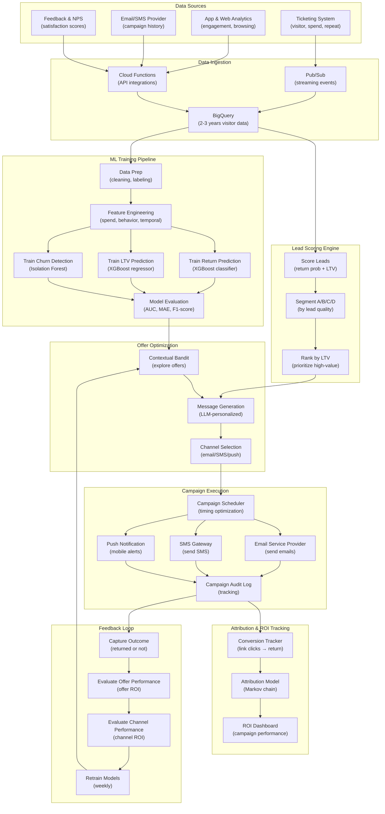

# Lead Generation for Return Visitors & Marketing

> This document outlines the ML solution for identifying and converting high-value prospects into return visitors through targeted marketing campaigns.

---

## 1. ML Problem Statement

### Business Context
The estate needs to increase returning visitors (currently unknown baseline) to improve revenue stability and customer lifetime value. One-time visitors don't generate repeat tickets or ancillary revenue. The family wants to grow from 5,000 to 15,000 daily visitors while maximizing the proportion of loyal, repeat customers.

### Problem Definition
**Primary Objective**: Identify high-value visitor prospects and predict conversion to return visit with personalized marketing

**Key Prediction Targets**:
- **Return visit likelihood**: Probability that a visitor will return within 12 months
- **Optimal offer**: Best discount/incentive to maximize conversion
- **Churn risk**: Identify at-risk customers who might never return
- **Lifetime value (LTV)**: Predict total spend if customer becomes loyal
- **Marketing channel effectiveness**: Which channels drive highest ROI

### Problem Characteristics
- **Classification + Regression**: Predict return (binary) + LTV (continuous)
- **Imbalanced data**: Most visitors don't return (maybe 10-20% baseline)
- **Long feedback loop**: Takes 3-12 months to know if visitor returns
- **Multiple marketing channels**: Email, SMS, push notifications, social media
- **Personalization needed**: Generic emails won't work; needs segment-specific messaging
- **Budget constraints**: Limited marketing spend; must target efficiently

### Success Metrics
| Metric | Target | Description |
|--------|--------|-------------|
| Return visit rate | +30-40% | Increase from baseline (must measure baseline first) |
| Marketing ROI | >= 4:1 | $4 revenue per $1 marketing spend |
| Cost per acquisition | < $15 | Cost per converted return visitor |
| Churn rate | < 15% | % of loyal customers who stop visiting |
| Campaign conversion rate | 5-8% | % of targeted prospects who return |
| LTV prediction accuracy | MAE < $50 | Accuracy of predicted customer value |

---

## 2. ML Solution

### Architecture Overview
Multi-stage funnel: Identify prospects → Predict return likelihood → Select offer → Execute campaign → Measure ROI

#### 2.1 Core Models

**Model 1: Return Visit Prediction (Classification)**
- Algorithm: XGBoost / Gradient Boosting Classifier
- Predicts P(return_within_12_months | visit_data)
- Inputs: Demographics, visit behavior, spend, visit season
- Output: Return probability (0-1) + risk segments

**Model 2: Optimal Offer Recommendation (Recommendation Engine)**
- Algorithm: Contextual Bandits / Thompson Sampling
- Learns which discount level works best per visitor type
- Explores: 10% discount, 15%, 20%, free upgrade, group deal
- Output: Best offer to maximize conversion

**Model 3: Lifetime Value Prediction (Regression)**
- Algorithm: Gradient Boosting Regressor
- Predicts total spend over 3 years if visitor returns
- Inputs: Initial purchase, segment, loyalty tier propensity
- Output: Expected LTV ($)

**Model 4: Churn Risk Detection (Anomaly Detection)**
- Algorithm: Isolation Forest / Statistical thresholds
- Identifies customers at risk of never returning
- Monitors: Inactivity duration, declining spend, poor reviews
- Output: Churn risk score (0-1)

**Model 5: Marketing Channel Attribution (Multi-touch Attribution)**
- Algorithm: Markov Chain / Time decay model
- Determines which channels drive conversions
- Inputs: Marketing touch history, conversion outcome
- Output: Channel contribution weight

#### 2.2 Lead Scoring & Segmentation

```
Lead Scoring Pipeline:
1. Calculate return_probability = XGBoost_classifier(visitor_features)
2. Calculate ltv_prediction = Regression_model(visitor_features)
3. Calculate lead_score = 0.6×return_probability + 0.4×(ltv_prediction/max_ltv)
4. Classify into segments:
   
   Segment A (High-Value Prospects):
     - Return probability > 0.6 AND LTV > $200
     - Action: Premium offer (20% discount + free upgrade)
     - Channel: Email + Push notification
     - Cadence: Every 2 months
   
   Segment B (Medium-Value Prospects):
     - Return probability 0.3-0.6 OR LTV $100-200
     - Action: Standard offer (15% discount)
     - Channel: Email + SMS
     - Cadence: Every 3 months
   
   Segment C (Budget Prospects):
     - Return probability < 0.3 OR LTV < $100
     - Action: Entry offer (10% discount + early bird pricing)
     - Channel: Email only
     - Cadence: Every 4 months
   
   Segment D (Churn Risk):
     - Churn_risk > 0.7
     - Action: Win-back campaign (25% discount + exclusive offer)
     - Channel: Email + Push + SMS
     - Cadence: Targeted retention
```

#### 2.3 Marketing Campaign Workflow

```
Campaign Execution:
1. Generate leads daily: new_visitors - repeat_visitors
2. Score leads using trained models
3. Segment leads by A/B/C/D groups
4. For each segment:
   a. Predict optimal offer using contextual bandit
   b. Generate personalized message (LLM-based)
   c. Select delivery channel (email/SMS/push)
   d. Schedule send time (optimal engagement time)
   e. Track: send timestamp, open, click, conversion
5. Measure ROI: (revenue_from_converters - marketing_spend) / marketing_spend
6. Retrain offer models weekly based on new outcome data
```

---

## 3. Data Requirement

### 3.1 Primary Data Sources

**Source 1: Customer & Visit Data (Ticketing System)**
| Data Point | Collection Method | Frequency | Granularity |
|------------|-------------------|-----------|------------|
| Customer ID | Ticketing registration | Per customer | Persistent |
| Email address | Registration form | Per customer | Persistent |
| Demographics | Optional profile fields | Per customer | When provided |
| Visit date | Ticket purchase/scan | Per visit | Visit-level |
| Spend amount | Transaction total | Per order | Transaction-level |
| Ticket type | Purchased category | Per ticket | Ticket-level |
| Group size | Occupancy count | Per visit | Visit-level |
| Visitor source | Referral tracking | Per visit | Visit-level |
| Repeat flag | Loyalty DB check | Per visit | Visit-level |

**Source 2: Behavior Data (Mobile App & Website)**
| Data Point | Collection Method | Frequency | Granularity |
|------------|-------------------|-----------|------------|
| App usage | Analytics tracking | Real-time | Session-level |
| Pages viewed | Web analytics | Per session | Page-level |
| Time on site | Session duration | Per visit | Session-level |
| Search queries | Analytics tracking | Per search | Query-level |
| Attractions clicked | Clickstream data | Per click | Event-level |
| Purchase funnel | Conversion tracking | Per session | Session-level |

**Source 3: Marketing Engagement Data**
| Data Point | Collection Method | Frequency | Granularity |
|------------|-------------------|-----------|------------|
| Email opens | Email service provider | Per email | Email-level |
| Email clicks | ESP click tracking | Per click | Click-level |
| SMS delivery | SMS gateway | Per SMS | Message-level |
| Push notifications | Mobile analytics | Per notification | Notification-level |
| Campaign conversions | Attribution tracking | Per conversion | Conversion-level |
| Offer redemption | Discount code tracking | Per redemption | Redemption-level |

**Source 4: Feedback & Sentiment Data**
| Data Point | Collection Method | Frequency | Granularity |
|------------|-------------------|-----------|------------|
| Review ratings | Post-visit survey | Post-visit | Review-level |
| NPS score | Annual survey | Annual | Customer-level |
| Price feedback | Comment analysis | Per review | Comment-level |
| Staff feedback | Comment analysis | Per review | Comment-level |

### 3.2 Data Specifications

**Historical Data Requirements**:
- **Minimum**: 2-3 years of visitor data (dates, spend, demographics)
- **Follow-up window**: 12 months of return visit tracking
- **Minimum samples**: 10,000+ unique visitors for training

**Label Definition**:
- **Return visit**: Any repeat visitor within 12 months of initial visit
- **Positive class**: visited within 12 months (return_flag = 1)
- **Negative class**: never returned within 12 months (return_flag = 0)

**Feature Engineering**:
| Category | Features | Computation |
|----------|----------|-------------|
| Temporal | Visit month, season, day-of-week, time-gap-from-today | Date arithmetic |
| Spend | Total spend, average order value, items purchased | Aggregation |
| Behavior | Page views, app sessions, search queries, attractions viewed | Analytics |
| Demographic | Age group, group size, visitor origin (if available) | Profile data |
| Satisfaction | Review rating, NPS, sentiment score | NLP on feedback |
| Marketing | Prior campaign exposure, offer history, channel preference | Attribution |
| Seasonal | School holidays, weather season, competitor events | Calendar |

### 3.3 Data Storage

**BigQuery Datasets**:
```
- visitors: Master customer table
- visits: Transactional visit history
- marketing_campaigns: Email/SMS campaign history
- offer_performance: Redemption and conversion data
- churn_signals: Customer engagement metrics
```

**Data Pipeline**:
```
Ticketing DB → Pub/Sub → BigQuery (visitors, visits)
Email ESP → Cloud Functions → BigQuery (marketing_campaigns)
Mobile Analytics → Dataflow → BigQuery (behavior_data)
Survey API → Cloud Scheduler → BigQuery (feedback_data)
```

---

## 4. Infra Mermaid of Solution



### Infrastructure Components

| Component | GCP Service | Purpose | Scaling |
|-----------|------------|---------|---------|
| **Data Ingestion** | Pub/Sub + Cloud Functions | Real-time visitor data | 100K+ events/sec |
| **Storage** | BigQuery | 2-3 years visitor history | 50GB+ datasets |
| **ML Training** | Vertex AI Training | Train models | 8vCPU, GPU-capable |
| **Lead Scoring** | Vertex AI Prediction | Real-time scoring | Auto-scaling endpoints |
| **Offer Optimization** | Cloud Run | Bandit algorithm | Sub-1s latency |
| **Message Generation** | Vertex AI Generative AI | Personalized messages | 100+ concurrent |
| **Campaign Execution** | Cloud Scheduler + Cloud Functions | Scheduled campaigns | Daily/weekly jobs |
| **Email Service** | SendGrid / Mailgun (3rd party) | Mass email delivery | 100K+ emails/day |
| **SMS Service** | Twilio / AWS SNS (3rd party) | SMS delivery | 10K+ SMS/hour |
| **Attribution** | BigQuery + Custom ML | Multi-touch attribution | Real-time computation |
| **Monitoring** | Cloud Monitoring + Looker | Campaign dashboards | Real-time tracking |

---

## 5. ML Ops

### 5.1 Model Training Schedule

**Daily Operations**:
- Lead scoring: Generate scores for new visitors (batch job 3:00 AM UTC)
- Campaign execution: Select and send campaigns (4:00 AM UTC)
- Outcome tracking: Ingest conversion data throughout day

**Weekly Model Retraining** (Monday 02:00 UTC):
- Retrain return prediction model
- Retrain LTV model
- Retrain churn detection model
- Evaluate on holdout test set
- Deploy if performance improves (AUC +1%)

**Monthly Analysis** (1st of month):
- Review campaign ROI by segment, offer, channel
- Update offer strategies based on performance
- Identify emerging segments or patterns
- A/B test new messaging strategies

### 5.2 Campaign Workflow

**Lead Selection & Scoring** (Daily):
```
1. Load new visitors from last 24 hours
2. Join with historical behavior data
3. Score return probability: model(demographics + spend + behavior)
4. Predict LTV: model(initial_spend + segment + satisfaction)
5. Predict churn risk: anomaly_detection(engagement_metrics)
6. Calculate composite lead_score = 0.6×return_prob + 0.4×(LTV/max_LTV)
7. Segment: A/B/C based on thresholds
8. Rank within segment by LTV
9. Cache scores in Firestore
```

**Offer Selection** (Contextual Bandit):
```
For each lead in segment:
  1. Query bandit algorithm for best offer
     - Bandit maintains exploration vs exploitation
     - Explores: 10%, 15%, 20%, 25%, free upgrade
     - Learns which offer has highest conversion per segment
  
  2. Thompson Sampling:
     - Maintain posterior distribution per arm (offer)
     - Sample from posterior
     - Select offer with highest expected reward
  
  3. Log action for later feedback
```

**Campaign Execution** (4:00 AM UTC):
```
For each segment:
  1. Select top N leads by lead_score (daily budget)
  2. For each lead:
     a. Get assigned offer from bandit
     b. Generate personalized message (LLM):
        "Hi [Name], we'd love to see you again! 
        Here's [offer] just for you. Valid through [date]."
     c. Choose channel: Email (primary) + SMS (high-value) + Push
     d. Schedule send: Optimal time for engagement
     e. Log to audit trail
  
  3. Send via ESP (SendGrid):
     - Track: open, click, conversion
     - Sync back to BigQuery hourly
```

### 5.3 Monitoring & Feedback Loop

**Campaign Metrics** (Real-time Dashboard):
```
Sent Metrics:
  - Leads sent per day (by segment, offer)
  - Email deliverability rate (target: >98%)
  - SMS delivery rate (target: >95%)

Engagement Metrics:
  - Open rate (email, target: >20%)
  - Click-through rate (target: >5%)
  - SMS read rate (target: >60%)

Conversion Metrics:
  - Return visit rate (target: 5-8%)
  - Conversion rate by segment (A, B, C, D)
  - Conversion rate by offer (10%, 15%, 20%)
  - Conversion rate by channel (email vs SMS vs push)

ROI Metrics:
  - Revenue from converters
  - Cost per converted lead
  - Marketing ROI (revenue / spend)
  - Payback period (days to ROI)
```

**Feedback Loop** (Weekly):
```
1. Measure actual return visits (within 2 weeks)
2. Compare return rate vs predicted return probability
   - Calibration check: predicted 60% should have ~60% actual return
3. Measure offer effectiveness:
   - 10% offer: X% conversion rate
   - 15% offer: Y% conversion rate
   - Winner: highest (conversion_rate × profit_margin)
4. Measure channel effectiveness:
   - Email channel: Z% conversion rate
   - SMS channel: W% conversion rate
   - Push channel: V% conversion rate
5. Update bandit algorithm with outcomes
6. Identify underperforming segments → investigate
```

### 5.4 Alerts & Anomaly Detection

| Alert Type | Threshold | Action |
|-----------|-----------|--------|
| Low conversion rate | < 3% | Review targeting, offer attractiveness |
| High unsubscribe rate | > 2% | Reduce frequency, improve personalization |
| Model drift | AUC drops > 5% | Immediate retrain, investigate data shift |
| Email deliverability | < 95% | Contact ESP, check sender reputation |
| Campaign ROI negative | Loss margin > 10% | Pause campaign, increase discount or retarget |
| Lead quality drop | <50% scoreable leads | Check data pipeline, investigate visitor quality change |

---

## 6. Caveats to Consider

### 6.1 Model Challenges

| Challenge | Impact | Mitigation |
|-----------|--------|-----------|
| **Class imbalance** | 80-90% negatives (non-returners) | Use SMOTE, class weights, stratified CV |
| **Long feedback lag** | Takes 12 months to know outcome | Use proxy metrics (engagement) + short-term returns |
| **Data leakage** | Future info leaks into model | Temporal split only; prevent future purchase leakage |
| **Seasonality** | Holiday visitors have different patterns | Segment by season; separate models for peak/off-season |
| **Concept drift** | Visitor behavior changes over time | Quarterly retraining; drift detection |

### 6.2 Marketing Risks

| Risk | Consequence | Mitigation |
|------|-------------|-----------|
| **Email fatigue** | High unsubscribe rates, brand damage | Frequency cap: max 2 emails/month per person |
| **Offer cannibalization** | Discount attracts only bargain hunters | Use tiered offers; premium offers for high-LTV |
| **Privacy violations** | GDPR/privacy law violations | Explicit opt-in; easy unsubscribe; store only necessary data |
| **Demographic bias** | Model favors certain groups unfairly | Audit for demographic parity; diversity in training data |
| **Personalization failures** | Generic or irrelevant messages | LLM-based personalization; A/B test messages |

### 6.3 Data Quality Issues

| Issue | Effect | Solution |
|-------|--------|---------|
| **Incomplete email addresses** | Can't send campaigns to ~10% of visitors | Make email required at booking; collect post-visit |
| **Email bounces** | Invalid emails waste send budget | Validate emails at signup; maintain suppression list |
| **GDPR unsubscribes** | Lost contacts due to privacy | Manual unsubscribe management; honor requests immediately |
| **Duplicate records** | Same person multiple customer IDs | Dedup on email + name; merge records before modeling |
| **Missing demographics** | Can't segment without age/location | Optional profile fields; infer from booking patterns |

### 6.4 Operational Constraints

| Constraint | Issue | Workaround |
|-----------|-------|-----------|
| **Email sending limits** | ESP rate limits (e.g., 100K/day) | Batch campaigns over hours; use multiple senders |
| **SMS cost** | Expensive per message ($0.01-0.05) | Limit SMS to high-value (segment A); prefer email |
| **Push notification fatigue** | Users disable notifications | Reserve for urgent/valuable offers only |
| **Manual campaign overrides** | Staff want to exclude certain visitors | Flag mechanism; admin override with audit log |
| **Campaign coordination** | Multiple teams want to send campaigns | Centralized campaign calendar; prevent message overlap |

### 6.5 Attribution & Measurement Issues

| Issue | Impact | Approach |
|-------|--------|----------|
| **Multi-touch attribution** | Hard to credit correct channel | Markov Chain / time decay model |
| **Control group comparison** | Need to compare vs no campaign | Holdout 10% of leads as control group |
| **External factors** | New attractions, holidays drive returns | Control for seasonality, events in attribution |
| **Return visits from multiple campaigns** | Which campaign gets credit? | Last-click attribution or Markov model |

### 6.6 Recommendation Priorities

**Immediate (MVP)** - Weeks 1-4:
1. ✅ Set up data pipeline (visitor → BigQuery)
2. ✅ Train baseline return prediction model
3. ✅ Manual lead scoring (rule-based)
4. ✅ Simple email campaigns (all leads, standard offer)

**Phase 2** - Weeks 5-12:
1. Segment leads (A/B/C groups)
2. Contextual bandit offer selection
3. Channel selection (email + SMS)
4. Campaign ROI tracking dashboard

**Phase 3** - Weeks 13-24:
1. LLM-based message personalization
2. Churn risk detection + win-back campaigns
3. Multi-touch attribution
4. Lookalike modeling (find new prospects like best customers)

---

## 7. Success Criteria & KPIs

| KPI | Baseline | Target | Timeline |
|-----|----------|--------|----------|
| Return visit rate | TBD (measure first) | +30-40% | Week 12 |
| Campaign conversion rate | N/A | 5-8% | Week 8 |
| Email open rate | Industry avg 18% | 25% | Week 6 |
| Click-through rate | Industry avg 3% | 6% | Week 8 |
| Marketing ROI | N/A | >= 4:1 | Week 12 |
| Cost per converted lead | N/A | < $15 | Week 10 |
| Churn rate | N/A | < 15% | Week 16 |

