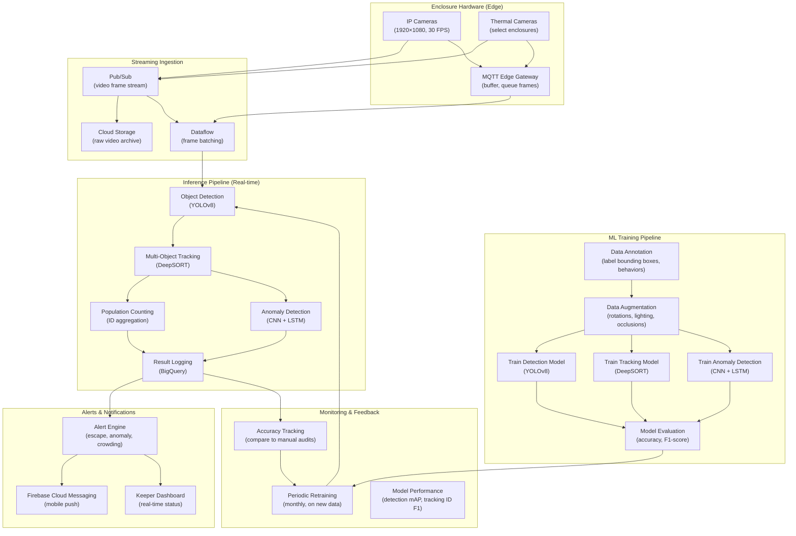

# Vision-Based Animal Population Counting

> This document outlines the computer vision ML solution for automatically monitoring animal populations and health indicators in enclosures, critical for animal welfare and regulatory compliance.

---

## 1. ML Problem Statement

### Business Context
The estate has 200+ animals across 55 enclosures. Manual counting is time-consuming and error-prone. Regulatory compliance requires accurate population tracking (especially for the "jumping piranha collection"). Real-time monitoring enables early detection of animal escapes, fights, or health issues.

### Problem Definition
**Primary Objective**: Automatically count and track animals in real-time using camera feeds

**Key Prediction Targets**:
- **Population count**: Accurate headcount per enclosure
- **Individual identification**: Track specific animals (for endangered/valuable animals)
- **Behavior anomalies**: Detect illness, stress, aggression, unusual patterns
- **Occupancy alerts**: Alert if count drops (escape) or rises (unauthorized entry)
- **Health indicators**: Detect visible wounds, limping, abnormal positioning

### Problem Characteristics
- **Computer vision task**: Real-time video processing from fixed cameras
- **Multiple species**: Different counting logic for fish, birds, mammals
- **Varying conditions**: Lighting changes, water clarity, mud, vegetation
- **Crowding**: Animals overlap; counting challenging when packed
- **Regulatory need**: Accurate logs for inspections and compliance
- **Continuous monitoring**: 24/7 operation; must handle edge cases

### Success Metrics
| Metric | Target | Description |
|--------|--------|-------------|
| Counting accuracy | 95%+ | Correct population count vs manual audit |
| False positive alerts | < 2% | Avoid alert fatigue from false alarms |
| Processing latency | < 5 sec | Real-time response to escape detection |
| Uptime | 99%+ | Reliable 24/7 monitoring |
| Species accuracy | 98%+ | Correct species identification where needed |
| Anomaly detection F1 | > 0.85 | Balance recall (catch issues) vs precision (avoid false positives) |

---

## 2. ML Solution

### Architecture Overview
Multi-stage computer vision pipeline: Capture → Detection → Tracking → Counting → Analysis

#### 2.1 Core Components

**Component 1: Object Detection (YOLOv8 / Faster R-CNN)**
- Detects individual animals in video frame
- Draws bounding boxes around each animal
- Handles occlusion and crowding
- Input: Video frame (1920×1080 typical)
- Output: Bounding boxes + confidence scores

**Component 2: Multi-Object Tracking (DeepSORT / ByteTrack)**
- Assigns unique ID to each animal
- Tracks across video frames
- Handles temporary occlusions
- Input: Detection boxes from frame t-1, frame t
- Output: Tracked object IDs + trajectories

**Component 3: Population Counting (Aggregation)**
- Counts unique tracked IDs per enclosure
- Filters false positives and noise
- Compares to previous count
- Input: Tracked object list per frame
- Output: Final population count + confidence

**Component 4: Behavior Anomaly Detection (CNN + Transformer)**
- Analyzes animal positioning and movement patterns
- Detects illness indicators: lying still, limping, head drooping
- Detects aggression: chasing, fighting, herding
- Detects escape attempts: persistent wall-climbing
- Input: Animal bounding box + motion history
- Output: Anomaly classification (normal, stress, injury, aggression, escape)

**Component 5: Species Identification (Custom CNN)**
- Optional: Identify species if enclosure contains mixed animals
- Classifies bounding box into species
- Input: Cropped animal image
- Output: Species label + confidence

#### 2.2 Counting Algorithm

```
For each enclosure E with camera stream:

1. VIDEO PROCESSING (per 5 seconds):
   a. Grab current frame from camera
   b. Run YOLOv8 object detection
   c. Filter by confidence > 0.7
   d. Get bounding boxes: [(x1,y1,x2,y2), ...]

2. TRACKING (frame by frame):
   a. Match current bounding boxes to previous frame IDs using DeepSORT
   b. Calculate centroid distance, appearance similarity
   c. Assign ID to each detection
   d. Log trajectory for each animal: {id: [(frame, x, y, behavior)...]}

3. COUNTING (every 30 seconds):
   a. Count unique IDs in last 30-second window
   b. Filter out likely false positives:
      - IDs with < 5 detections in 30s (noise)
      - IDs with bounding box area < min_area (reflection/debris)
   c. Count valid_ids = final_population
   
4. ANOMALY DETECTION (per tracked animal):
   a. Analyze last 5 frames of trajectory
   b. Extract features:
      - Movement velocity, acceleration
      - Position in enclosure (center vs edge)
      - Time since last movement (stillness)
      - Body orientation changes
   c. Run anomaly detector (CNN + LSTM):
      - Model trained on labeled normal/abnormal videos
      - Output: abnormality_score (0-1)
      - If abnormality_score > 0.7:
        * Classify type (injury, stress, aggression, etc.)
        * Alert keeper with video clip + ID

5. ALERTS:
   a. Count change > 10% OR count < expected_min:
      - Alert: Possible escape, check immediately
   b. Anomaly_score > 0.7 for any animal:
      - Alert: Potential health/behavioral issue
   c. Sustained crowding (occupancy > 90%):
      - Alert: Overcrowding risk
```

#### 2.3 Species-Specific Considerations

**Fish Enclosures** (aquatic):
- Challenges: Reflections, water movement, low visibility
- Solution: Background subtraction + motion detection
- Counting: Silhouette-based, not color-based
- Behavior: Aggregation patterns indicate stress

**Bird Enclosures** (aerial):
- Challenges: Fast movement, fleeting detections
- Solution: Higher FPS camera (60 FPS); tracking over time
- Counting: Return to perches; count from roosting positions
- Behavior: Perching patterns; flight erraticism = stress

**Mammal/Reptile Enclosures** (terrestrial):
- Challenges: Camouflage, resting/hiding
- Solution: Thermal imaging for hidden animals
- Counting: Time-lapse aggregation (count over day)
- Behavior: Gait analysis, posture recognition

---

## 3. Data Requirement

### 3.1 Primary Data Sources

**Source 1: Camera Feeds (RTMP/RTSP Streaming)**
| Data Point | Collection Method | Frequency | Specifications |
|------------|-------------------|-----------|-----------------|
| Video feed | Fixed IP cameras per enclosure | Continuous 24/7 | 1920×1080, 30 FPS, H.264 codec |
| Thermal imaging | Thermal cameras (select enclosures) | Continuous 24/7 | 320×256, 30 FPS (for hidden animals) |
| Frame snapshots | Extract from stream | Every 5 seconds | JPEG, for processing |

**Source 2: Ground Truth Annotations (Training Data)**
| Data Point | Collection Method | Frequency | Details |
|------------|-------------------|-----------|---------|
| Manual counts | Keeper manual audit | Daily | Enclosure ID, time, count, notes |
| Labeled videos | Annotator labeling | Weekly | 50 videos x 5 min = 250 min/week |
| Anomaly videos | Incident capture + labeling | As they occur | Rare; ~10-20 per month |
| Thermal ground truth | Keeper validation | Weekly | For thermal model training |

### 3.2 Data Specifications

**Training Data Requirements**:
- **Object Detection**: 5,000+ labeled images per species (bounding boxes)
- **Tracking**: 100+ hours of continuous video with ID annotations
- **Behavior Anomalies**: 500+ labeled video clips (normal vs abnormal)
- **Species Classification**: 3,000+ cropped animal images per species (if needed)

**Dataset Composition**:
- 70% training (labeled video data)
- 15% validation (labeled video data)
- 15% test (held-out recent data for performance evaluation)

**Annotation Details**:
- Bounding box format: (x_min, y_min, x_max, y_max, class_id)
- Tracking IDs: Persistent across frames
- Behavior labels: {normal, injured, stressed, aggressive, escape_attempt}
- Confidence scores: Annotator agreement (multi-annotator average)

### 3.3 Feature Engineering

**Visual Features** (extracted per animal):
- Bounding box area, aspect ratio, centroid position
- Color histogram (if not in thermal)
- Edge density (detect injuries/wounds)
- Movement velocity, acceleration
- Time spent in specific regions (preference patterns)

**Sequence Features** (across time):
- Trajectory smoothness (erratic = stress)
- Stillness duration (lying still = potentially injured)
- Aggregation patterns (clustering = social/panic)
- Perching/resting frequency (birds)

**Enclosure Context Features**:
- Lighting conditions (bright, dim, night)
- Water clarity (for aquatic)
- Enclosure occupancy percentage
- Time of day (activity patterns vary)

### 3.4 Data Storage

**Streaming Data Pipeline**:
```
IP Cameras (RTMP/RTSP) → GCP Cloud Pub/Sub → Cloud Storage (video archives)
                      ↓
                 Dataflow (real-time processing)
                      ↓
                 Vertex AI Prediction (inference)
                      ↓
                 BigQuery (logs, counts, anomalies)
```

**Storage Structure**:
```
- video_archive/: Raw video segments (daily, per enclosure)
- detection_logs/: Bounding box predictions (frame-level)
- tracking_logs/: Tracked object IDs + trajectories
- population_counts/: Aggregated counts (30-min summaries)
- anomaly_detections/: Flagged behaviors + incident videos
- ground_truth/: Manual annotations (training data)
```

---

## 4. Infra Mermaid of Solution



### Infrastructure Components

| Component | GCP Service | Purpose | Specs |
|-----------|------------|---------|-------|
| **Streaming** | Pub/Sub | Ingest video frame stream | 100+ topics for 55 enclosures |
| **Storage** | Cloud Storage | Archive raw video | 100GB+/day (55 enclosures × 24h) |
| **Processing** | Dataflow | Real-time frame processing | Auto-scaling workers |
| **ML Training** | Vertex AI Training | Train detection/tracking models | GPU (A100 preferred) |
| **Inference** | Vertex AI Prediction | Real-time object detection | 50 concurrent endpoints |
| **Tracking** | Custom service (Cloud Run) | Multi-object tracking (DeepSORT) | 1-2s per frame |
| **Logging** | BigQuery | Store counts, anomalies, logs | 100K rows/day |
| **Alerts** | Cloud Functions + FCM | Send alerts to keepers | Real-time messaging |
| **Dashboard** | Looker Studio / Cloud Console | Visualization | Real-time enclosure status |

---

## 5. ML Ops

### 5.1 Model Training Workflow

**Initial Setup** (Weeks 1-4):
```
1. Install cameras in all 55 enclosures
2. Record 2 weeks of baseline video (continuous)
3. Manual annotation:
   - Draw bounding boxes (~5,000 images per species)
   - Label behaviors (~500 video clips)
   - Create training dataset
4. Train initial models:
   - YOLOv8 detection (5 epochs, 8 GPU hours)
   - DeepSORT tracking (3 epochs, 4 GPU hours)
   - CNN-LSTM anomaly detection (10 epochs, 8 GPU hours)
```

**Ongoing Training** (Monthly):
```
1. Collect new ground truth:
   - Manual audit counts (weekly)
   - Incident videos (as they occur)
   - Annotation: 500+ new training frames
2. Retrain models:
   - Detection: Add new frames, 2 epochs fine-tuning (2 GPU hours)
   - Tracking: Extend tracking data, 1 epoch fine-tuning (1 GPU hour)
   - Anomaly: Add incident examples, 3 epochs fine-tuning (3 GPU hours)
3. Evaluate on holdout test set
4. Deploy if accuracy improves (mAP +1% or F1 +2%)
```

**Continuous Improvement** (Weekly):
```
- Review detection failures (false negatives)
- Collect misclassified examples for retraining
- Audit anomaly alerts for false positives
- Calibrate thresholds based on actual outcomes
```

### 5.2 Inference & Alerting Pipeline

**Real-time Processing** (per 5 seconds):
```
1. Grab latest frame from camera feed
2. Run YOLOv8 detection (GPU, ~100ms)
3. Match detections to previous frame IDs (DeepSORT)
4. Update tracking trajectories
5. Aggregate unique IDs for population count
6. Analyze anomalies using LSTM
7. Log results to BigQuery
8. Check alerts:
   - If count_change > 10%: ESCAPE ALERT
   - If anomaly_score > 0.7: HEALTH/BEHAVIOR ALERT
   - If occupancy > 90%: CROWDING ALERT
```

**Alert Workflow**:
```
When alert triggered:
1. Generate alert message (enclosure, issue, severity)
2. Attach video clip (last 30 seconds)
3. Send via Firebase Cloud Messaging to keeper's phone
4. Log to audit trail
5. Re-assess every 1 minute until issue resolved
```

### 5.3 Monitoring & Accuracy Tracking

**Daily Metrics**:
```
Detection Metrics:
  - mAP (mean Average Precision, target > 0.90)
  - Per-species recall (target > 0.95)
  - False positive rate (target < 2%)

Tracking Metrics:
  - ID F1-score (correct tracking efficiency, target > 0.85)
  - MOTA (Multiple Object Tracking Accuracy, target > 0.90)
  - Identity switches (ID swaps, target < 5%)

Counting Accuracy:
  - Compare automated count vs manual audit (weekly)
  - MAPE (mean absolute percentage error, target < 5%)
  - By species breakdown

Anomaly Detection:
  - Precision (avoid false alarms, target > 0.95)
  - Recall (catch actual issues, target > 0.80)
  - F1-score (balance, target > 0.85)
```

**Manual Audits** (Weekly):
```
Process:
1. Keeper manually counts animals in 5-10 random enclosures
2. Compare to automated system counts
3. Investigate discrepancies
4. Retrain on misclassified examples
5. Adjust detection/tracking parameters if needed
```

### 5.4 Failure Modes & Recovery

| Failure Mode | Detection | Recovery |
|--------------|-----------|----------|
| **Camera down** | Streaming stops | Alert ops; retry connection |
| **Poor image quality** | Blurry, overexposed frames | Adjust camera settings; retrain on varied lighting |
| **Crowding** | Detection accuracy drops | Use historical average; escalate to manual counting |
| **Thermal image unavailable** | Thermal feed missing | Use visible light detection only |
| **Model drift** | Accuracy drops >5% | Immediate retrain on recent data |

---

## 6. Caveats to Consider

### 6.1 Technical Challenges

| Challenge | Impact | Mitigation |
|-----------|--------|-----------|
| **Occlusion** | Can't detect fully hidden animals | Use thermal imaging for caves/dens; estimate from group behavior |
| **Reflection/glare** | False positives from water/glass | Background subtraction; polarized filters on cameras |
| **Motion blur** | Fast-moving animals undetected | Increase FPS (60 vs 30); use faster shutter speed |
| **Lighting changes** | Model trained on day fails at night | Augment training data with night footage; infrared cameras |
| **Species confusion** | Misclassify similar-looking animals | Fine-grained classification; multiple camera angles |

### 6.2 Operational Issues

| Issue | Consequence | Solution |
|-------|-----------|---------|
| **Alert fatigue** | Staff ignores real alerts | Aggressive threshold tuning; group minor alerts |
| **Camera maintenance** | Dirty/damaged lenses → poor images | Weekly lens cleaning; hardware monitoring |
| **Network drops** | Loss of real-time data | Edge MQTT broker; local buffering + sync |
| **Keeper resistance** | Staff don't trust system | Education; show accuracy statistics; gradual rollout |
| **Regulatory audits** | Must have audit trail of system decisions | Maintain detailed logs; export for compliance |

### 6.3 Animal Welfare Concerns

| Concern | Risk | Approach |
|---------|------|----------|
| **Camera stress** | Lights/infrared bother animals | Use low-light cameras; minimize intrusive lighting |
| **Privacy** | Animals should have hiding places | Don't require 100% visible detection; accept blind spots |
| **Accuracy failures** | Missed escape = animal safety risk | Redundant cameras per enclosure; manual audits as backup |
| **Over-reliance** | Staff stops manual checking | Regular spot-checks; manual audits as ground truth |

### 6.4 Data & Privacy Issues

| Issue | Impact | Mitigation |
|-------|--------|-----------|
| **Video storage costs** | 100GB/day = $3K+/month | Compress H.265; delete after 30 days unless incident |
| **Privacy violations** | Continuous recording could capture staff | Limit camera scope to animal areas only |
| **Data breaches** | Video leaks could show vulnerable animals | Encrypt videos; access control; audit logs |

### 6.5 Recommendation Priorities

**Immediate (MVP)** - Weeks 1-8:
1. Install cameras + thermal imaging
2. Collect & annotate training data
3. Train baseline detection + tracking models
4. Deploy with manual verification
5. Weekly accuracy audits

**Phase 2** - Weeks 9-16:
1. Fine-tune models on enclosure-specific data
2. Implement anomaly detection
3. Alert automation
4. Dashboard for keepers

**Phase 3** - Weeks 17-24:
1. Multi-enclosure view / comparison
2. Individual animal identification (for endangered species)
3. Advanced behavior analytics
4. Predictive health alerts (before obvious symptoms)

---

## 7. Success Criteria & KPIs

| KPI | Target | Timeline |
|-----|--------|----------|
| Detection mAP | > 0.90 | Week 8 |
| Tracking accuracy (MOTA) | > 0.90 | Week 10 |
| Population count accuracy (MAPE) | < 5% | Week 12 |
| Anomaly detection F1 | > 0.85 | Week 16 |
| Manual audit count match | > 95% | Week 12 |
| Alert false positive rate | < 2% | Week 12 |

