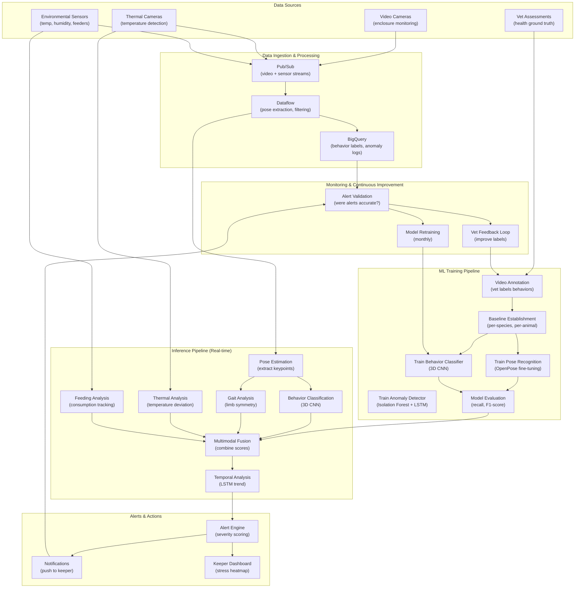

# Behavior & Stress Recognition in Animals

> This document outlines the ML solution for detecting behavioral stress, illness, and emotional states in animals through computer vision and sensor data analysis.

---

## 1. ML Problem Statement

### Business Context
Animal welfare is critical for both ethics and reputation. Sick or stressed animals:
- Require immediate veterinary care (cost & welfare)
- May become dangerous to visitors or staff
- Reduce visitor experience (people avoid sad animals)
- Create compliance/legal risks (animal cruelty allegations)

Early detection of stress/illness enables proactive intervention, reducing costs and animal suffering.

### Problem Definition
**Primary Objective**: Automatically detect behavioral indicators of stress, illness, or emotional distress

**Key Prediction Targets**:
- **Stress indicators**: Pacing, excessive vocalizing, aggression, withdrawn behavior
- **Illness indicators**: Limping, head drooping, loss of appetite, unusual posturing
- **Emotional state**: Content/active vs distressed/lethargic
- **Specific conditions**: Heat stress, dehydration, malnutrition (visual cues)
- **Injury detection**: Visible wounds, abnormal gait, favoring limbs

### Problem Characteristics
- **Multi-modal data**: Video (behavior) + temperature sensors + feeding data
- **Species-specific**: Different species show stress differently
- **Contextual**: Normal resting looks different from illness
- **Gradual degradation**: Condition worsens over days/weeks
- **Annotation challenge**: Only domain experts (vets) can label ground truth
- **High cost of false negatives**: Missing sick animal is unacceptable

### Success Metrics
| Metric | Target | Description |
|--------|--------|-------------|
| Stress recall | > 0.90 | Catch 90%+ of genuinely stressed animals |
| False positive rate | < 5% | Minimize alert fatigue |
| Detection latency | < 1 hour | Alert within 1 hour of stress onset |
| Illness recall | > 0.85 | Catch 85%+ of sick animals |
| Keeper acceptance | >= 4.0/5.0 | Staff trust and use system |
| Time to diagnosis | < 12 hours | Alert keepers before condition worsens |

---

## 2. ML Solution

### Architecture Overview
Multi-modal behavior analysis: Video behavior + Sensor data + Feeding data → Anomaly detection

#### 2.1 Core Components

**Component 1: Video Behavior Analysis (CNN + Temporal)**
- Detects posture, movement, social behavior
- Models: Pose estimation (OpenPose) + action recognition (3D CNN)
- Inputs: Video frames from enclosure camera
- Outputs: Behavior classification (pacing, resting, eating, playing, aggression)

**Component 2: Gait Analysis (Pose-based)**
- Extracts skeleton from video
- Analyzes limb movement patterns
- Detects lameness, limping, pain responses
- Inputs: Pose landmarks (joints) over time
- Outputs: Gait abnormality score

**Component 3: Thermal Analysis (Infrared)**
- Detects fever (elevated surface temperature)
- Detects shock/cold (low temperature)
- Uses thermal camera feed
- Inputs: Thermal image
- Outputs: Temperature deviation from species baseline

**Component 4: Sensor Fusion (Multimodal Anomaly Detection)**
- Combines video + thermal + feeding + activity data
- Detects correlations (e.g., fever + lethargy + no eating)
- Uses ensemble of anomaly detectors
- Inputs: All modalities
- Outputs: Stress/illness severity score

**Component 5: Contextual Reasoning (LSTM)**
- Considers temporal patterns
- Normal: Brief rest is fine; prolonged immobility = concern
- Learns species & individual baseline patterns
- Inputs: Time series of anomaly scores
- Outputs: Trend (improving, stable, worsening)

#### 2.2 Stress Detection Algorithm

```
For each animal in enclosure E:

1. VIDEO BEHAVIOR ANALYSIS (per 5 seconds):
   a. Extract pose landmarks using OpenPose
   b. Classify action using 3D CNN:
      - Resting, walking, running, eating, social_interaction, aggression
   c. Analyze posture:
      - Head height (low = distress)
      - Spine curvature (hunched = pain)
      - Ear position (back = stress)
   d. Score behavior normalcy: behavior_score (0-1)
      If behavior_score < 0.4: RED FLAG

2. GAIT ANALYSIS (per movement episode):
   a. Track joint positions over 10 frames
   b. Calculate:
      - Stride length asymmetry (limping indicator)
      - Movement speed deviation from baseline
      - Weight bearing on each limb
   c. Gait abnormality score = 1 - symmetry
   d. If gait_score > 0.3: RED FLAG

3. THERMAL ANALYSIS (every 1 minute):
   a. Capture thermal image
   b. Extract animal core temperature estimate
   c. Compare to species baseline + individual baseline
   d. Fever_deviation = (current_temp - baseline_temp) / baseline_temp
   e. If abs(fever_deviation) > 0.05: RED FLAG

4. FEEDING DATA ANALYSIS (per feeding cycle):
   a. Track food consumed vs expected
   b. Compare to individual's weekly average
   c. If current_consumption < 0.7 × average: RED FLAG

5. MULTIMODAL FUSION:
   a. Combine scores:
      stress_score = w1×behavior_score + w2×gait_score + 
                     w3×fever_score + w4×feeding_score
      where w1=0.4, w2=0.2, w3=0.2, w4=0.2
   
   b. Classify severity:
      - stress_score < 0.3: Normal
      - 0.3-0.5: Monitor
      - 0.5-0.7: Concerning
      - > 0.7: Alert immediately

6. TEMPORAL CONTEXT (LSTM analysis):
   a. Feed stress_score time series to LSTM
   b. Model outputs: trend (improving vs worsening)
   c. If trend = "worsening" over 6 hours: Escalate alert

7. ALERT DECISION:
   if stress_score > 0.5 AND trend = "worsening":
     ALERT = High priority
   elif stress_score > 0.6:
     ALERT = Medium priority
   elif stress_score > 0.5:
     ALERT = Low priority
```

#### 2.3 Species-Specific Baselines

**Aquatic Animals** (Fish, Turtles):
- Baseline: Distributed spacing, normal swimming speed
- Stress indicators: Clustering (huddling), erratic movement, surface gasping
- Illness: Floating (breathing heavily), rigid posture, color loss

**Birds**:
- Baseline: Perching, grooming, foraging
- Stress indicators: Constant head movement, pacing, over-preening
- Illness: Ruffled feathers, reduced movement, ground sitting

**Mammals/Reptiles**:
- Baseline: Exploration, social interaction, active periods
- Stress indicators: Pacing, aggression, self-injury, extreme inactivity
- Illness: Discharge, limping, hunched posture, head drooping

---

## 3. Data Requirement

### 3.1 Primary Data Sources

**Source 1: Video Feeds (Enclosure Cameras)**
| Data Point | Collection | Frequency | Specs |
|------------|-----------|-----------|-------|
| Video stream | IP cameras | Continuous 24/7 | 1080p, 30 FPS |
| Pose keypoints | Extracted via OpenPose | Per frame | 17+ joint coordinates |

**Source 2: Thermal Imaging**
| Data Point | Collection | Frequency | Specs |
|------------|-----------|-----------|-------|
| Thermal frames | Thermal cameras | Every 1-2 min | 320×256, calibrated |

**Source 3: Enclosure Sensors**
| Data Point | Collection | Frequency | Specs |
|------------|-----------|-----------|-------|
| Enclosure temperature | DHT22 sensor | Every 5 min | Celsius |
| Humidity | DHT22 sensor | Every 5 min | % RH |
| Food weight | Load cell on feeder | Per feeding | grams |
| Water quality | pH, dissolved O2 sensors | Every 30 min | Digital |

**Source 4: Manual Vet Assessments**
| Data Point | Collection | Frequency | Specs |
|------------|-----------|-----------|-------|
| Health score | Vet check | Weekly | 1-5 scale |
| Condition notes | Vet observations | Weekly | Text notes |
| Treatment history | Medical records | As needed | Date + treatment |

### 3.2 Data Specifications

**Training Data Requirements**:
- **Behavior video**: 100+ hours of labeled video (normal + stressed)
- **Labeled behaviors**: 5,000+ annotated video clips (action + emotional state)
- **Thermal training**: 1,000+ thermal images with temperature ground truth
- **Vet-labeled health**: 500+ video clips labeled by veterinarian (healthy vs sick)

**Ground Truth Labels**:
- Behavior: {resting, active, eating, social, aggression, stress, illness}
- Stress level: {none, mild, moderate, severe}
- Illness indicators: {lethargy, fever, loss_of_appetite, visible_injury, abnormal_gait}

### 3.3 Baseline Establishment

**Per-Animal Baseline** (Individual):
- Normal activity patterns (sleep hours, activity hours)
- Normal movement speed / gait
- Baseline temperature (per species + individual variation)
- Normal feeding consumption
- Personality traits (naturally shy vs social)

**Per-Species Baseline** (Group):
- Typical behavior repertoire
- Normal social structure
- Species-specific stress signals
- Species-specific illness indicators

### 3.4 Data Storage Pipeline

```
Video Cameras → Pub/Sub → Cloud Storage (archive)
                      ↓
                Dataflow (pose extraction)
                      ↓
                BigQuery (pose keypoints + behavior labels)

Thermal Cameras → MQTT → Pub/Sub → BigQuery (thermal logs)

Feeder Sensors → MQTT → Pub/Sub → BigQuery (feeding logs)

Vet Assessments → Manual input → BigQuery (health labels)
```

---

## 4. Infra Mermaid of Solution



### Infrastructure Components

| Component | GCP Service | Purpose | Scaling |
|-----------|------------|---------|---------|
| **Video Ingestion** | Pub/Sub | Stream video frames | 55 enclosures, 30 FPS |
| **Pose Extraction** | Dataflow + Vertex AI | Extract skeleton keypoints | Auto-scaling workers |
| **Behavior Classification** | Vertex AI Prediction | 3D CNN inference | GPU-accelerated endpoints |
| **Anomaly Detection** | Vertex AI AutoML | Multimodal anomaly scoring | Managed service |
| **Temporal Analysis** | Cloud Run | LSTM trend detection | Auto-scaling containers |
| **Alerting** | Cloud Functions + FCM | Push alerts to keepers | Real-time messaging |
| **Storage** | BigQuery | Logs, labels, audit trail | 100K+ rows/day |
| **Dashboard** | Looker / Grafana | Real-time stress monitoring | Custom visualizations |

---

## 5. ML Ops

### 5.1 Training & Retraining

**Initial Setup** (Weeks 1-6):
```
1. Collect 100+ hours of video (normal + stressed animals)
2. Veterinarian labels:
   - Behavioral categories (500+ clips)
   - Stress levels (500+ clips)
   - Illness indicators (200+ clips)
3. Extract baseline patterns:
   - Per-species activity schedules
   - Per-animal personality profiles
   - Normal temperature ranges
4. Train models:
   - Pose estimation: Fine-tune OpenPose (2 GPU days)
   - Behavior classifier: 3D CNN (5 GPU days)
   - Anomaly detector: Isolation Forest + LSTM (3 GPU days)
```

**Monthly Retraining**:
```
1. Collect new vet assessments (weekly health checks)
2. Curate new labeled video clips (50+ new samples)
3. Update baselines:
   - Seasonal activity changes
   - Individual aging/development
4. Retrain models with new data (2 GPU hours each)
5. Evaluate on holdout test set
6. Deploy if recall improves by 2%+
```

### 5.2 Baseline Management

**Per-Animal Baseline** (Established in Week 2, Updated Monthly):
```
For each animal ID:
  - Normal sleep schedule (learned from first 2 weeks)
  - Normal activity level (% active hours per day)
  - Baseline temperature (average of 100 readings)
  - Normal feeding amount (per species + individual)
  - Personality traits (social vs withdrawn baseline)

Update monthly:
  - Incorporate seasonal changes
  - Account for aging
  - Reset if major life event (relocation, treatment)
```

### 5.3 Alert Pipeline & Severity Levels

**Real-time Processing** (per 5 seconds):
```
1. Extract pose from latest video frame
2. Classify behavior using 3D CNN
3. Analyze gait for abnormalities
4. Check thermal for temperature deviation
5. Combine scores via multimodal fusion
6. Feed time series to LSTM for trend

If stress_score increases OR trend = "worsening":
  Generate alert with severity
```

**Alert Severity Levels**:
| Level | Criteria | Action |
|-------|----------|--------|
| **Low** | stress_score 0.4-0.5 | Log for reference; weekly review by keeper |
| **Medium** | stress_score 0.5-0.7 | Notify keeper via dashboard; suggest observation |
| **High** | stress_score > 0.7 | Push notification to keeper; recommend vet check |
| **Urgent** | Rapid worsening + high score | Immediate push + SMS; request immediate check |

### 5.4 Validation & Feedback Loop

**Weekly Alert Accuracy Check**:
```
Process:
1. For each alert issued last week:
   a. Keeper notes: Was animal actually sick/stressed?
   b. Vet assessment: Did animal need treatment?
   c. Outcome: How did animal condition evolve?

2. Calculate metrics:
   - True positive rate (alerts that matched real issues)
   - False positive rate (alerts with no issue)
   - Alert latency (how early we detected problem)

3. Retrain on misclassified examples
4. Adjust thresholds if accuracy drops
```

---

## 6. Caveats to Consider

### 6.1 Model Challenges

| Challenge | Impact | Mitigation |
|-----------|--------|-----------|
| **Species variation** | Model trained on cats fails on birds | Species-specific models; separate training sets |
| **Individual differences** | Same behavior means different things per animal | Per-animal baselines; allow customization |
| **False positives** | Normal rest looks like illness | LSTM context; require sustained signal before alert |
| **Occlusion** | Can't see full animal in group settings | Use inferred gait from partial skeleton |
| **Annotation quality** | Vet disagreement on stress labels | Multi-annotator labels; use agreement threshold |

### 6.2 Operational Risks

| Risk | Consequence | Mitigation |
|------|-------------|-----------|
| **Missed illness** | Animal suffers; welfare/legal risk | High recall threshold; combine with manual checks |
| **Alert fatigue** | Staff ignores alerts; low adoption | Aggressive threshold tuning; only alert on high-confidence |
| **False alarms cause overcorrection** | Unnecessary stress on animal (vet checks) | Require confirmation before action; caution in alerts |
| **System dependency** | Staff stop manually checking | Require manual audits; system is aid, not replacement |
| **Thermal camera failure** | Lost visibility into fever/cold | Redundant cameras; fallback to behavior alone |

### 6.3 Data Quality Issues

| Issue | Effect | Solution |
|-------|--------|---------|
| **Poor pose extraction** | Gait analysis fails | Retrain on enclosure-specific video; adjust confidence thresholds |
| **Camera obstruction** | Can't see animal | Place redundant cameras; accept partial visibility |
| **Baseline drift** | Normal threshold becomes abnormal | Recompute baselines quarterly; detect drift |
| **Labeling noise** | Model trained on wrong labels | Multiple vet reviewers; inter-rater agreement checks |

### 6.4 Animal Welfare Considerations

| Concern | Risk | Approach |
|---------|------|----------|
| **Camera stress** | Animals disturbed by observation | Use low-light/IR cameras; test impact on behavior |
| **False alarms cause vet stress** | Unnecessary handling | High precision threshold; require confirmation |
| **Intervention timing** | Alert too late to help | Daily human checks + model alerts for redundancy |

### 6.5 Recommendation Priorities

**Immediate (MVP)** - Weeks 1-8:
1. Install cameras + thermal imaging
2. Establish per-animal baselines
3. Collect & label training data (vet + video)
4. Train behavior classifier + anomaly detector
5. Deploy with manual validation

**Phase 2** - Weeks 9-16:
1. Fine-tune pose estimation
2. Implement gait analysis
3. Integrate feeding data
4. Real-time LSTM trend detection

**Phase 3** - Weeks 17-24:
1. Multi-species model ensemble
2. Individual identification (for endangered species)
3. Predictive health alerts (before acute onset)
4. Integration with vet medical records

---

## 7. Success Criteria & KPIs

| KPI | Target | Timeline |
|-----|--------|----------|
| Stress detection recall | > 0.85 | Week 12 |
| False positive rate | < 5% | Week 12 |
| Illness detection recall | > 0.80 | Week 16 |
| Alert acceptance by keepers | >= 4.0/5.0 | Week 10 |
| Detection latency | < 1 hour | Week 8 |
| Keeper trust score | 4.0+/5.0 | Week 12 |

