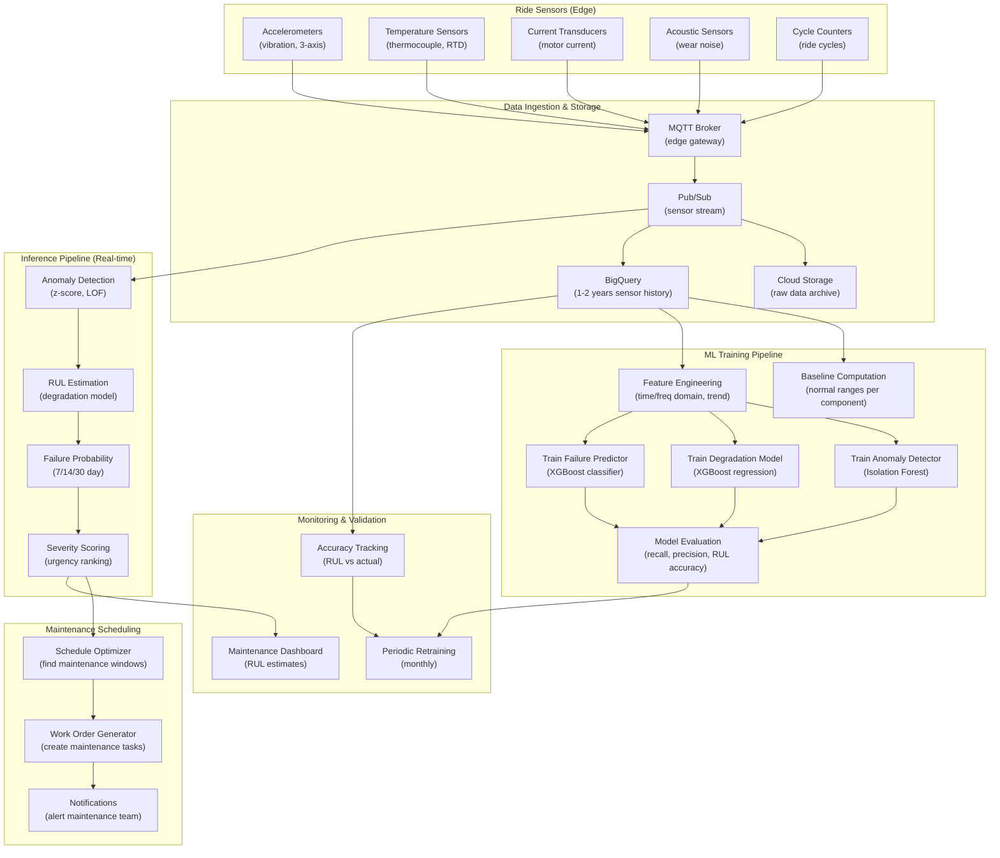

# Predictive Maintenance for Amusement Park Rides

> This document outlines the ML solution for predicting ride maintenance needs before failures occur, maximizing uptime and safety.

---

## 1. ML Problem Statement

### Business Context
The estate has 40 historic amusement park rides. Each ride consists of mechanical and electrical components that wear over time. Unexpected breakdowns cause:
- Lost revenue (ride closed for repairs)
- Visitor dissatisfaction (refunds, negative reviews)
- Safety risks (component failure mid-ride)
- Emergency repairs (costly, slower than planned maintenance)

Predictive maintenance enables scheduled downtime before failure, reducing costs and safety risks.

### Problem Definition
**Primary Objective**: Predict remaining useful life (RUL) of ride components before failure

**Key Prediction Targets**:
- **Component failure**: Probability of failure in next 7/14/30 days
- **Time to failure**: Days until component failure (regression)
- **Maintenance urgency**: Schedule maintenance before critical threshold
- **Root cause**: Which component is degrading
- **Failure mode**: How will component fail (overload, corrosion, wear)

### Problem Characteristics
- **Time series prediction**: Sensor data shows degradation patterns over time
- **Multiple failure modes**: Different components fail differently
- **Imbalanced data**: Most sensors don't fail (few positive examples)
- **Regulatory compliance**: Must maintain audit trail of maintenance
- **Safety critical**: False negatives (missed failures) unacceptable
- **Economic tradeoff**: False positives (unnecessary maintenance) costly

### Success Metrics
| Metric | Target | Description |
|--------|--------|-------------|
| Failure detection recall | > 0.95 | Catch 95%+ of impending failures |
| False alarm rate | < 10% | Minimize unnecessary maintenance |
| Mean time to detection | > 14 days | Alert at least 2 weeks before failure |
| Maintenance ROI | >= 2:1 | Savings > 2x maintenance cost |
| Unplanned downtime | < 5% | <5% of rides down unexpectedly |
| Prediction accuracy (RUL) | RMSE < 5 days | Within 5 days of actual failure |

---

## 2. ML Solution

### Architecture Overview
Multi-component monitoring system: Real-time sensors → Anomaly detection → Failure prediction → Maintenance scheduling

#### 2.1 Core Components

**Component 1: Sensor Data Ingestion**
- Vibration sensors (accelerometers)
- Temperature sensors (thermal monitoring)
- Acoustic sensors (noise changes = wear)
- Electrical sensors (current draw changes)
- Cycle counters (usage metrics)

**Component 2: Anomaly Detection (Isolation Forest / Local Outlier Factor)**
- Detects when sensor reading deviates from normal
- Learns baseline normal operating range
- Triggers investigation on anomalies
- Input: Time series of sensor readings
- Output: Anomaly score (0-1)

**Component 3: Degradation Modeling (XGBoost / Gradient Boosting)**
- Models component wear progression over time
- Learns typical failure trajectories
- Input: Historical sensor data + maintenance records + failure events
- Output: Days until failure (RUL estimate)

**Component 4: Failure Prediction (Classification)**
- Predicts probability of failure in next 7/14/30 days
- Uses XGBoost classifier
- Input: Current sensor state + trend + anomaly score
- Output: Failure probability + confidence interval

**Component 5: Maintenance Scheduling (Optimization)**
- Recommends optimal maintenance window
- Balances: Availability vs preventive maintenance
- Considers: Weather, visitor season, other rides
- Input: Multiple ride failure predictions
- Output: Maintenance schedule (which rides, which days)

#### 2.2 Predictive Maintenance Workflow

```
For each ride component C on ride R:

1. BASELINE ESTABLISHMENT (Weeks 1-4):
   - Collect 30 days of normal operation sensor data
   - Calculate baseline ranges:
     - Vibration acceleration: baseline_accel ± std_accel
     - Temperature: baseline_temp ± std_temp
     - Current draw: baseline_current ± std_current
   - Store in model registry

2. ANOMALY DETECTION (Real-time, per 5 minutes):
   - Get latest sensor readings
   - Compare to baseline:
     - z_score = (current_value - baseline_mean) / baseline_std
   - Classify: Normal (|z| < 2) vs Anomaly (|z| >= 2)
   - If anomaly:
     * Increment anomaly_count
     * Log to time series
     * If anomaly_count > 5: Alert on dashboard

3. DEGRADATION MODELING (Per day):
   - Extract features from sensor data (last 24h):
     - Mean, std, max, min of each sensor
     - Trend (slope) of key sensors
     - Anomaly frequency
     - Number of start/stop cycles
   - Feed to XGBoost regression model
   - Output: RUL estimate (days until failure)
   - If RUL < 30 days: Schedule maintenance

4. FAILURE PREDICTION (Per day):
   - Classify failure probability in next 7/14/30 days
   - Use XGBoost classifier
   - Output: P(failure in 7d), P(failure in 14d), P(failure in 30d)
   - Thresholds:
     * P(7d) > 0.9: URGENT maintenance
     * P(14d) > 0.7: PLAN maintenance soon
     * P(30d) > 0.5: MONITOR closely

5. MAINTENANCE SCHEDULING:
   - Identify all rides needing maintenance
   - Rank by urgency (highest P(failure) first)
   - Find optimal windows (low visitor days, no other maintenance)
   - Schedule maintenance
   - Notify maintenance team
   - Remove ride from active schedule

6. POST-MAINTENANCE VALIDATION:
   - After maintenance, reset sensor baselines
   - Verify component repaired/replaced
   - Confirm sensor normalization
   - If not normalized: Investigate deeper issue
```

#### 2.3 Component-Specific Models

**Mechanical Component Model** (Bearings, Gearboxes, Chains):
- Key sensor: Vibration (accelerometer)
- Failure mode: Increasing vibration + noise
- RUL model: Sees vibration trend acceleration → estimates failure
- Lead time: 7-14 days typically

**Electrical Component Model** (Motors, Controllers):
- Key sensor: Current draw + temperature
- Failure mode: Increasing current → motor stall
- RUL model: Current trend + thermal stress
- Lead time: 3-7 days typically

**Structural Component Model** (Frame, Supports, Brakes):
- Key sensor: Stress sensors + inspection cameras
- Failure mode: Crack growth, corrosion
- RUL model: Crack size trend → break point
- Lead time: 14-30 days typically (slower degradation)

---

## 3. Data Requirement

### 3.1 Primary Data Sources

**Source 1: Ride Sensors (Real-time Telemetry)**
| Data Point | Sensor Type | Frequency | Specifications |
|------------|------------|-----------|-----------------|
| Vibration | Accelerometer (3-axis) | 100 Hz | ±16G, ±2G for precision |
| Temperature | Thermocouples / RTD | Every 5 sec | -20 to +100°C |
| Current draw | Current clamp / transducer | Every 5 sec | 0-500A range |
| Sound/Noise | Acoustic sensor | 10 kHz sampling | Frequency spectrum |
| Cycle count | Mechanical counter / encoder | Per cycle | Cumulative count |
| Position | Limit switches | Per event | Discrete events |

**Source 2: Maintenance Records**
| Data Point | Collection | Frequency | Details |
|------------|-----------|-----------|---------|
| Maintenance performed | Work order system | As scheduled | Component, date, type |
| Component replaced | Inventory log | As needed | Part ID, serial, date |
| Inspection findings | Technician notes | Weekly | Condition assessment |
| Failure incidents | Incident report | As occurred | Date, time, severity, root cause |

**Source 3: Operational Data**
| Data Point | Collection | Frequency | Details |
|------------|-----------|-----------|---------|
| Ride cycles | Control system | Real-time | Number of times ride ran |
| Downtime events | POS / scheduling system | Per event | Unplanned stops, duration |
| Environmental factors | Weather API + sensors | Hourly | Temperature, humidity, rain |

**Source 4: Inspection Data**
| Data Point | Collection | Frequency | Details |
|------------|-----------|-----------|---------|
| Visual inspection | Camera feed + technician | Weekly | Photo evidence of wear |
| Dimensional checks | Calipers / laser | Monthly | Component dimensions vs spec |
| Fluid analysis | Oil sampling | Quarterly | Viscosity, contaminants (for hydraulics) |

### 3.2 Data Specifications

**Historical Data Requirements**:
- **Minimum**: 1-2 years of continuous sensor data
- **Ideal**: 3-5 years including multiple failure examples per component
- **Failure samples**: At least 20-30 documented component failures with prior sensor data

**Feature Engineering**:
| Category | Features | Computation |
|----------|----------|------------|
| Time-domain | Mean, std, min, max of sensor | Rolling window (1h, 24h) |
| Frequency-domain | FFT spectrum, dominant frequencies | Fourier transform on vibration |
| Trend | Slope, acceleration of sensor change | Linear regression fit |
| Anomaly | Z-score, count above threshold | Statistical test per sensor |
| Degradation | Rate of change, curvature | Derivative of trend |
| Contextual | Ride age, cycles, maintenance history | From maintenance records |

### 3.3 Data Storage

**Real-time Data Pipeline**:
```
Ride Sensors (MQTT) → Pub/Sub → Dataflow → BigQuery (time series)
Maintenance DB → Cloud Scheduler → BigQuery (maintenance records)
Weather API → Cloud Functions → BigQuery (environmental context)
Inspection Photos → Cloud Storage → BigQuery (metadata)
```

**BigQuery Datasets**:
```
- sensor_readings: Time series (1M+ rows/day)
- maintenance_history: Component replacement/repair logs
- failure_events: Documented failures with timestamps
- component_baselines: Per-ride-component normal ranges
```

---

## 4. Infra Mermaid of Solution



### Infrastructure Components

| Component | GCP Service | Purpose | Scaling |
|-----------|------------|---------|---------|
| **Data Ingestion** | Pub/Sub | Stream sensor data | 10K+ messages/sec from 40 rides |
| **Storage** | Cloud Storage + BigQuery | Archive + analytics | 1-2 years history |
| **ML Training** | Vertex AI Training | Train models | CPU, 8vCPU standard |
| **Baseline Computation** | Dataflow | Compute per-ride baselines | Auto-scaling |
| **Real-time Inference** | Vertex AI Prediction | Anomaly + degradation | Sub-second latency |
| **Scheduling** | Cloud Scheduler + Cloud Functions | Maintenance window optimization | Daily job |
| **Notifications** | Cloud Pub/Sub + Cloud Messaging | Alert maintenance team | Real-time |
| **Dashboard** | Looker / Grafana | Visualize RUL, ride health | Real-time updates |

---

## 5. ML Ops

### 5.1 Baseline Establishment & Model Training

**Initial Setup** (Weeks 1-4):
```
1. Install sensors on all 40 rides
2. Collect 30 days of normal operation baseline data
3. For each ride component:
   - Compute mean, std of each sensor
   - Store in model registry
4. Collect historical maintenance records (3-5 years)
5. Identify failure events in data
6. Label sensor windows leading up to failures
7. Train initial models:
   - Anomaly detector: 1 GPU hour
   - Degradation model (RUL): 2 GPU hours
   - Failure classifier: 2 GPU hours
```

**Monthly Retraining**:
```
1. Collect new maintenance/failure data (last 30 days)
2. Update baselines if seasonal changes detected
3. Retrain degradation models: 1 GPU hour
4. Retrain failure classifiers: 1 GPU hour
5. Evaluate on holdout test set
6. Deploy if:
   - Recall improves by 2%+
   - False alarm rate decreases
   - RUL RMSE < 5 days
```

### 5.2 Real-time Monitoring

**Per Ride Monitoring** (5-minute intervals):
```
1. Fetch latest 5 minutes of sensor data
2. Compute features (time-domain + frequency)
3. Run anomaly detector
4. If anomaly detected:
   - Increment anomaly counter
   - Alert if counter > 3
5. Run degradation model
6. Estimate RUL
7. Run failure classifier
8. Log predictions to BigQuery
```

**Daily Maintenance Scheduling** (02:00 UTC):
```
1. Identify all rides with RUL < 30 days
2. Rank by severity:
   - RUL < 7 days: URGENT
   - RUL 7-14 days: HIGH
   - RUL 14-30 days: MEDIUM
3. Find optimal maintenance windows:
   - Low visitor days preferred
   - Coordinate with other ride maintenance
4. Generate work orders
5. Notify maintenance team
6. Update ride schedule (remove from rotation)
```

### 5.3 Alerts & Dashboard

**Alert Thresholds**:
| Condition | Alert Level | Action |
|-----------|------------|--------|
| Anomaly persists 15+ min | WARNING | Alert technician; recommend inspection |
| RUL < 14 days | MEDIUM | Schedule maintenance in next week |
| RUL < 7 days | HIGH | Schedule maintenance within 48h |
| P(7d failure) > 0.9 | URGENT | Immediate maintenance; ride off schedule |

**Dashboard Displays**:
- Ride health (green/yellow/red) per ride
- RUL estimates (days to failure)
- Sensor anomalies (flagged readings)
- Maintenance schedule (upcoming work)
- Historical trends (degradation curves)

### 5.4 Accuracy Tracking & Feedback

**Post-Maintenance Validation**:
```
After maintenance:
1. Collect 2 weeks of sensor data
2. Check if sensors normalize (anomalies disappear)
3. If sensors don't normalize:
   - Investigate deeper problem
   - May indicate wrong component replaced
4. If sensors normalize:
   - Confirm maintenance effective
   - Log maintenance action → model feedback
```

**RUL Accuracy Tracking** (Monthly):
```
For each maintenance event:
1. Compare predicted RUL vs actual time-to-failure
2. Calculate error: |predicted - actual| days
3. Track RMSE across all components
4. Identify systematic biases (over/under predicting)
5. Adjust models if bias > 5 days
```

---

## 6. Caveats to Consider

### 6.1 Technical Challenges

| Challenge | Impact | Mitigation |
|-----------|--------|-----------|
| **Sensor failures** | Lost visibility into ride health | Redundant sensors per component; fault detection |
| **Sensor drift** | Baseline becomes inaccurate over time | Recalibrate sensors quarterly; track drift trends |
| **Data gaps** | Network outages lose data | Edge MQTT broker; local buffering + sync |
| **Vibration from external sources** | Wind, nearby traffic cause false positives | Isolated sensor mounting; filter environmental noise |
| **Model overfitting** | Model learns specific rides, doesn't generalize | Cross-ride validation; per-ride fine-tuning |

### 6.2 Operational Challenges

| Challenge | Consequence | Solution |
|-----------|-----------|---------|
| **Technician skepticism** | Staff ignores model predictions | Start with high-confidence alerts only; show accuracy |
| **Unscheduled failures despite prediction** | Model missed something | Root cause analysis; improve feature engineering |
| **Maintenance creates new issues** | Technician error during repair | Quality assurance; post-maintenance sensor validation |
| **Ride age / lack of maintenance history** | Older rides have no baseline data | Use similar ride type as proxy; manual engineering judgment |
| **Seasonal patterns** | Summer heavy use looks like failure | Seasonal baseline models; normalize by ride cycle count |

### 6.3 Safety & Compliance Issues

| Issue | Risk | Mitigation |
|-------|------|-----------|
| **False negatives** | Missed failure → safety hazard | High recall threshold; redundant checks |
| **Over-maintenance** | Excessive downtime → lost revenue | Tune false positive rate; balance safety vs availability |
| **Regulatory documentation** | Inspectors require maintenance audit trail | Log all predictions + actions; export for audits |
| **Liability** | If component fails after prediction alert | Detailed logs; show alert was issued + acknowledged |

### 6.4 Cost Considerations

| Factor | Cost | Optimization |
|--------|------|-------------|
| **Sensor hardware** | ~$2K per ride × 40 = $80K | Phase deployment; start with critical rides |
| **Preventive maintenance** | Earlier replacement = higher maintenance cost | Balance against emergency repair costs ($5-10K per failure) |
| **Data storage** | 1-2 years sensor history = $100-200/month | Archive older data; compress; sample lower-priority sensors |
| **Cloud compute** | Training + inference = $500-1K/month | Optimize model training; batch inference |

### 6.5 Recommendation Priorities

**Immediate (MVP)** - Weeks 1-8:
1. Install vibration + temperature sensors on critical components
2. Establish baselines (30 days)
3. Train anomaly detector + basic degradation model
4. Dashboard for technician review
5. Manual maintenance scheduling (assisted by model)

**Phase 2** - Weeks 9-16:
1. Add acoustic + current sensors
2. Train failure classifiers
3. Automated RUL estimation
4. Work order auto-generation

**Phase 3** - Weeks 17-24:
1. Component-specific models
2. Predictive diagnostics (root cause of failures)
3. Automated maintenance scheduling
4. Integration with ride control systems

---

## 7. Success Criteria & KPIs

| KPI | Target | Timeline |
|-----|--------|----------|
| Failure detection recall | > 0.90 | Week 12 |
| False alarm rate | < 15% | Week 12 |
| Mean warning lead time | 14+ days | Week 12 |
| RUL accuracy (RMSE) | < 5 days | Week 16 |
| Maintenance ROI | >= 2:1 | Week 20 |
| Unplanned downtime reduction | -40% | Week 24 |

