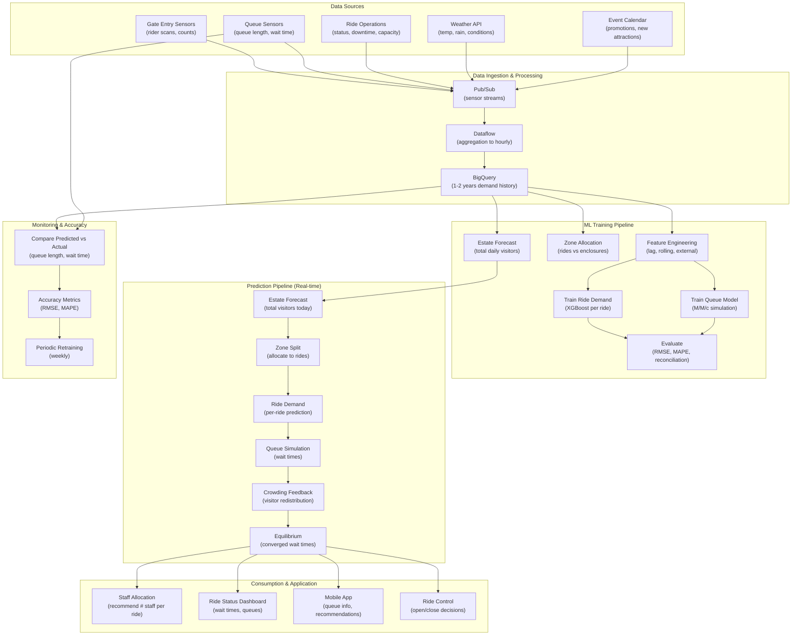

# Ride-Level Demand Prediction

> This document outlines the ML solution for predicting demand at individual rides and attractions, enabling granular resource allocation and queue management.

---

## 1. ML Problem Statement

### Business Context
The estate has 40 rides and 55 animal enclosures with vastly different popularity levels. Knowing which rides will be crowded allows the estate to:
- Deploy staff to popular rides (reduce queue time → satisfaction)
- Open/close attractions based on predicted demand
- Allocate staggered ride operations (save energy during low-demand periods)
- Suggest attractions to visitors (reduce crowding, improve experience)
- Price dynamic entry tickets per zone/ride

### Problem Definition
**Primary Objective**: Forecast hourly visitor demand at individual ride/attraction level

**Key Prediction Targets**:
- **Hourly queue length**: Expected wait time per ride
- **Peak hour identification**: Which hours will see crowds
- **Capacity utilization**: % of ride capacity for each hour
- **Staff allocation**: Recommended staff per ride per hour
- **Visitor distribution**: Predicted flow between rides

### Problem Characteristics
- **Hierarchical forecasting**: Estate-wide → zone → ride level
- **Multiple time scales**: Daily + hourly + 15-minute granularity
- **Seasonality patterns**: Weekends, holidays, school terms
- **Spillover effects**: One ride's crowd affects others
- **Weather sensitivity**: Rain affects outdoor rides
- **Events/specials**: New attractions drive crowds

### Success Metrics
| Metric | Target | Description |
|--------|--------|-------------|
| Queue length RMSE | < 10 minutes | Forecast accuracy |
| Peak hour detection recall | > 0.85 | Catch 85%+ of crowded periods |
| Capacity utilization MAPE | < 15% | Accurate utilization forecasts |
| Staff allocation efficiency | +25% | Reduce over/under-staffing |
| Visitor distribution accuracy | MAPE < 20% | Route recommendations effective |
| Forecast latency | < 5 minutes | Generated in time for decisions |

---

## 2. ML Solution

### Architecture Overview
Hierarchical forecasting: Estate-wide forecast → Zone-level → Individual ride

#### 2.1 Core Components

**Component 1: Estate-Level Demand Forecast (From 4.1)**
- Predicts total daily visitor count
- Predicts hourly distribution of visitors throughout day
- Output: Total visitors per hour (estate-wide)

**Component 2: Zone-Level Demand Allocation**
- Splits estate-wide forecast by zone (rides vs enclosures)
- Uses historical zone-share patterns
- Input: Estate-wide hourly forecast
- Output: Visitors to ride zone per hour

**Component 3: Ride-Level Demand Prediction (Gradient Boosting)**
- Forecasts demand at individual ride level
- Accounts for ride-specific popularity, capacity, queue effects
- Input: Zone-level forecast + ride features + historical patterns
- Output: Visitors per ride per hour

**Component 4: Queue Length Estimation (Simulation)**
- Converts predicted visitor demand to queue wait times
- Models: Service time per ride + arrival rate
- Uses M/M/c queuing theory (Poisson arrivals, exponential service)
- Input: Predicted visitor count + ride capacity + # of stations
- Output: Expected queue length (minutes) + utilization %

**Component 5: Crowding Feedback Network (RNN)**
- Models visitor choices influenced by queue lengths
- If Ride A has 30min wait, visitors shift to Ride B
- Iterative equilibrium: Balances demand based on wait times
- Input: Predicted base demand + simulated wait times (previous iteration)
- Output: Equilibrium visitor distribution

#### 2.2 Hierarchical Forecasting Algorithm

```
For date D and hour H:

1. ESTATE-LEVEL FORECAST:
   estate_forecast[D][H] = Prophet_model(daily_visitors, seasonality, events)
   
2. ZONE ALLOCATION:
   For each zone Z (rides, enclosures):
     zone_share[Z] = Historical average % visitors to Z
     zone_forecast[Z][H] = estate_forecast[D][H] * zone_share[Z]
   
3. RIDE-LEVEL DEMAND (Base Prediction):
   For each ride R in rides_zone:
     features = {
       ride_id, day_of_week, is_holiday, weather,
       time_of_day, past_7day_avg, seasonal_modifier,
       new_attraction_flag, maintenance_flag
     }
     ride_base_demand[R][H] = XGBoost(features)
     
   Constraint: Sum(ride_base_demand[R][H]) = zone_forecast[rides][H]
   Reconciliation: Adjust predictions to satisfy hierarchy
   
4. QUEUE SIMULATION (Iteration 1):
   For each ride R:
     queue_length[R] = Simulate_queue(
       arrival_rate = ride_base_demand[R][H],
       service_rate = ride_capacity / cycle_time,
       num_stations = ride_stations
     )
     wait_time[R] = queue_length[R] * avg_service_time
   
5. CROWDING FEEDBACK (Visitor Redistribution):
   For each visitor arrival in simulated visitors:
     - Observe wait times at all rides
     - Calculate desirability = (ride_rating - wait_time_penalty)
     - Choose ride probabilistically based on desirability
     - Adjust predicted visitor flow
   
   Iterate steps 4-5 until convergence:
     - Visitor distribution stabilizes
     - Wait times equilibrate
     - Spillover effects captured
   
6. FINAL PREDICTIONS:
   For each ride R:
     final_demand[R][H] = converged_visitor_distribution
     queue_wait[R][H] = converged_queue_simulation
     capacity_util[R][H] = final_demand[R] / ride_capacity
```

#### 2.3 Ride-Specific Features

**Ride Characteristics**:
- Capacity (riders per cycle)
- Cycle time (minutes per cycle)
- Number of stations/tracks
- Theme/type (family, thrill, gentle)
- Popularity rating (historical average visitors)
- Height/age restrictions

**Temporal Features**:
- Hour of day (rides busier at different times)
- Day of week (weekends more crowded)
- Season (summer vs winter patterns)
- Holiday flags
- School term indicators

**External Features**:
- Weather (rain ↓ outdoor rides, hot ↑ water rides)
- Special events (new animal exhibit, concert, promotion)
- Ride maintenance status (closed = crowd redirects elsewhere)
- Competitor attractions opening/closing

---

## 3. Data Requirement

### 3.1 Primary Data Sources

**Source 1: Entry/Exit Data (Gate Sensors + Entry Logs)**
| Data Point | Collection | Frequency | Granularity |
|------------|-----------|-----------|------------|
| Ride entry scan | QR code / RFID scan | Per entry | Individual rider |
| Ride exit scan | Exit gate sensor | Per exit | Per group |
| Entry timestamp | Timestamp from gate | Real-time | Precise time |
| Entry zone | Which gate/entry point | Per entry | Zone-level |

**Source 2: Queue Sensors (Real-time)**
| Data Point | Collection | Frequency | Specs |
|------------|-----------|-----------|-------|
| Queue length | IR/pressure sensors in queue | Every 30 sec | Count of people |
| Queue wait time | Timestamp tracking | Per person | Entry to ride start |
| Ride cycle time | Timer on ride | Per cycle | Minutes |
| Capacity utilization | Rider count per cycle | Per cycle | # riders |

**Source 3: Ride Operations**
| Data Point | Collection | Frequency | Details |
|------------|-----------|-----------|---------|
| Ride status | Control system | Real-time | Open, closed, limited capacity |
| Downtime events | System log | Per event | Start/end timestamp, reason |
| Maintenance window | Schedule | As planned | Ride, date, duration |

**Source 4: External Data**
| Data Point | Collection | Frequency | Details |
|------------|-----------|-----------|---------|
| Weather | Weather API | Hourly | Temp, rain, wind, UV index |
| Events | Event calendar | Manual input | New attractions, concerts, promos |
| Competitor actions | Manual monitoring | Weekly | Competitor attractions opening |

### 3.2 Data Specifications

**Historical Data Requirements**:
- **Minimum**: 1-2 years of hourly rider counts per ride
- **Ideal**: 3-5 years for seasonal pattern capture
- **Granularity**: Hourly at minimum; 15-minute preferred for queue analysis

**Dataset Features**:
| Category | Features | Computation |
|----------|----------|------------|
| Ride-specific | Ride ID, capacity, type, restrictions | Static data |
| Temporal | Date, hour, day-of-week, season, holiday | Calendar |
| Lag features | Riders (lag 1h, 6h, 24h, 7d) | Lagged aggregation |
| Rolling stats | Mean, std of last 7 days | Rolling window |
| Weather | Temp, rain, wind, UV for hour | Join weather data |
| Events | New attraction, promotion, concert flag | Event calendar |
| Rides status | Closed, reduced capacity flags | Operations log |

### 3.3 Data Storage

**Pipeline**:
```
Entry Gate Sensors → Pub/Sub → Dataflow (aggregation) → BigQuery
Queue Sensors → Pub/Sub → Dataflow (queue length) → BigQuery
Ride Control System → Cloud Scheduler → BigQuery (status, events)
Weather API → Cloud Functions → BigQuery (hourly weather)
```

**BigQuery Datasets**:
```
- ride_entries: Entry logs (1M+ rows/day)
- hourly_demand: Aggregated demand per ride per hour
- queue_metrics: Queue length, wait time, utilization
- ride_status: Maintenance, closures, capacity changes
```

---

## 4. Infra Mermaid of Solution



### Infrastructure Components

| Component | GCP Service | Purpose | Scaling |
|-----------|------------|---------|---------|
| **Data Ingestion** | Pub/Sub | Real-time gate + queue data | 100K+ events/sec |
| **Aggregation** | Dataflow | Hourly aggregation | Auto-scaling |
| **Storage** | BigQuery | 1-2 years demand history | 100GB+ datasets |
| **Estate Forecast** | Vertex AI Prediction | Daily total forecast | Pre-cached |
| **Ride Models** | Vertex AI Training | Train XGBoost per ride | 8vCPU |
| **Queue Simulation** | Cloud Run | Iterative queue solver | Sub-1s latency |
| **Crowding Feedback** | Vertex AI Prediction | Visitor redistribution | Low-latency endpoints |
| **Dashboard** | Looker / Grafana | Real-time wait times | Live updates |
| **Mobile API** | Cloud Run / Cloud Functions | Queue info API | Auto-scaling |

---

## 5. ML Ops

### 5.1 Training & Retraining

**Initial Setup** (Weeks 1-6):
```
1. Collect 1 year of historical ride entry data
2. Aggregate to hourly level (per ride)
3. Feature engineering: lag, rolling avg, seasonal
4. Split: 70% train, 15% validation, 15% test (time-based)
5. Train models:
   - XGBoost ride demand: 4 GPU hours
   - Queue simulation: Parameter tuning (CPU)
6. Baseline: Estate forecast from 4.1 (already trained)
7. Evaluate on test set:
   - RMSE per ride
   - MAPE on queue predictions
```

**Weekly Retraining**:
```
1. Fetch new data (last 2 weeks)
2. Retrain ride models: 2 GPU hours
3. Evaluate on holdout week
4. Deploy if RMSE improves 5%+
```

### 5.2 Real-time Prediction

**Daily Forecast Generation** (02:00 UTC):
```
1. Get estate-level forecast (total visitors today)
2. For each ride R:
   a. Load trained XGBoost model
   b. Prepare features for each hour
   c. Predict base demand per hour
   d. Reconcile with zone-level forecast
3. Simulate queue for each ride:
   a. Use predicted arrivals + ride specs
   b. Calculate wait time per hour
4. Iterate crowding feedback:
   a. Adjust demand based on wait times
   b. Simulate new queue lengths
   c. Repeat until convergence (5-10 iterations)
5. Cache results (today's predictions)
6. Push to dashboard + API
```

**Real-time Updates** (Every 30 minutes):
```
1. Update with actual ride entries (last 30 min)
2. Recompute queue for next 2 hours
3. Alert if queue > expected by 20%
```

### 5.3 Staff Allocation Optimization

**Recommended Staff Levels** (per ride, per hour):
```
For each ride R and hour H:
  predicted_queue_length[R][H] = queue_simulation(demand, capacity)
  staff_needed[R][H] = Calculate_staffing_requirement(
    queue_length = predicted_queue_length,
    min_staff = ride_minimum_safety_requirement,
    max_capacity = ride_capacity,
    service_level_target = 15min_max_wait
  )
  
Recommend staff_needed[R][H] to operations team
```

### 5.4 Accuracy Monitoring

**Daily Accuracy Check**:
```
For each ride R and hour H:
  predicted_queue_length = from forecast
  actual_queue_length = from sensors (end of hour)
  error = |predicted - actual|
  
  Log error to tracking system
  
  If error > 20 minutes:
    Flag for investigation
    Check if events/anomalies caused deviation
```

**Weekly Accuracy Report**:
```
Metrics:
  - RMSE per ride (target < 10 min)
  - MAPE per ride (target < 20%)
  - Peak hour detection accuracy (target > 85%)
  - Worst performing rides → investigate
```

---

## 6. Caveats to Consider

### 6.1 Model Challenges

| Challenge | Impact | Mitigation |
|-----------|--------|-----------|
| **Spillover effects** | One ride closing changes demand elsewhere | Model ride interdependencies; crowding feedback network |
| **Cascading crowd shifts** | Visitor redistribution cascades → instability | Iterative convergence; limit feedback iterations |
| **Queue model assumptions** | M/M/c assumes Poisson arrivals (may not hold) | Validate against actual queue patterns; adjust model |
| **Ride downtime prediction** | Can't predict unplanned maintenance | Manual input required; flag in dashboard |
| **New rides/attractions** | No historical data for new attractions | Use similar ride as proxy; warm-start model |

### 6.2 Operational Challenges

| Challenge | Consequence | Solution |
|-----------|-----------|---------|
| **Staff resistance** | Staff ignore staffing recommendations | Start with advisory; show accuracy; gradual adoption |
| **Visitor frustration** | Staff isn't available despite prediction | Buffer staff levels; never over-reduce |
| **Demand forecast errors** | Wrong estate-level forecast cascades | Validate estate forecast; bound ride forecasts |
| **Measurement noise** | Queue sensor glitches cause errors | Redundant sensors; outlier detection |
| **Crowding equilibrium cycles** | Visitors oscillate between rides | Damp feedback; limit feedback iterations |

### 6.3 Visitor Experience Issues

| Issue | Risk | Mitigation |
|-------|------|-----------|
| **Ride suggestions backfire** | Recommending crowded rides frustrates visitors | Only suggest rides below 50% capacity + > 80% satisfaction |
| **False queue length reporting** | App shows 30min wait, actual is 5min | Calibrate queue estimates; update in real-time |
| **Bottleneck at popular rides** | Can't eliminate crowds at must-do attractions | Use dynamic pricing / reservations for popular rides |

### 6.4 Technical Issues

| Issue | Impact | Solution |
|-------|--------|---------|
| **Queue sensor failures** | Can't validate predictions | Redundant sensors; estimate from ridership |
| **Forecast latency** | Predictions arrive too late | Pre-compute daily; use caches |
| **Convergence issues** | Feedback loop doesn't converge | Cap iterations; use regularization |

### 6.5 Recommendation Priorities

**Immediate (MVP)** - Weeks 1-8:
1. Train basic ride demand models (XGBoost per ride)
2. Simple queue simulation (no crowding feedback)
3. Dashboard showing predicted vs actual queues
4. Manual staff allocation recommendations

**Phase 2** - Weeks 9-16:
1. Crowding feedback network
2. Iterative queue equilibrium
3. Real-time queue updates
4. Mobile app integration

**Phase 3** - Weeks 17-24:
1. Dynamic ride capacity adjustments
2. Visitor suggestion engine
3. Advanced queue control (reservation system)
4. Cross-ride spillover optimization

---

## 7. Success Criteria & KPIs

| KPI | Target | Timeline |
|-----|--------|----------|
| Queue prediction RMSE | < 10 minutes | Week 12 |
| Peak hour detection recall | > 0.85 | Week 10 |
| Capacity utilization MAPE | < 15% | Week 14 |
| Staff allocation efficiency | +25% | Week 16 |
| Visitor satisfaction with recommendations | 4.0+/5.0 | Week 12 |

