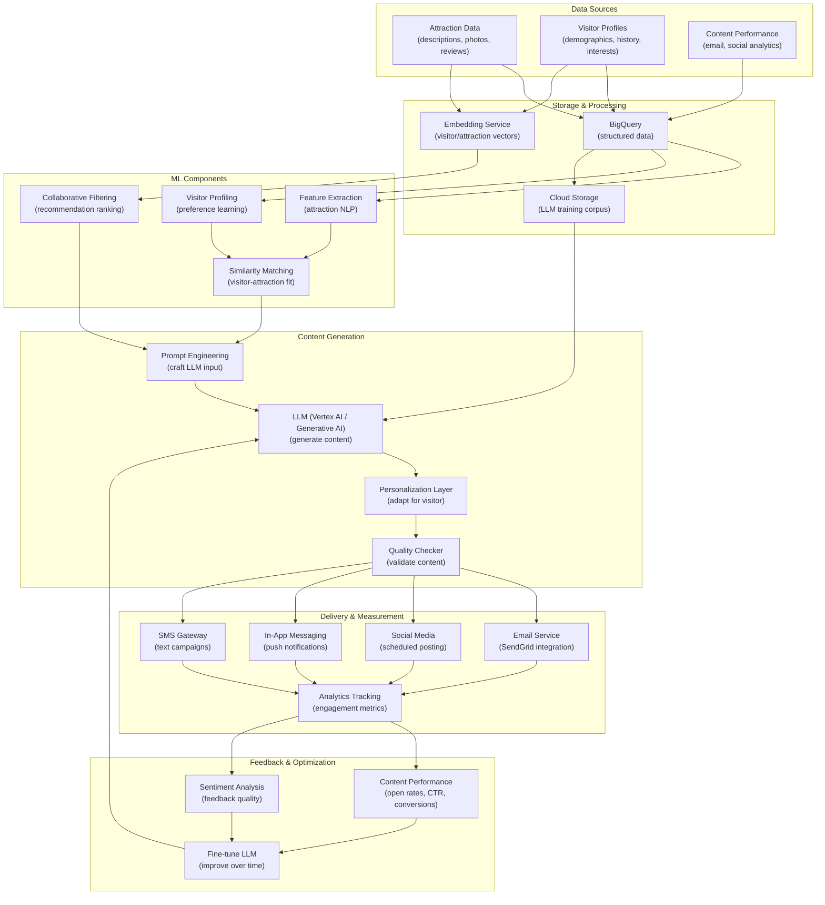

# AI-Generated Marketing Content

> This document outlines the ML solution for automatically generating personalized, engaging marketing content to promote attractions and drive visitor engagement.

---

## 1. ML Problem Statement

### Business Context
The estate has 40 rides and 55 animal attractions, each with unique features and visitor appeal. Creating unique marketing content for each attraction is labor-intensive. Visitors want personalized recommendations based on their interests, age, group size, and previous visits.

### Problem Definition
**Primary Objective**: Generate personalized marketing content that increases engagement and drives attraction visits

**Key Prediction Targets**:
- **Attraction recommendations**: Suggest rides/animals matching visitor preferences
- **Personalized descriptions**: Write captions highlighting visitor-relevant aspects
- **Social media content**: Generate Instagram/TikTok posts for each attraction
- **Promotional offers**: Create targeted discounts for underperforming attractions
- **Visitor-specific messaging**: Email subject lines, SMS content personalized per person

### Problem Characteristics
- **Content generation**: Requires LLM (large language model)
- **Personalization**: Consider visitor demographics, history, preferences
- **Multi-channel**: Email, SMS, social media, in-app, web
- **Variety**: Need hundreds of unique posts per week
- **Authenticity**: Content should reflect real attraction features
- **Compliance**: Marketing claims must be truthful; avoid misleading hype

### Success Metrics
| Metric | Target | Description |
|--------|--------|-------------|
| Email open rate | > 25% | CTR improvement vs generic emails |
| Click-through rate | > 8% | CTR to attraction pages |
| Visit conversion rate | 5-8% | % who actually visit recommended attraction |
| Content engagement | >= 4.0/5.0 | User satisfaction rating for content |
| Social media reach | +50% | Engagement vs manual content |
| Time to content creation | < 5 min/piece | Reduce manual content creation time |

---

## 2. ML Solution

### Architecture Overview
Multi-stage content generation: Attraction data → LLM prompt engineering → Personalization → Content generation

#### 2.1 Core Components

**Component 1: Attraction Feature Extraction (NLP)**
- Analyzes attraction descriptions, visitor reviews, photos
- Extracts key features: Theme, target age, thrills, educational value
- Uses semantic analysis to understand attraction appeal
- Input: Attraction metadata, reviews, photos
- Output: Feature vector (theme, appeal, difficulty, uniqueness)

**Component 2: Visitor Preference Profiling (Collaborative Filtering + NLP)**
- Analyzes visitor behavior: Past visits, ratings, search queries
- Identifies visitor interests: Adventure-seeker, animal-lover, educational
- Uses embeddings to represent visitor + attraction in same space
- Input: Visitor history, demographics, stated preferences
- Output: Visitor preference vector

**Component 3: Large Language Model (LLM) - Vertex AI / GPT-4**
- Generates natural language content
- Fine-tuned on existing attraction descriptions + marketing copy
- Prompt-engineered for different content types
- Input: Attraction features + visitor profile + content type
- Output: Natural language content

**Component 4: Content Personalization (Context-aware)**
- Adapts content for individual visitors
- Adjusts tone, language, features based on visitor profile
- Selects most relevant aspects to highlight
- Input: Base content + visitor profile
- Output: Personalized content variant

**Component 5: Content Quality & Safety Checker (Classification)**
- Validates content for accuracy, tone, compliance
- Detects misleading claims, unsafe language
- Uses rule-based + ML-based checks
- Input: Generated content
- Output: Quality score, compliance flags

#### 2.2 Content Generation Workflow

```
For each visitor V and recommended attraction A:

1. ATTRACTION FEATURE EXTRACTION:
   attraction_features = {
     theme: "animal education", 
     target_age: "5-12",
     duration: "20 minutes",
     thrill_level: 2 (out of 5),
     unique_selling_points: ["giraffes", "interactive feeding", "live trainer talk"]
   }

2. VISITOR PREFERENCE PROFILING:
   visitor_profile = {
     age_group: "30-40",
     interests: ["animal welfare", "education", "family time"],
     past_visits: [zoo, aquarium, nature_center],
     group_size: "family of 4 (2 kids ages 6,8)",
     satisfaction_history: 4.5/5.0,
     visit_frequency: "occasional"
   }

3. VISITOR-ATTRACTION MATCH:
   match_score = Similarity(visitor_profile, attraction_features)
   If match_score < 0.6:
     Skip this recommendation (low relevance)
   Else:
     Continue to content generation

4. LLM PROMPT ENGINEERING:
   prompt = f"""
   Create a short, engaging social media post for a {visitor_profile.age_group} 
   audience about our {attraction_features.theme} attraction.
   
   Target audience interests: {visitor_profile.interests}
   Key features to highlight: {attraction_features.unique_selling_points}
   Tone: {determine_tone(visitor_profile)}
   
   Post format: Instagram caption (150 chars max)
   Include: Call-to-action, emoji, hashtags
   """

5. LLM CONTENT GENERATION:
   base_content = LLM(prompt)
   
   Output example:
   "🦒 Meet our giraffes! Perfect for families who love learning about wildlife. 
   Interactive feeding at 2PM & 4PM daily. Who's ready for an adventure? 
   #GiraffeEncounter #FamilyFun #AnimalLove"

6. PERSONALIZATION:
   If visitor_profile.group_size == "family_with_kids":
     - Highlight: "great for kids ages 5-12"
     - Add: "Stroller-friendly pathways"
     - Tone: Warm, family-focused
   
   If visitor_profile.interests contains "education":
     - Highlight: "Learn about giraffe conservation"
     - Add: "Expert-led talk at 3PM"
     - Emphasize learning aspect
   
   personalized_content = Adapt_LLM_output(base_content, visitor_profile)

7. QUALITY & SAFETY CHECK:
   checks = {
     factual_accuracy: "Is giraffe feeding really at 2PM & 4PM?" ✓
     brand_voice: "Does it match brand tone?" ✓
     no_unsafe_claims: "Are all claims verifiable?" ✓
     tone_appropriate: "Is tone suitable for audience?" ✓
     call_to_action: "Is CTA clear?" ✓
   }
   
   quality_score = Sum(checks) / Len(checks)
   If quality_score >= 0.9:
     Approve content
   Else:
     Flag for manual review + regenerate

8. CONTENT DELIVERY:
   - Email subject: "🦒 [Visitor Name], your family will love this!"
   - Email body: Personalized recommendation + content
   - SMS: Shortened version + booking link
   - Social media: Base content + visitor tag (if opted in)
   - In-app: Push notification with content + CTA
```

#### 2.3 Content Types & Templates

**Email Subject Lines** (Personalized):
```
Template variables: [Name], [Attraction], [Interest], [Urgency]

Examples (generated):
- "Sarah, your kids will love our giraffe encounter! 🦒"
- "Adventure awaits at the Haunted Mansion - 50% off this weekend"
- "Educational fun: Learn conservation at our Animal Academy"
```

**Social Media Posts** (Instagram/TikTok):
```
- Short-form: 150-200 character caption + hook
- Include: Emoji, hashtag, call-to-action
- Tone: Fun, engaging, shareable
- Video: Script for TikTok videos showing attraction
```

**SMS Promotions** (Short & actionable):
```
Example: "Hey John! Your kids loved the zoo last time. 
Our new penguin show is perfect for them! 
Book now: [link] 20% off this week!"
```

---

## 3. Data Requirement

### 3.1 Primary Data Sources

**Source 1: Attraction Data**
| Data Point | Collection | Frequency | Details |
|------------|-----------|-----------|---------|
| Description | Manual entry | Per attraction | Text, photos, videos |
| Visitor reviews | Review platform | Continuous | Ratings, comments |
| Operating hours | Schedule system | Updated | Hours, capacity, restrictions |
| Features/amenities | Manual curation | Per update | Facilities, experiences, restrictions |
| Photos/videos | Media library | Ongoing | Visual content for reference |

**Source 2: Visitor Data**
| Data Point | Collection | Frequency | Specs |
|------------|-----------|-----------|-------|
| Demographics | Registration form | Per visitor | Age, group composition, origin |
| Interests | Survey / inferred | Per visit | From search, purchases |
| Visit history | Ticketing system | Per visit | Attractions visited, ratings |
| Ratings/feedback | Post-visit survey | Per visit | Attraction ratings, comments |
| Interaction history | App analytics | Continuous | Viewed, clicked, shared content |

**Source 3: Content Performance Data**
| Data Point | Collection | Frequency | Details |
|------------|-----------|-----------|---------|
| Email metrics | Email service provider | Real-time | Opens, clicks, conversions |
| Social metrics | Social platforms | Daily | Impressions, engagements, shares |
| Website metrics | Analytics | Real-time | Page views, time on page, bounces |
| Attribution | Marketing platform | Per conversion | Which content drove visit |

### 3.2 Data Specifications

**LLM Training Data**:
- 500+ existing attraction descriptions
- 1,000+ marketing emails (past campaigns)
- 500+ social media posts (high-engagement examples)
- 200+ visitor reviews (positive, authentic)

**Visitor Profile Features**:
| Category | Examples |
|----------|----------|
| Demographics | Age group, group size, family status |
| Interests | Animals, education, thrill, nature, history |
| Behavior | Frequent visitor, first-time, solo, group |
| Preferences | Budget-conscious, luxury, value-focused |
| Past experience | Ratings given, attractions visited, satisfaction |

### 3.3 Data Storage

**Pipeline**:
```
Attraction Metadata → BigQuery (features, descriptions)
Visitor Profiles → BigQuery (demographics, interests, history)
Content Performance → BigQuery (email opens, social engagement)
LLM Fine-tuning Data → Cloud Storage (training corpus)
```

---

## 4. Infra Mermaid of Solution



### Infrastructure Components

| Component | GCP Service | Purpose | Scaling |
|-----------|------------|---------|---------|
| **Storage** | BigQuery | Attraction, visitor, performance data | 100GB+ |
| **LLM Service** | Vertex AI Generative AI | Content generation | 1000s concurrent |
| **Embeddings** | Vertex AI Embeddings | Vector similarity | Fast retrieval |
| **Feature Store** | Vertex AI Feature Store | Visitor/attraction features | Real-time access |
| **Email Service** | SendGrid (3rd party) | Email delivery | 100K+/day |
| **Social Media** | Buffer / Hootsuite (3rd party) | Scheduled posting | Automation |
| **Push Notifications** | Firebase Cloud Messaging | In-app messaging | Real-time |
| **Analytics** | BigQuery + Looker | Track performance | Real-time dashboards |
| **Workflow** | Cloud Composer | Content generation jobs | Daily/hourly schedule |

---

## 5. ML Ops

### 5.1 Content Generation Pipeline

**Daily Content Generation** (03:00 UTC):
```
1. Identify visitor segments needing engagement
   (e.g., inactive members, birthday month, recent visitors)

2. For each visitor segment:
   a. Identify top 3 attractions not yet visited
   b. Check LLM cache for recent similar posts
   c. If cached: Use cached content
   d. Else: Generate new content via LLM
   
3. Quality check:
   - Factual accuracy review
   - Brand tone compliance
   - Compliance check (no misleading claims)
   
4. Personalize:
   - Visitor name in subject/greeting
   - Relevant features highlighted
   - Appropriate tone/language
   
5. Schedule delivery:
   - Optimal send time per visitor
   - Channel selection (email/SMS/push)
   - A/B test 10% on variant
   
6. Send campaigns
```

**Weekly LLM Fine-tuning** (Monday 02:00 UTC):
```
1. Collect top-performing content from past week
   - High email open rates
   - High social engagement
   - High conversion rates
2. Analyze patterns:
   - Which attractions get praised
   - Which visitor segments respond best
   - Which content styles work
3. Add successful examples to fine-tuning dataset
4. Fine-tune LLM on new examples (2-4 GPU hours)
5. Evaluate on holdout test set
6. Deploy if performance improves
```

### 5.2 Quality Assurance

**Content Quality Checklist**:
```
For each generated piece:
☐ Factually accurate (all claims verifiable)
☐ Brand voice consistent (matches tone guidelines)
☐ No misleading claims (truthful marketing)
☐ Culturally appropriate (no insensitive language)
☐ Engaging (compelling, not generic)
☐ Call-to-action clear (visitor knows what to do)
☐ Length appropriate (not too long/short)

If any checks fail: Flag for manual review + regenerate
```

**Manual Review Process**:
- Sample 5-10% of generated content daily
- Marketing team reviews for quality
- Flag issues back to LLM (add to exclusion rules)
- Monthly review of all rejections for patterns

### 5.3 Performance Monitoring

**Content Engagement Metrics** (Real-time Dashboard):
```
Email Campaigns:
  - Open rate (target > 25%)
  - Click-through rate (target > 8%)
  - Conversion rate (target > 2%)

Social Media:
  - Impressions
  - Engagements (likes, comments, shares)
  - Click-through rate to booking

In-App / SMS:
  - Open rate (% who view notification)
  - CTR (% who click link)
  - Conversion rate (% who visit)
```

**A/B Testing** (Weekly):
```
Test 1: LLM-generated vs manually written
  - Control: Existing manual content
  - Variant: LLM-generated content
  - Metric: Email open rate, CTR
  - Sample: 20% of recipients per variant

Test 2: Personalization depth
  - Control: Generic recommendations
  - Variant: Highly personalized recommendations
  - Metric: Conversion rate, visitor satisfaction
  - Duration: 2 weeks
```

### 5.4 Feedback Loop & Continuous Improvement

**Weekly Analysis**:
```
1. Which attractions are promoted most? → Ensure rotation
2. Which content types perform best? → Double down on winners
3. Which visitor segments convert best? → Target more like them
4. Which attractions are underperforming? → Improve content or reconsider
5. Sentiment of user feedback? → Adjust tone/messaging
```

**Monthly LLM Improvement**:
```
1. Collect successful content from past month
2. Analyze what made it successful
3. Document patterns
4. Update LLM prompt templates
5. Fine-tune on new examples
6. Evaluate on validation set
```

---

## 6. Caveats to Consider

### 6.1 LLM Challenges

| Challenge | Impact | Mitigation |
|-----------|--------|-----------|
| **Hallucination** | LLM invents false features/facts | Quality checker + manual review; fact database |
| **Generic output** | LLM produces bland, non-engaging content | Prompt engineering; few-shot examples; fine-tuning |
| **Bias in training data** | LLM reflects biases (gender, age, etc.) | Monitor outputs; filter biased examples; guidelines |
| **Inconsistent tone** | Tone varies across pieces | Explicit tone instructions; fine-tuning on brand voice |
| **Predictability** | Content becomes repetitive/formulaic | Encourage diversity in prompts; randomization |

### 6.2 Personalization Risks

| Risk | Consequence | Mitigation |
|------|-----------|-----------|
| **Over-personalization** | Too targeted → feels creepy to visitors | Transparency; opt-in; limit frequency |
| **Filter bubbles** | Recommending same attractions repeatedly | Force diversity; recommend new/underexplored |
| **Demographic profiling** | Recommendations based on age/group stereotype | Audit for demographic bias; allow preference override |
| **Privacy concerns** | Visitors don't want tracked/profiled | Clear privacy policy; easy opt-out; data minimization |

### 6.3 Data Quality Issues

| Issue | Effect | Solution |
|-------|--------|---------|
| **Missing visitor data** | Can't personalize without info | Optional fields; infer from behavior |
| **Outdated attraction info** | Content references closed attractions | Auto-flag outdated features; manual verification |
| **Biased training data** | Model learns from skewed historical content | Audit training data; balance across types |
| **Attribution lag** | Takes weeks to know if content drove visit | Use proxy metrics (click, site visit, app activity) |

### 6.4 Brand & Compliance Issues

| Issue | Risk | Approach |
|-------|------|----------|
| **False advertising** | Marketing claims must be truthful | Fact-check all generated content; exclude unverifiable |
| **Harmful stereotypes** | Offensive content damages brand | Review guidelines; filter risky content; manual check |
| **GDPR compliance** | Visitor data handling must be legal | Explicit consent; easy opt-out; data minimization |
| **Copyright** | LLM training may violate copyright | Use only licensed data; proper attribution |

### 6.5 Recommendation Priorities

**Immediate (MVP)** - Weeks 1-4:
1. Gather attraction descriptions + sample marketing emails
2. Set up LLM (Vertex AI Generative AI)
3. Basic prompt engineering (generic templates)
4. Email sending via SendGrid
5. Manual quality review

**Phase 2** - Weeks 5-12:
1. Visitor preference profiling
2. Similarity-based recommendations
3. Personalization layer (dynamic content variants)
4. A/B testing framework
5. Performance tracking dashboard

**Phase 3** - Weeks 13-24:
1. Fine-tune LLM on high-performing content
2. Sentiment analysis on feedback
3. Social media automation
4. In-app personalization
5. Multi-channel coordination (avoid message overlap)

---

## 7. Success Criteria & KPIs

| KPI | Target | Timeline |
|-----|--------|----------|
| Email open rate | > 25% (industry avg ~18%) | Week 8 |
| Email click-through rate | > 8% (industry avg ~3%) | Week 10 |
| Visit conversion rate | 5-8% of targeted | Week 12 |
| Content generation time | < 5 min per piece | Week 4 |
| Manual review rejection rate | < 5% | Week 8 |
| Visitor satisfaction | >= 4.0/5.0 | Week 12 |

