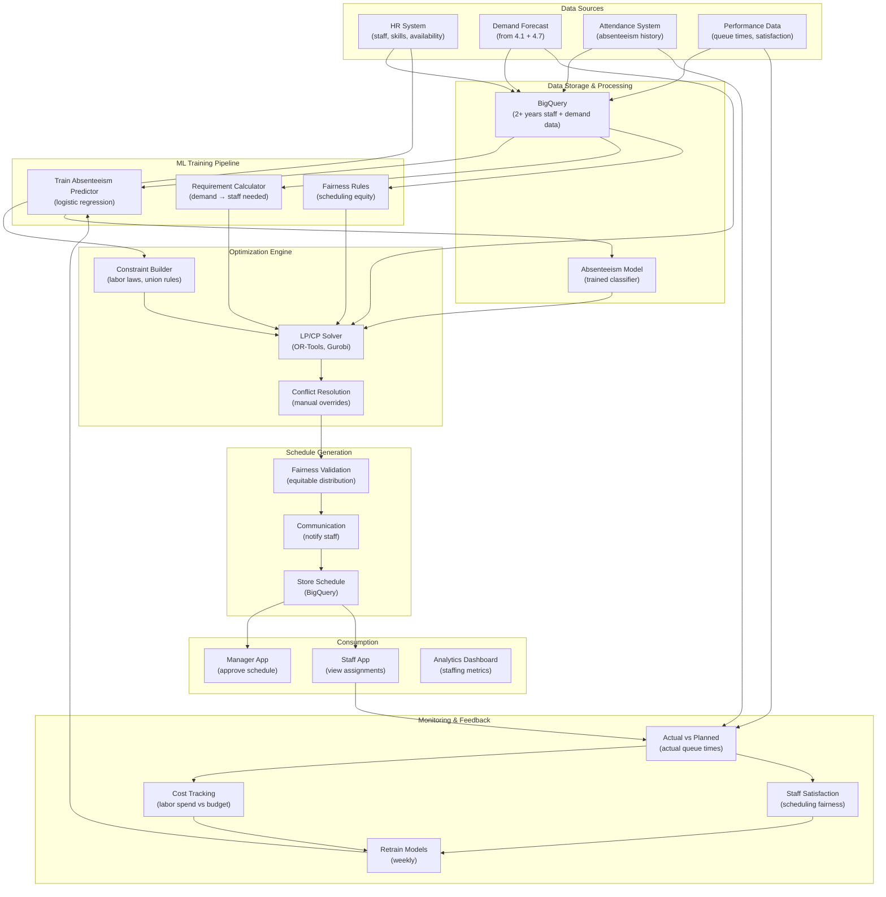

# Staffing Optimization for Operations

> This document outlines the ML solution for optimizing staff scheduling, allocation, and skill matching to maximize operational efficiency and visitor experience.

---

## 1. ML Problem Statement

### Business Context
The estate operates 40 rides and 55 animal enclosures, requiring hundreds of staff across queue management, animal care, maintenance, and visitor services. Over/under-staffing hurts profitability and visitor satisfaction:
- Too many staff: High labor costs, low productivity
- Too few staff: Long queues, missed animal care schedules, safety risks

ML can predict staffing needs and optimize scheduling to reduce labor costs while maintaining service quality.

### Problem Definition
**Primary Objective**: Recommend optimal staff levels and schedules to balance costs and visitor experience

**Key Prediction Targets**:
- **Daily staffing needs**: Total staff required by day and role
- **Hourly allocation**: Staff per ride/area per hour
- **Skill matching**: Assign appropriate staff to roles
- **Schedule optimization**: Generate conflict-free schedules
- **Absence prediction**: Forecast staff absenteeism
- **Cross-training needs**: Identify skill gaps

### Problem Characteristics
- **Multiple objectives**: Cost vs service quality trade-off
- **Complex constraints**: Skill requirements, shift limits, union rules, availability
- **Hierarchical**: Estate-level → area → ride level
- **Dynamic**: Demand changes hourly; need frequent updates
- **Fairness**: Equitable distribution of desirable/undesirable shifts
- **Regulatory**: Labor laws, break requirements, work hour limits

### Success Metrics
| Metric | Target | Description |
|--------|--------|-------------|
| Labor cost reduction | -15-20% | vs baseline scheduling |
| Queue management | Avg wait < 15 min | Staff levels reduce wait times |
| Staff satisfaction | >= 4.0/5.0 | Fair scheduling, minimal conflicts |
| Visitor satisfaction | >= 4.2/5.0 | Quality staff availability |
| Schedule coverage | 100% of roles filled | No uncovered shifts |
| Scheduling time | < 4 hours | vs 40+ hours manual |

---

## 2. ML Solution

### Architecture Overview
Multi-stage optimization: Demand → Staffing needs → Skill matching → Schedule optimization → Conflict resolution

#### 2.1 Core Components

**Component 1: Demand Forecasting (From 4.1 & 4.7)**
- Predicts visitor count and distribution hourly
- Uses estate-level + ride-level demand forecasts
- Input: Historical data, events, weather
- Output: Hourly visitor forecast

**Component 2: Staffing Requirement Calculator**
- Converts demand into required staff
- Rules: 1 staff per 20 visitors for queues, 2 per ride for operations, etc.
- Considers: Ride complexity, safety requirements, break coverage
- Input: Hourly demand, role rules, coverage requirements
- Output: Staff count needed per hour per role

**Component 3: Staff Availability & Constraint Modeling**
- Tracks: Available staff, skills, shift preferences, constraints
- Rules: Max 8-hour shifts, 1 break per 4 hours, 2 days off per week
- Input: Staff database, availability, regulations
- Output: Constraint satisfaction model

**Component 4: Schedule Optimization (Linear Programming / Constraint Programming)**
- Solves: Assign available staff to shifts optimally
- Objective: Minimize cost while meeting demand + constraints
- Uses: OR-Tools or Gurobi solver
- Input: Demand, staff, constraints, preferences
- Output: Recommended schedule

**Component 5: Schedule Fairness & Conflict Resolution**
- Checks: Equitable distribution of shifts (no one gets all bad shifts)
- Resolves: Conflicts using precedence rules
- Input: Proposed schedule, fairness criteria
- Output: Final schedule for approval

**Component 6: Absenteeism Prediction (Classifier)**
- Predicts probability staff will call out
- Input: Historical absenteeism, weather, day-of-week, recent absences
- Output: No-show probability per staff member
- Enables: Over-booking to account for likely absences

#### 2.2 Staffing Algorithm

```
For scheduled date D:

1. DEMAND FORECASTING:
   hourly_demand[D][H] = Forecast_model(historical_demand, events, weather)
   
2. STAFFING REQUIREMENTS:
   For each role R (queue_mgmt, ride_ops, animal_keeper, etc):
     For each hour H:
       demand_visitors = hourly_demand[D][H]
       
       If R == "queue_management":
         Required_staff[R][H] = ceil(demand_visitors / 20)  # 1 per 20 visitors
       Else if R == "ride_operations":
         Required_staff[R][H] = num_rides_open × 2 + cleanup_staff
       Else if R == "animal_care":
         Required_staff[R][H] = num_enclosures / 3 + medical_staff
       
       Add buffer for breaks, absences:
       Final_required[R][H] = Required_staff[R][H] × 1.15

3. STAFF AVAILABILITY:
   For each staff member S:
     available_shifts[S] = Find_valid_shifts(
       preferred_shifts = staff_preferences,
       unavailable_dates = staff_unavailability,
       skill = staff_skill_level,
       max_hours = 40 per week,
       break_requirements = labor_regulations
     )

4. ABSENTEEISM ADJUSTMENT:
   For each staff member S:
     no_show_probability[S] = Predict_absenteeism_model(S, D)
     adjustment_factor = 1 + no_show_probability[S]
   
   Adjust schedule assignments to over-book likely absentees

5. SCHEDULE OPTIMIZATION (Constraint Programming):
   Objective: Minimize labor_cost
   Variables: assignment[S][H] = 1 if staff S assigned hour H, 0 otherwise
   
   Constraints:
     - For each hour H and role R:
         Sum(assignment[S][H] for S in role R) >= Final_required[R][H]
     - For each staff S:
         Max consecutive hours <= 8
         Min break between shifts >= 12 hours
         Total hours per week <= 40
         Must have 2 days off per week
     - No double-booking: Staff can only work one role at a time
     - Skill match: Only assign staff with required skill level
   
   Fairness constraints:
     - Overtime distribution: No one works >45 hours
     - Shift timing: Rotate early/late/night shifts fairly
     - Undesirable shifts: Spread equally
   
   Solve using LP/CP solver (5-60 min depending on complexity)

6. CONFLICT RESOLUTION:
   Manual review of conflicts:
     - Infeasible constraints? Remove lowest-priority constraint
     - Over-budget? Reduce staffing level slightly
     - Staff objections? Swap shifts (if valid)
   
   Iterate until feasible solution

7. FINAL SCHEDULE OUTPUT:
   - Staff assignments per shift
   - Role per shift
   - Backup coverage (who covers if someone no-shows)
   - Communication to staff (email notifications)
```

#### 2.3 Skill-Based Assignment

**Staff Skills & Roles**:
```
Skill Levels:
1. Entry: Basic visitor service, no ride operation
2. Ride Operator: Can operate rides independently
3. Lead Operator: Can train others, emergency decisions
4. Animal Keeper: Certified animal care, feeding, health monitoring
5. Veterinary Support: Can assist veterinarians

Role Requirements:
- Queue Management: Skill 1+
- Ride Operations: Skill 2+ (Lead: Skill 3+)
- Animal Care: Skill 4+ (Medical: Skill 5)
- Maintenance Support: Technical certification

Staff Development:
- Track skill progression
- Identify promotion opportunities
- Recommend cross-training for flexibility
```

---

## 3. Data Requirement

### 3.1 Primary Data Sources

**Source 1: Staff Database**
| Data Point | Collection | Frequency | Details |
|------------|-----------|-----------|---------|
| Staff ID | HR system | Per hire | Unique identifier |
| Role/skill | HR system | Per role change | Competencies, certifications |
| Availability | Self-service app | Weekly | When available to work |
| Preferences | Self-service app | Monthly | Preferred shifts, time-off requests |
| Absenteeism history | Attendance tracking | Per absence | Date, reason, pattern |

**Source 2: Schedule Data**
| Data Point | Collection | Frequency | Details |
|------------|-----------|-----------|---------|
| Shifts | Scheduling system | Per schedule | Date, start, end, role, assigned staff |
| Swaps/changes | Manual input | As occurs | Staff-initiated or manager-approved |
| Overtime | Time tracking | Per timesheet | Hours worked, authorization |
| Break compliance | System log | Real-time | Break taken, duration |

**Source 3: Performance Data**
| Data Point | Collection | Frequency | Details |
|------------|-----------|-----------|---------|
| Queue times | Sensors | Hourly | Actual wait times at rides |
| Visitor satisfaction | Survey | Daily | Rating based on staff interactions |
| Incident reports | Manual | Per incident | Staffing-related issues |
| Animal care quality | Vet checks | Weekly | Health outcomes, care standards |

**Source 4: Operational Data**
| Data Point | Collection | Frequency | Details |
|------------|-----------|-----------|---------|
| Ride status | Control system | Real-time | Open, closed, reduced capacity |
| Maintenance schedule | Work order system | Per job | Rides down, duration |
| Weather | Weather API | Hourly | Temperature, rain affecting operations |
| Special events | Event calendar | Per event | Changes to demand/operations |

### 3.2 Data Specifications

**Historical Data Requirements**:
- **Minimum**: 1-2 years of staff scheduling + performance data
- **Ideal**: 2-3 years for seasonal pattern capture
- **Absenteeism**: 6+ months to build predictive model

**Feature Engineering**:
| Category | Features | Source |
|----------|----------|--------|
| Temporal | Date, day-of-week, season, holiday | Calendar |
| Demand | Forecasted visitors per hour | From 4.1/4.7 |
| Staff | Skill level, seniority, availability, past absences | HR data |
| Constraints | Labor laws, union rules, shift limits | Policy documents |
| Performance | Queue times, visitor satisfaction per staff | Operations |
| Weather | Temperature, rain, special conditions | Weather API |

### 3.3 Data Storage

**Pipeline**:
```
HR System → Cloud Scheduler → BigQuery (staff data)
Attendance Tracking → Cloud Pub/Sub → BigQuery (absences)
Visitor Feedback → Manual export → BigQuery (performance)
Demand Forecast → From ML model → BigQuery (staffing calc)
```

**BigQuery Datasets**:
```
- staff_profiles: Skills, availability, preferences
- scheduling_history: Past schedules, performance data
- absenteeism: Absence patterns, predictions
- demand_forecast: Hourly visitor forecasts (input to staffing)
```

---

## 4. Infra Mermaid of Solution



### Infrastructure Components

| Component | GCP Service | Purpose | Scaling |
|-----------|------------|---------|---------|
| **Data Storage** | BigQuery | Staff, scheduling, performance data | 50GB+ |
| **Absenteeism Model** | Vertex AI Training | Train prediction model | CPU, 2 GPU hours |
| **LP/CP Solver** | Cloud Run + OR-Tools | Optimize schedules | Sub-1min solve per schedule |
| **Automation** | Cloud Scheduler | Daily schedule generation | Cron job (02:00 UTC) |
| **Communication** | Cloud Pub/Sub + Cloud Functions | Notify staff | Real-time messaging |
| **Staff App** | Cloud Run / Flutter | View schedules, request swaps | Mobile + web |
| **Manager App** | Cloud Run / React | Review, approve schedules | Web-based |
| **Monitoring** | Looker / Grafana | Staffing metrics dashboard | Real-time |

---

## 5. ML Ops

### 5.1 Absenteeism Model Training

**Training Schedule** (Weekly):
```
1. Collect absenteeism data (last 2 weeks)
2. Feature engineering:
   - Staff ID, day-of-week, season
   - Weather conditions
   - Recent absence history (rolling)
   - Scheduled shift difficulty (early, late, undesirable)
   - Recent overtime hours
3. Train logistic regression model
4. Evaluate on holdout week
5. Deploy if accuracy improves 2%+
```

**Features for Absenteeism**:
```
- Individual factors: Age, tenure, past absenteeism
- Contextual: Day-of-week, season, holiday
- Weather: Rain, extreme heat (might increase absences)
- Schedule: Early shifts, late shifts, consecutive days
- Workload: Recent overtime, mandatory events
- Recent patterns: Consecutive absences (medical leave)?
```

### 5.2 Schedule Generation Pipeline

**Weekly Schedule Generation** (Tuesday 02:00 UTC):
```
1. Fetch demand forecast (next 2 weeks)
2. Calculate staffing requirements:
   - Apply formulas: visitors → staff per role
   - Add buffer for absences (1.15× factor)
   - Account for mandatory breaks, regulatory limits

3. Predict absenteeism:
   - For each staff member, predict no-show probability
   - Adjust assignments to over-book likely absences

4. Optimize schedule:
   - Run OR-Tools LP solver
   - Objective: Minimize labor cost
   - Constraints: All coverage, skill match, fairness, regulations
   - Timeout: 15 minutes max

5. Fairness validation:
   - Check equitable shift distribution
   - Verify no one works excessive hours
   - Confirm rotations (not same person always early shifts)
   - If issues: Resolve manually or re-run with constraints

6. Manager review:
   - Present schedule to ops manager
   - Allow overrides (personal knowledge)
   - Approve for publication

7. Communicate to staff:
   - Send schedule via staff app
   - Email confirmed assignments
   - Note any last-minute changes
   - Allow shift swaps (with approval)
```

### 5.3 Real-time Monitoring & Adjustments

**Daily Monitoring**:
```
Morning (06:00 UTC):
  1. Check absenteeism: Who called out?
  2. Identify coverage gaps
  3. Trigger backup plan:
     a. Call staff on standby
     b. Offer emergency overtime
     c. Cross-train available staff
     d. Reduce ride capacity if needed

Real-time:
  1. Track actual queue times vs forecasted
  2. Alert manager if queues exceed threshold (20 min)
  3. Recommend staff reassignment
  4. Monitor visitor satisfaction scores
```

**Performance Metrics** (Hourly Dashboard):
```
- Queue length vs target
- Staff utilization rate
- Coverage gaps (unfilled positions)
- Visitor satisfaction (real-time feedback)
- Labor cost (actual spend)
```

### 5.4 Optimization & Feedback Loop

**Weekly Analysis**:
```
1. Compare planned vs actual schedules:
   - Did absences match predictions?
   - Were queue times as forecast?
   - Was staffing sufficient?

2. Identify systematic issues:
   - Certain staff members frequently absent?
   - Specific shifts always over-budget?
   - Specific areas under-served?

3. Adjust for next week:
   - Update absenteeism predictions
   - Recalibrate staffing rules
   - Adjust fairness constraints if needed
```

---

## 6. Caveats to Consider

### 6.1 Optimization Challenges

| Challenge | Impact | Mitigation |
|-----------|--------|-----------|
| **Infeasible constraints** | No valid schedule exists | Relax lowest-priority constraints; reduce demand |
| **Long solve times** | LP solver takes hours | Use heuristics + primal solutions; timeout at 15 min |
| **Staff resistance** | Unhappy with optimized schedules | Include fairness rules; allow manual overrides |
| **Absenteeism unpredictability** | Can't perfectly predict call-outs | Over-book conservatively; maintain standby pool |
| **Dynamic changes** | Emergency maintenance, illness changes needs | Allow real-time reassignment; flexible standby |

### 6.2 Operational Challenges

| Challenge | Consequence | Solution |
|-----------|-----------|---------|
| **Cross-training gaps** | Can't shift staff when needed | Invest in training; identify flexibility needs |
| **Union constraints** | Labor rules limit optimization options | Incorporate union rules into solver; negotiate flexibility |
| **Staff burnout** | Automated scheduling ignores fatigue | Add fatigue metrics; limit consecutive shifts |
| **Morale** | "Robot scheduler" complaints | Show fairness in distribution; allow personalization |
| **Manual overrides** | Managers ignore recommendations | Education on schedule rationale; gradual adoption |

### 6.3 Labor & Compliance Issues

| Issue | Risk | Approach |
|-------|------|----------|
| **Break violations** | Legal liability if breaks not given | Hard constraints in solver; audit compliance |
| **Overtime limits** | FLSAssess and track labor regulations | Automatic limits in solver; alerts at 40 hours |
| **Minimum wage credits** | Ensure scheduling meets minimum hours | Set minimum guaranteed hours per staff member |
| **Discrimination** | Scheduling bias (e.g., always giving holidays to favorites) | Fairness audits; remove biased constraints; transparency |

### 6.4 Business Trade-offs

| Trade-off | Impact | Balance |
|-----------|--------|---------|
| **Cost vs Quality** | Lower cost → reduced staff → longer queues | Weighted objective; visitor satisfaction constraint |
| **Fairness vs Efficiency** | Fair distribution → higher costs | Allow optional overrides; balance weights |
| **Flexibility vs Predictability** | Frequent changes → staff uncertainty | Stick to 2-week schedule; only emergency overrides |

### 6.5 Recommendation Priorities

**Immediate (MVP)** - Weeks 1-4:
1. Implement demand → staffing calculator
2. Build constraint model (labor laws, regulations)
3. Solve with basic LP solver
4. Manual fairness review
5. Communicate to staff via app

**Phase 2** - Weeks 5-12:
1. Train absenteeism predictor
2. Automated fairness validation
3. Manager app for schedule approval
4. Staff app for viewing, requesting swaps
5. Real-time queue monitoring + alerts

**Phase 3** - Weeks 13-24:
1. Dynamic schedule adjustment (real-time reassignment)
2. Staff satisfaction tracking + feedback loop
3. Cross-training recommendations
4. Predictive surge staffing
5. Integration with other systems (HR, payroll)

---

## 7. Success Criteria & KPIs

| KPI | Target | Timeline |
|-----|--------|----------|
| Labor cost reduction | -15-20% | Week 16 |
| Schedule coverage | 100% of roles filled | Week 8 |
| Average queue time | < 15 minutes | Week 12 |
| Staff satisfaction | >= 4.0/5.0 | Week 12 |
| Visitor satisfaction | >= 4.2/5.0 | Week 16 |
| Schedule generation time | < 4 hours | Week 4 |
| Absenteeism prediction accuracy | > 75% recall | Week 12 |

