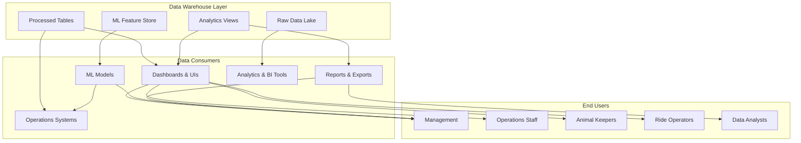

# Data Consumption and Usage Patterns

> This document describes how data products from the central Data Warehouse are consumed by operational systems, dashboards, reports, and ML models to drive decision-making across the estate.

---

## 1. Consumption Architecture Overview



---

## 2. Dashboard and UI Consumption

### 2.1 Estate Operations Command Center (Real-Time)

**Audience**: Estate Management, Operations Director

**Refresh Frequency**: Real-time (update every 30-60 seconds)

**Data Sources**:
- `analytics.current_estate_status` (view)
- `processed.visitor_session_journey` (last 1 hour)
- `processed.footfall_by_zone_hourly` (latest hour)
- `analytics.ride_status_dashboard` (today)
- `processed.animal_wellness_summary` (today)

**Key Metrics Displayed**:
```
┌─────────────────────────────────────────────────┐
│     ESTATE STATUS DASHBOARD - LIVE               │
├─────────────────────────────────────────────────┤
│                                                   │
│  Visitors Today:    4,523  (↑ 12% vs last week)  │
│  Revenue Today:     €45,230 (↑ 8%)               │
│  Current Occupancy: 68% (Optimal range: 60-80%)  │
│  Peak Hour:         2 PM (estimated)             │
│                                                   │
│  ┌─ ZONE STATUS ─────────────────────────────┐   │
│  │ Ride Zone A:      72% occupancy           │   │
│  │ Animal Park:      65% occupancy           │   │
│  │ Queue Times:      ~25 min average         │   │
│  │ Staffing Alert:   Zone C understaffed     │   │
│  └────────────────────────────────────────────┘   │
│                                                   │
│  ┌─ OPERATIONAL ALERTS ──────────────────────┐   │
│  │ 🔴 CRITICAL: Ride #7 wear at 85%         │   │
│  │ 🟡 WARNING:  Animal health alert #3      │   │
│  │ 🟢 INFO:     Forecast: 5,200 visitors    │   │
│  │              tomorrow                     │   │
│  └────────────────────────────────────────────┘   │
│                                                   │
└─────────────────────────────────────────────────┘
```

**Implementation**:
- **Backend**: Cloud Run service querying BigQuery + Firestore cache
- **Frontend**: React app with WebSocket updates
- **Query Pattern**: 
  ```sql
  SELECT 
    (SELECT COUNT(*) FROM processed.visitor_session_journey 
     WHERE DATE(entry_time) = CURRENT_DATE()) as today_visitors,
    (SELECT SUM(occupancy_pct) / COUNT(*) 
     FROM processed.footfall_by_zone_hourly 
     WHERE footfall_timestamp = TIMESTAMP_TRUNC(CURRENT_TIMESTAMP(), MINUTE))
       as current_occupancy
  ```

---

### 2.2 Visitor Footfall & Zone Management Dashboard

**Audience**: Queue Management Team, Zone Staff

**Refresh Frequency**: Every 5 minutes

**Data Sources**:
- `processed.footfall_by_zone_hourly` (last 24 hours)
- `processed.visitor_session_journey` (last 1 hour)
- `dim.zones` (reference)
- `dim.calendar` (for holiday flags)

**Key Metrics**:
- Current occupancy per zone (%)
- Hourly visitor flow (entries/exits)
- Queue depth and estimated wait times
- Anomaly alerts (unusual spike/drop)
- Recommended staff deployment

**Use Cases**:
1. **Queue Management**: "Zone B queue is getting long, recommend 2 more staff"
2. **Flow Optimization**: "Move barrier at Zone C to distribute flow"
3. **Crowd Control**: "Close temporary entry to Zone D, divert to Zone E"
4. **Real-time Decision Making**: "Should we trigger surge pricing?"

**SQL Example**:
```sql
WITH current_hour AS (
  SELECT 
    zone_id, zone_name,
    entry_count, exit_count,
    current_occupancy,
    occupancy_pct,
    anomaly_score
  FROM processed.footfall_by_zone_hourly
  WHERE footfall_timestamp = TIMESTAMP_TRUNC(CURRENT_TIMESTAMP(), HOUR)
    AND zone_id IN (SELECT zone_id FROM dim.zones)
)
SELECT 
  zone_id, zone_name,
  occupancy_pct,
  CASE 
    WHEN occupancy_pct > 90 THEN 'CRITICAL'
    WHEN occupancy_pct > 75 THEN 'HIGH'
    WHEN occupancy_pct > 40 THEN 'NORMAL'
    ELSE 'LOW'
  END as crowding_level,
  entry_count, exit_count,
  LAG(occupancy_pct) OVER (PARTITION BY zone_id ORDER BY footfall_timestamp) 
    as occupancy_pct_prev_hour,
  anomaly_score
FROM current_hour
ORDER BY occupancy_pct DESC;
```

---

### 2.3 Ride Maintenance & Safety Dashboard

**Audience**: Ride Maintenance Team, Safety Officer

**Refresh Frequency**: Every 1 hour

**Data Sources**:
- `processed.ride_usage_daily` (today)
- `processed.ride_maintenance_schedule` (current)
- `processed.ride_sensor_health` (realtime alerts)
- `dim.rides` (reference)

**Key Metrics**:
- Wear index per ride (red/yellow/green)
- Maintenance due schedule
- Safety event counts (e-stops, alerts)
- Component-level health
- Inspection certificate status
- Downtime vs utilization correlation

**Critical Features**:
1. **Maintenance Alerts**: "Component X due for maintenance in 2 days"
2. **Safety Escalation**: "E-stop triggered 3 times today - inspect ride immediately"
3. **Compliance Tracking**: "Inspection certificate expires in 3 months"
4. **Historical Trend**: "Ride 5 shows increasing wear pattern over 6 months"

**SQL Example**:
```sql
SELECT 
  r.ride_id, r.ride_name, r.zone_id,
  u.total_cycles, u.capacity_utilization_pct,
  u.safety_events,
  m.next_maintenance_due, m.days_until_due,
  m.wear_percentage,
  CASE 
    WHEN m.days_until_due <= 3 THEN 'URGENT'
    WHEN m.days_until_due <= 7 THEN 'SOON'
    ELSE 'SCHEDULED'
  END as maintenance_urgency,
  i.inspection_certificate_status,
  DATEDIFF(DAY, CURRENT_DATE(), i.next_inspection_due) 
    as days_until_inspection_due
FROM dim.rides r
LEFT JOIN processed.ride_usage_daily u ON r.ride_id = u.ride_id
LEFT JOIN processed.ride_maintenance_schedule m ON r.ride_id = m.ride_id
LEFT JOIN processed.ride_inspection_schedule i ON r.ride_id = i.ride_id
WHERE u.usage_date = CURRENT_DATE()
ORDER BY m.days_until_due ASC;
```

---

### 2.4 Animal Health & Welfare Dashboard

**Audience**: Animal Keepers, Veterinarians

**Refresh Frequency**: Every 5 minutes (health alerts), hourly (summaries)

**Data Sources**:
- `processed.enclosure_health_daily` (today)
- `processed.animal_individual_history` (rolling 90 days)
- `processed.population_by_species` (current)
- `dim.enclosures`, `dim.species` (reference)

**Key Metrics**:
- Population count per enclosure (with confidence)
- Average health score per enclosure
- Animals with active health alerts
- Feeding efficiency
- Days since last vet visit
- Temperature/environmental conditions

**Critical Features**:
1. **Health Alerts**: "Animal #47 weight down 8% in 3 days - vet attention needed"
2. **Population Monitoring**: "Jumping piranha enclosure: expected 47, counted 45 - check for escape"
3. **Behavior Stress**: "Zebra showing aggressive behavior - possible stress"
4. **Feeding Optimization**: "Enclosure B: feed consumption 65% - adjust portions"

**SQL Example**:
```sql
SELECT 
  e.enclosure_id, e.enclosure_name, s.species_name,
  h.population_count, h.population_confidence,
  h.avg_weight, h.weight_variance,
  h.temperature_avg, h.temperature_min, h.temperature_max,
  h.feeding_efficiency_pct,
  h.animals_with_health_alerts,
  h.avg_health_score,
  h.anomaly_detected,
  h.last_vet_visit_date,
  h.days_since_vet_visit,
  CASE 
    WHEN h.days_since_vet_visit > 90 THEN 'OVERDUE'
    WHEN h.days_since_vet_visit > 60 THEN 'SOON'
    ELSE 'SCHEDULED'
  END as vet_visit_urgency
FROM processed.enclosure_health_daily h
JOIN dim.enclosures e ON h.enclosure_id = e.enclosure_id
JOIN dim.species s ON h.species_id = s.species_id
WHERE h.health_date = CURRENT_DATE()
ORDER BY h.anomaly_detected DESC, h.animals_with_health_alerts DESC;
```

---

### 2.5 Revenue & Business Analytics Dashboard

**Audience**: Management, Finance, Marketing

**Refresh Frequency**: Daily (historical), Hourly (current day projections)

**Data Sources**:
- `processed.revenue_daily` (historical + today)
- `analytics.revenue_kpis` (view)
- `processed.customer_segment_analytics` (cohort analysis)
- `processed.visitor_daily_summary` (visitor trends)

**Key Metrics**:
- Daily/weekly/monthly revenue
- Revenue per visitor
- Ticket type breakdown (individual, family, passes)
- Customer acquisition and retention
- Lifetime value by segment
- Promotion effectiveness

**Strategic Features**:
1. **Revenue Forecasting**: "Projected revenue tomorrow: €48,000 (98% confidence)"
2. **Cohort Analysis**: "Family pass buyers have 3.2x repeat visit rate"
3. **Promotion ROI**: "Back-to-school promotion: +12% revenue, +8% new visitors"
4. **Segment Insights**: "Loyalty members now 34% of revenue, growing 5% month-over-month"

**SQL Example**:
```sql
SELECT 
  r.revenue_date,
  r.total_revenue,
  r.total_tickets_sold,
  r.avg_ticket_price,
  ROUND(LAG(r.total_revenue) OVER (ORDER BY r.revenue_date), 2) 
    as revenue_prev_day,
  ROUND((r.total_revenue - LAG(r.total_revenue) OVER (ORDER BY r.revenue_date)) 
    / LAG(r.total_revenue) OVER (ORDER BY r.revenue_date) * 100, 2)
    as revenue_growth_pct_1d,
  r.family_pass_revenue / r.total_revenue * 100 
    as family_pass_pct,
  r.loyalty_member_revenue / r.total_revenue * 100 
    as loyalty_revenue_pct,
  r.repeat_visitor_revenue / r.total_revenue * 100 
    as repeat_visitor_revenue_pct
FROM processed.revenue_daily r
ORDER BY r.revenue_date DESC
LIMIT 30;
```

---

## 3. ML Model Consumption

### 3.1 Demand Forecasting Model

**Purpose**: Predict visitor count for operational planning and dynamic pricing

**Input Data Source**: `ml_features.demand_forecast_daily`

**Model Type**: Ensemble (ARIMA + Prophet + LSTM + XGBoost)

**Prediction Granularity**:
- Daily forecast: 7-14 days ahead
- Hourly forecast: 24-48 hours ahead
- Zone-level forecast: 24 hours ahead

**Model Outputs**:
```
Predictions table: ml_predictions.demand_forecast
Columns:
  - prediction_date (DATE)
  - forecast_timestamp (TIMESTAMP) - when prediction was made
  - hourly_visitor_count (INT)
  - hourly_lower_bound (INT) - 95% CI
  - hourly_upper_bound (INT)
  - zone_id (STRING)
  - zone_visitor_count (INT)
  - confidence_score (FLOAT)
  - model_version (STRING)
```

**Consumption Channels**:
1. **Operations Dashboard**: Display forecast vs actual
2. **Staffing Automation**: Recommend staff levels per shift
3. **Dynamic Pricing Service**: "If forecast > 12K visitors, increase price by 5%"
4. **Capacity Planning**: "Forecast spike next Saturday, prepare additional queues"

**SLA**: 
- Forecast available by 6 AM daily
- Hourly updates every 2 hours
- Target accuracy: MAPE < 10% for daily, RMSE < 50 for hourly

**Query for Consumption**:
```sql
-- Get tomorrow's forecast
SELECT 
  forecast_timestamp,
  EXTRACT(HOUR FROM prediction_date) as hour,
  hourly_visitor_count,
  hourly_lower_bound,
  hourly_upper_bound,
  confidence_score
FROM ml_predictions.demand_forecast
WHERE prediction_date = CURRENT_DATE() + 1
  AND zone_id IS NULL  -- estate-wide
ORDER BY EXTRACT(HOUR FROM prediction_date);

-- Use in staffing calculation
SELECT 
  EXTRACT(HOUR FROM prediction_date) as hour,
  hourly_visitor_count,
  CASE 
    WHEN hourly_visitor_count > 800 THEN 12  -- staff count
    WHEN hourly_visitor_count > 500 THEN 8
    ELSE 5
  END as recommended_staff_count
FROM ml_predictions.demand_forecast
WHERE prediction_date = CURRENT_DATE() + 1
ORDER BY hour;
```

---

### 3.2 Dynamic Pricing Model

**Purpose**: Optimize ticket prices in real-time to maximize revenue

**Input Data Source**: `ml_features.pricing_optimization_daily`

**Model Type**: Revenue optimization engine (Linear Programming + Demand Elasticity)

**Prediction Granularity**:
- Daily pricing: Updated nightly for next day
- Real-time adjustments: Every 2 hours based on current demand

**Model Outputs**:
```
Predictions table: ml_predictions.price_recommendation
Columns:
  - recommendation_timestamp (TIMESTAMP)
  - effective_date (DATE)
  - hour_of_day (INT)
  - individual_ticket_price (DECIMAL)
  - family_pass_price (DECIMAL)
  - group_price (DECIMAL)
  - loyalty_member_discount_pct (FLOAT)
  - predicted_revenue_impact_pct (FLOAT)
  - confidence_score (FLOAT)
  - reason_for_change (STRING)
  - model_version (STRING)
```

**Consumption Channels**:
1. **Ticketing Service**: Query current price recommendation, apply to booking system
2. **Pricing Dashboard**: Show recommended vs current price, revenue impact
3. **A/B Testing**: Test recommended price on subset of users
4. **Alert System**: Flag unusual price swings for approval

**SLA**:
- Pricing recommendation available 24h before
- Real-time adjustments with < 5 min latency
- Daily review and approval by management

**Query for Consumption**:
```sql
-- Get current price recommendation
SELECT 
  individual_ticket_price,
  family_pass_price,
  loyalty_member_discount_pct,
  predicted_revenue_impact_pct,
  confidence_score,
  reason_for_change
FROM ml_predictions.price_recommendation
WHERE effective_date = CURRENT_DATE()
  AND hour_of_day = EXTRACT(HOUR FROM CURRENT_TIME())
LIMIT 1;

-- Alert if unusual change
SELECT 
  individual_ticket_price,
  LAG(individual_ticket_price) OVER (ORDER BY recommendation_timestamp)
    as previous_price,
  ROUND((individual_ticket_price - LAG(individual_ticket_price) 
    OVER (ORDER BY recommendation_timestamp)) / LAG(individual_ticket_price) 
    OVER (ORDER BY recommendation_timestamp) * 100, 2)
    as price_change_pct
FROM ml_predictions.price_recommendation
WHERE effective_date = CURRENT_DATE()
HAVING ABS(price_change_pct) > 10  -- Alert if > 10% change
ORDER BY recommendation_timestamp DESC;
```

---

### 3.3 Animal Health Anomaly Detection Model

**Purpose**: Detect illness, stress, or behavioral anomalies in animals

**Input Data Source**: `ml_features.animal_health_anomaly_daily`

**Model Type**: Deep Learning (CNN + Transformer for behavior, XGBoost for health metrics)

**Prediction Granularity**:
- Per-animal daily assessment
- Real-time alerts on anomaly detection
- Behavioral stress prediction

**Model Outputs**:
```
Predictions table: ml_predictions.animal_health_anomaly
Columns:
  - prediction_date (DATE)
  - animal_id (STRING)
  - anomaly_detected (BOOLEAN)
  - anomaly_type (STRING) - illness/stress/injury/behavior_change
  - anomaly_score (FLOAT) - 0.0-1.0 confidence
  - risk_level (STRING) - LOW/MEDIUM/HIGH/CRITICAL
  - recommended_action (STRING) - no_action/monitor/vet_checkup/isolate
  - key_indicators (ARRAY<STRING>) - which features triggered alert
  - explanation (STRING) - human-readable reason
```

**Consumption Channels**:
1. **Animal Health Dashboard**: Show alerts per enclosure
2. **Keeper Mobile App**: Real-time push notification for assigned animals
3. **Vet Scheduling**: Auto-create vet visit request for high-risk animals
4. **Behavior Analysis**: "Animal showing stress behavior - check enclosure crowding"

**SLA**:
- Anomaly detection results available within 4 hours of daily health readings
- Critical anomalies (risk_level = CRITICAL) trigger immediate alert
- False positive rate < 2%

**Query for Consumption**:
```sql
-- Get alerts for keeper's assigned animals
SELECT 
  a.animal_id, a.animal_name, s.species_name,
  h.anomaly_detected, h.anomaly_type, h.anomaly_score,
  h.risk_level, h.recommended_action,
  h.explanation
FROM ml_predictions.animal_health_anomaly h
JOIN dim.animals a ON h.animal_id = a.animal_id
JOIN dim.species s ON a.species_id = s.species_id
WHERE h.prediction_date = CURRENT_DATE()
  AND h.risk_level IN ('HIGH', 'CRITICAL')
  AND a.animal_id IN (
    SELECT animal_id FROM keeper_assignments 
    WHERE keeper_id = 'KEEPER_001'
  )
ORDER BY h.anomaly_score DESC;

-- Push notification to keeper
-- "Alert: Animal {name} showing {anomaly_type} behavior (confidence: 87%)"
```

---

### 3.4 Vision-Based Population Counting Model

**Purpose**: Automatic population census per enclosure from camera feeds

**Input Data Source**: Live camera streams (video) + `raw.camera_feeds`

**Model Type**: Computer Vision (YOLOv8 + DeepSORT + Behavior Analysis)

**Output Granularity**:
- Per enclosure every 5 minutes
- Per species within enclosure
- Behavioral anomaly detection

**Model Outputs**:
```
Predictions table: ml_predictions.population_count
Columns:
  - count_timestamp (TIMESTAMP)
  - enclosure_id (STRING)
  - species_id (STRING)
  - population_count (INT)
  - count_confidence (FLOAT) - 0.0-1.0
  - counting_method (STRING) - vision/manual_verify/hybrid
  - animals_identified (INT)
  - animals_unidentified (INT)
  - population_change_since_last_count (INT)
  - anomalies_detected (ARRAY<STRING>) - escape_attempt/fight/illness/unusual_behavior
  - camera_health_score (FLOAT) - image quality assessment
  - model_version (STRING)
```

**Consumption Channels**:
1. **Animal Health Dashboard**: Display population count with confidence
2. **Enclosure Status**: Show missing animals alert if count < expected
3. **Regulatory Compliance**: Daily census report for authorities
4. **Behavior Monitoring**: Alert on escape attempts or aggression

**SLA**:
- Population count available within 5 minutes of capture
- Counting accuracy ≥ 95% (vs manual audit)
- False alert rate < 2%
- Uptime: 99%+ (24/7 monitoring)

**Query for Consumption**:
```sql
-- Check for missing animals (escape detection)
WITH expected_pop AS (
  SELECT enclosure_id, species_id, COUNT(*) as expected_count
  FROM dim.animals
  WHERE status = 'ACTIVE'
  GROUP BY enclosure_id, species_id
)
SELECT 
  p.enclosure_id, p.species_id, p.population_count,
  ep.expected_count,
  (ep.expected_count - p.population_count) as missing_animals,
  p.count_confidence,
  CASE 
    WHEN (ep.expected_count - p.population_count) > 0 
      AND p.count_confidence > 0.95 THEN 'ALERT_POSSIBLE_ESCAPE'
    ELSE 'NORMAL'
  END as status
FROM ml_predictions.population_count p
LEFT JOIN expected_pop ep USING (enclosure_id, species_id)
WHERE p.count_timestamp = (
  SELECT MAX(count_timestamp) FROM ml_predictions.population_count
)
  AND ep.expected_count IS NOT NULL
ORDER BY missing_animals DESC;
```

---

## 4. Operational System Integration

### 4.1 Ticketing Service Integration

**Data Needed From Warehouse**:
- `dim.ticket_types` - current ticket catalog and prices
- `ml_predictions.price_recommendation` - dynamic pricing
- `processed.current_occupancy` - capacity status
- `processed.promotions_active` - active discount codes

**Query Pattern**:
```python
# Pseudocode: Ticketing service
def get_ticket_price(ticket_type, purchase_date):
    # Get base price from catalog
    base_price = bq.query(
        f"SELECT base_price FROM dim.ticket_types WHERE type='{ticket_type}'"
    )[0]
    
    # Get dynamic adjustment
    adjustment = bq.query(
        f"SELECT individual_ticket_price FROM ml_predictions.price_recommendation "
        f"WHERE effective_date='{purchase_date}' LIMIT 1"
    )[0]
    
    return adjustment if adjustment else base_price
```

---

### 4.2 Operations API Integration

**Real-Time Endpoints**:

```python
# GET /api/estate/status
# Returns current operational status from warehouse
{
  "current_visitors": 4523,
  "current_occupancy_pct": 68,
  "peak_hour": 14,
  "zones": [
    {"zone_id": "Z1", "occupancy_pct": 72, "alerts": []},
    {"zone_id": "Z2", "occupancy_pct": 65, "alerts": []},
    {"zone_id": "Z3", "occupancy_pct": 80, "alerts": ["HIGH_CROWDING"]}
  ],
  "rides": [
    {"ride_id": "R7", "wear_index": 85, "alert": "MAINTENANCE_URGENT"},
    {"ride_id": "R12", "wear_index": 45, "alert": null}
  ],
  "animals": [
    {"enclosure_id": "E3", "population": 45, "expected": 47, "alert": "POSSIBLE_ESCAPE"},
    {"enclosure_id": "E7", "population": 23, "expected": 23, "alert": null}
  ]
}

# GET /api/forecast/demand
# Returns visitor forecast for planning
{
  "forecast_date": "2024-01-15",
  "daily_forecast": 12500,
  "hourly_breakdown": [
    {"hour": 0, "visitors": 100},
    {"hour": 1, "visitors": 80},
    ...
    {"hour": 14, "visitors": 1200},  # peak
    ...
    {"hour": 23, "visitors": 250}
  ],
  "confidence_score": 0.94
}

# GET /api/staffing/recommendation
# Returns staffing needs based on forecast
{
  "recommended_staff_plan": [
    {"shift": "8AM-2PM", "queue_team": 8, "ride_ops": 5, "keepers": 3},
    {"shift": "2PM-8PM", "queue_team": 12, "ride_ops": 7, "keepers": 4},
    {"shift": "8PM-12PM", "queue_team": 5, "ride_ops": 3, "keepers": 2}
  ]
}
```

---

## 5. Reporting and Export

### 5.1 Daily Management Report

**Generated**: 7 AM each day
**Format**: PDF email to management
**Data Source**: `analytics.estate_daily_summary` + ML predictions

**Contents**:
1. Daily summary (visitors, revenue, incidents)
2. Visitor forecast for today and tomorrow
3. Top 3 operational alerts
4. Revenue vs budget
5. Key metrics trend chart (last 30 days)
6. Retention rate by cohort

**SQL Query**:
```sql
-- Generate daily report data
SELECT 
  CURRENT_DATE() as report_date,
  s.visitors_count,
  s.revenue_total,
  s.revenue_per_visitor,
  f.visitor_forecast_tomorrow,
  (SELECT COUNT(*) FROM analytics.operational_alerts WHERE priority = 'CRITICAL') 
    as critical_alerts,
  r.revenue_growth_pct_1d,
  r.repeat_visitor_pct
FROM analytics.estate_daily_summary s
JOIN ml_predictions.demand_forecast f ON DATE(f.prediction_date) = CURRENT_DATE()
JOIN analytics.revenue_kpis r ON r.revenue_date = CURRENT_DATE()
WHERE s.summary_date = CURRENT_DATE() - 1;  -- yesterday's report
```

---

### 5.2 Weekly Operational Deep Dive

**Generated**: Monday 8 AM
**Format**: Interactive BI report
**Data Sources**: All processed tables + feature store

**Sections**:
- Visitor trends (week vs week, year vs year)
- Top/bottom performing zones and rides
- Animal health summary by species
- Maintenance completion rate
- Revenue breakdown by ticket type
- Customer retention cohort analysis
- ML model performance metrics

---

### 5.3 Monthly Executive Summary

**Generated**: 1st of month at 9 AM
**Format**: Executive presentation
**Data Sources**: Aggregated monthly metrics

**Key Slides**:
1. Financial Performance (revenue, COGS, margin)
2. Operational Efficiency (utilization, safety, maintenance)
3. Customer Experience (retention, satisfaction, growth)
4. ML Insights (demand patterns, pricing effectiveness, animal welfare)
5. Strategic Recommendations (based on data trends)

---

### 5.4 Data Exports for External Systems

**Export Destinations**:

1. **Revenue System** → Accounting software
   - Daily revenue summary (orders, payments)
   - Frequency: Daily at 11 PM
   - Format: CSV, SFTP

2. **HR System** → Staff scheduling software
   - Staffing recommendations
   - Frequency: Daily at 6 AM
   - Format: JSON API

3. **Regulatory Reporting** → Government compliance
   - Animal population census
   - Safety incident log
   - Frequency: Weekly
   - Format: Encrypted PDF

4. **Marketing Platform** → Customer segmentation
   - Cohort definitions and metrics
   - Customer LTV scores
   - Frequency: Weekly
   - Format: CSV to cloud storage

---

## 6. BI Tools Integration

### 6.1 Looker Studio for Real-Time Dashboards

**Data Source**: BigQuery tables + ML predictions

**Dashboards**:
- Public Estate Dashboard (lobby display)
- Staff Operations Dashboard (mobile-friendly)
- Management Command Center (executive view)
- Animal Wellness Monitor (keeper app)
- Revenue Analytics (finance view)

**Refresh**: Real-time connections (Looker polls BigQuery every 30 seconds)

### 6.2 Tableau for Advanced Analytics

**Data Source**: BigQuery + raw data lake (GCS)

**Use Cases**:
- Cohort analysis dashboards
- Predictive analytics (model output visualization)
- Root cause analysis (drill-down capabilities)
- Custom business logic analysis

**Access**: Data analysts and senior management

---

## 7. ML Model Monitoring and Feedback Loop

### 7.1 Model Performance Tracking

**Table**: `ml_monitoring.model_performance`

```
Columns:
  - prediction_date (DATE)
  - model_name (STRING) - demand_forecast, pricing, anomaly_detection
  - model_version (STRING)
  - actual_value (FLOAT) - ground truth
  - predicted_value (FLOAT) - model output
  - mae (FLOAT) - mean absolute error
  - mape (FLOAT) - mean absolute percentage error
  - accuracy (FLOAT) - for classification models
  - data_drift_detected (BOOLEAN)
  - action_taken (STRING) - retrain/alert/monitor
```

**Monitoring Dashboard**:
- Daily accuracy metrics
- Alert if MAPE > threshold
- Automatic retraining trigger

---

### 7.2 Feedback Loop for Model Improvement

```
1. Model makes prediction (e.g., forecast 12,000 visitors)
   ↓
2. Actual value observed (actual: 11,800 visitors)
   ↓
3. Recorded in ml_monitoring.model_performance
   ↓
4. Analytics job calculates metrics
   ↓
5. If error exceeds threshold:
   - Alert data science team
   - Flag data for investigation
   - Trigger automatic retraining
   ↓
6. Retrained model evaluated on holdout test set
   ↓
7. If improved: Deploy new model version
   If degraded: Keep current model, investigate data quality
```

---

## 8. Data Consumption SLA and Availability

| Consumer | Data Source | Refresh SLA | Availability | Critical? |
|----------|-------------|------------|---------------|-----------|
| **Estate Operations Dashboard** | Real-time views | < 1 min | 99.9% | Yes |
| **Demand Forecast Model** | Feature store | 6 AM daily | 99% | Yes |
| **Dynamic Pricing Service** | Price recommendations | Hourly | 99.5% | Yes |
| **Animal Health Dashboard** | Health summary | 5-min windows | 99% | Yes |
| **Revenue Dashboard** | Revenue daily table | 1 hour | 95% | No |
| **Monthly Executive Report** | Aggregated metrics | Monthly | 99% | No |
| **Regulatory Export** | Animal census | Weekly | 99.5% | Yes |

---

## 9. Example: Complete Visitor Journey Data Flow

```
REAL-TIME OPERATIONS
═══════════════════════════════════════════════════════════════

8:00 AM: Manager logs into Operations Dashboard
  ↓ [Queries analytics.current_estate_status]
  ↓
  "Current visitors: 1,200
   Busiest zone: Ride Zone A (85% occupancy)
   Forecast today: 9,500 total (95% confidence)
   Recommended staff: +3 more in Queue Mgmt"
  ↓ [Manager deploys additional staff]

10:00 AM: Actual visitor flow increases as expected
  ↓ [Real-time data ingested]
  ↓ [processed.footfall_by_zone_hourly updated]
  ↓ [Looker dashboard updates automatically]
  ↓
  "Zone A now 92% occupancy - alert triggered
   Recommend surge pricing: +8%"
  ↓ [Ticketing system queries ml_predictions.price_recommendation]
  ↓ [Pricing adjusted automatically]
  ↓ [New visitors see higher price, some deter (elastic demand)]

2:00 PM: Peak hour passes
  ↓ [Occupancy drops to 70%]
  ↓ [Automatic price reversion]
  ↓ [Demand increases again, reaches equilibrium]

6:00 PM: Daily batch jobs run
  ↓ [raw.entry_logs + rides.usage aggregated]
  ↓ [processed.visitor_daily_summary created]
  ↓ [processed.revenue_daily updated]
  ↓ [processed.ride_usage_daily updated]

7:00 PM: ML feature engineering runs
  ↓ [ml_features.demand_forecast_daily populated]
  ↓ [ml_features.pricing_optimization_daily populated]
  ↓ [ml_features.animal_health_anomaly_daily populated]

8:00 PM: ML models run
  ↓ [Demand model predicts tomorrow: 11,200 visitors]
  ↓ [Pricing model recommends price: €42 individual, €130 family]
  ↓ [Health anomaly model flags 2 animals for vet check]
  ↓ [Results written to ml_predictions tables]

8:30 PM: Management review
  ↓ [Manager queries tomorrow's forecast]
  ↓ [Reviews price recommendation]
  ↓ [Approves pricing; rejects if unreasonable]

6:00 AM NEXT DAY: Tickets go on sale
  ↓ [New prices active]
  ↓ [Ticketing service queries current prices from warehouse]
  ↓ [Forecast displayed to public on website]

THIS ENTIRE FLOW: Powered by integrated data warehouse consuming and producing data continuously
```

---

This consumption architecture ensures that every piece of data flowing into the warehouse creates actionable value for operations, management, and strategic decision-making.
