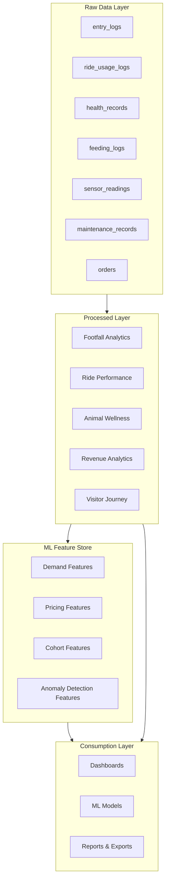

# Data Products and Analytics

> This document describes the curated data products, datasets, and analytical views created in the central Data Warehouse to power dashboards, ML models, and business intelligence for estate operations.

---

## 1. Data Products Overview

Data products are structured, curated datasets designed for specific business use cases. They transform raw operational data into actionable insights.



---

## 2. Core Data Products

### 2.1 Footfall & Visitor Analytics

**Purpose**: Understand visitor flow, peak times, and zone popularity

**Tables**:

#### 2.1.1 `processed.visitor_daily_summary`
Track daily visitor metrics across the estate

```
Columns:
  - visit_date (DATE)
  - total_visitors (INT) - total unique visitors
  - new_visitors (INT) - first-time visitors
  - returning_visitors (INT) - loyalty members or repeat tickets
  - avg_dwell_time_minutes (FLOAT) - average time on estate
  - revenue_total (DECIMAL) - total ticket + attraction revenue
  - peak_hour (INT) - busiest hour of day (0-23)
  - weather_condition (STRING) - clear, rainy, etc.
  
Granularity: 1 row per day
Refresh: Daily at 1 AM UTC
Retention: 5 years
Partitioning: visit_date
Clustering: region_id
```

**Use Cases**:
- Management dashboard: "How busy was today?"
- Staffing optimization: "When are peak hours?"
- Revenue reporting: "Daily revenue trends"
- Forecasting input: "Historical visitor patterns"

---

#### 2.1.2 `processed.footfall_by_zone_hourly`
Visitor distribution across zones and attractions

```
Columns:
  - footfall_timestamp (TIMESTAMP)
  - zone_id (STRING) - ride/enclosure zone
  - zone_name (STRING) - descriptive name
  - entry_count (INT) - entries to zone per hour
  - exit_count (INT) - exits from zone per hour
  - current_occupancy (INT) - estimated current visitors
  - occupancy_pct (FLOAT) - occupancy / zone_capacity
  - peak_entry_minute (INT) - minute with highest entries (0-59)
  - anomaly_score (FLOAT) - 0.0-1.0, unusual patterns detected
  
Granularity: 1 row per zone per hour
Refresh: Hourly
Retention: 2 years
Partitioning: footfall_timestamp
Clustering: zone_id
```

**Use Cases**:
- Real-time operations: "Redirect queue to zone X"
- Ride/Enclosure popularity: "Which zones need more staff?"
- Anomaly detection: "Unusual spike in zone Y"
- Zone-level forecasting: "Demand pattern per zone"

---

#### 2.1.3 `processed.visitor_session_journey`
Track individual visitor sessions and paths through estate

```
Columns:
  - session_id (STRING) - unique visitor session
  - customer_id (STRING) - loyalty member or anonymous
  - ticket_type (STRING) - individual/family/pass
  - entry_time (TIMESTAMP)
  - exit_time (TIMESTAMP)
  - dwell_time_minutes (INT)
  - zones_visited (ARRAY<STRING>) - ordered list of zones
  - attractions_count (INT) - number of attractions visited
  - total_spend (DECIMAL) - ticket price + concessions
  - satisfaction_score (FLOAT) - optional: post-visit survey
  - device_type (STRING) - mobile/web for entry
  
Granularity: 1 row per visitor session
Refresh: Real-time + daily batch
Retention: 1 year
Partitioning: entry_time
Clustering: customer_id, ticket_type
```

**Use Cases**:
- Customer journey analysis: "Which zones drive next zone?"
- Personalization: "Recommend next zone based on path"
- Churn analysis: "Do short-visit customers return?"
- A/B testing: "Impact of new signage on zone routing"

---

### 2.2 Ride Operations & Maintenance Analytics

**Purpose**: Monitor ride safety, usage, and maintenance needs

**Tables**:

#### 2.2.1 `processed.ride_usage_daily`
Daily ride performance metrics

```
Columns:
  - usage_date (DATE)
  - ride_id (STRING)
  - ride_name (STRING)
  - zone_id (STRING)
  - total_cycles (INT) - total rides per day
  - total_riders (INT) - total individual riders
  - avg_riders_per_cycle (FLOAT)
  - capacity_utilization_pct (FLOAT) - avg riders / capacity
  - operational_hours (DECIMAL) - hours ride was open
  - downtime_minutes (INT) - maintenance or safety stops
  - safety_events (INT) - e-stop or alert triggers
  - maintenance_required (BOOLEAN) - maintenance alert triggered?
  - revenue_impact (DECIMAL) - ticket revenue from this ride
  - wear_index (FLOAT) - cumulative wear score (0-100)
  
Granularity: 1 row per ride per day
Refresh: Daily at 2 AM UTC
Retention: 5 years
Partitioning: usage_date
Clustering: ride_id
```

**Use Cases**:
- Operations dashboard: "Ride performance today"
- Maintenance planning: "Which rides need service?"
- Revenue per attraction: "Most profitable rides"
- Forecasting: "Ride usage patterns for demand model"

---

#### 2.2.2 `processed.ride_maintenance_schedule`
Proactive maintenance recommendations

```
Columns:
  - ride_id (STRING)
  - ride_name (STRING)
  - component_id (STRING) - specific wear component
  - last_maintenance_date (DATE)
  - maintenance_interval_days (INT) - recommended frequency
  - next_maintenance_due (DATE)
  - days_until_due (INT) - calculated
  - wear_percentage (FLOAT) - 0-100% degradation estimate
  - priority (STRING) - LOW/MEDIUM/HIGH/CRITICAL
  - estimated_downtime_hours (DECIMAL)
  - maintenance_cost_estimate (DECIMAL)
  - inspection_certificate_status (STRING) - VALID/EXPIRING/EXPIRED
  
Granularity: 1 row per component with active maintenance
Refresh: Daily
Retention: 2 years
Partitioning: next_maintenance_due
Clustering: priority, ride_id
```

**Use Cases**:
- Maintenance team dashboard: "What's due this week?"
- Budget planning: "Maintenance cost forecast"
- Heritage asset management: "Certification tracking"
- Safety compliance: "Inspection overdue alerts"

---

### 2.3 Animal Health & Welfare Analytics

**Purpose**: Monitor animal health, population, and feeding efficiency

**Tables**:

#### 2.3.1 `processed.enclosure_health_daily`
Daily health metrics per enclosure

```
Columns:
  - health_date (DATE)
  - enclosure_id (STRING)
  - enclosure_name (STRING)
  - species_id (STRING)
  - species_name (STRING)
  - population_count (INT) - latest headcount
  - population_confidence (FLOAT) - 0.0-1.0
  - avg_weight (DECIMAL) - average animal weight
  - weight_variance (DECIMAL) - std dev of weights
  - temperature_avg (DECIMAL) - avg enclosure temp
  - temperature_min (DECIMAL)
  - temperature_max (DECIMAL)
  - feeding_efficiency_pct (FLOAT) - qty_consumed / qty_dispensed
  - animals_with_health_alerts (INT)
  - avg_health_score (FLOAT) - 0-100 wellness metric
  - anomaly_detected (BOOLEAN) - unusual health pattern?
  - keeper_assigned (STRING)
  - last_vet_visit_date (DATE)
  - days_since_vet_visit (INT)
  
Granularity: 1 row per enclosure per day
Refresh: Daily at 3 AM UTC
Retention: 5 years
Partitioning: health_date
Clustering: enclosure_id, species_id
```

**Use Cases**:
- Keeper dashboard: "Animal health status today"
- Vet planning: "Which animals need checkup?"
- Feeding optimization: "Adjust portions for efficiency"
- Welfare monitoring: "Early disease detection"
- Compliance reporting: "Regulatory animal health reports"

---

#### 2.3.2 `processed.animal_individual_history`
Longitudinal health tracking per animal

```
Columns:
  - animal_id (STRING)
  - animal_name (STRING)
  - species_id (STRING)
  - enclosure_id (STRING)
  - observation_date (DATE)
  - weight (DECIMAL)
  - weight_change_pct (FLOAT) - vs previous observation
  - temperature (DECIMAL)
  - vital_signs_json (STRING) - JSON blob of vitals
  - behavior_observed (STRING) - normal/lethargic/aggressive/stressed
  - feeding_amount_dispensed (DECIMAL)
  - feeding_consumed_pct (FLOAT)
  - vet_notes (STRING)
  - health_score (INT) - 0-100 wellness index
  - is_breeding_individual (BOOLEAN)
  - days_in_enclosure (INT)
  - estimated_age_years (DECIMAL)
  
Granularity: 1 row per animal observation (daily if daily checks, otherwise per record)
Refresh: Real-time
Retention: 10 years (full animal lifetime)
Partitioning: observation_date
Clustering: animal_id
```

**Use Cases**:
- Individual animal medical history: "Weight gain/loss trends"
- Breeding program management: "Genetic/health tracking"
- Behavior stress recognition ML: "Input data for stress detection model"
- Compliance audits: "Full health history for inspections"

---

#### 2.3.3 `processed.population_by_species`
Aggregate population metrics per species

```
Columns:
  - observation_date (DATE)
  - species_id (STRING)
  - species_name (STRING)
  - total_population (INT)
  - expected_population (INT) - baseline
  - missing_animals (INT) - expected - actual
  - population_confidence (FLOAT) - 0.0-1.0
  - juveniles_count (INT)
  - breeding_adults_count (INT)
  - elderly_count (INT)
  - sex_ratio_m_f (STRING) - male:female estimate
  - death_loss_ytd (INT) - year-to-date deaths
  - birth_additions_ytd (INT) - year-to-date births
  
Granularity: 1 row per species per day
Refresh: Daily
Retention: 5 years
Partitioning: observation_date
Clustering: species_id
```

**Use Cases**:
- Regulatory compliance: "Population census tracking (especially jumping piranha)"
- Breeding program: "Population demographics"
- Capacity planning: "Enclosure expansion needs"
- Animal welfare: "Overcrowding detection"

---

### 2.4 Revenue & Ticketing Analytics

**Purpose**: Monitor ticket sales, revenue, and customer segments

**Tables**:

#### 2.4.1 `processed.revenue_daily`
Daily revenue summary

```
Columns:
  - revenue_date (DATE)
  - total_tickets_sold (INT)
  - total_revenue (DECIMAL)
  - avg_ticket_price (DECIMAL)
  - individual_tickets (INT)
  - family_passes_sold (INT)
  - family_pass_revenue (DECIMAL)
  - loyalty_member_revenue (DECIMAL)
  - promo_discount_total (DECIMAL)
  - online_revenue (DECIMAL)
  - gate_onsite_revenue (DECIMAL)
  - repeat_visitor_revenue (DECIMAL) - loyalty members
  - new_visitor_revenue (DECIMAL)
  - avg_revenue_per_visitor (DECIMAL)
  - revenue_by_day_of_week (STRING) - DAY_NAME
  
Granularity: 1 row per day
Refresh: Daily at 4 AM UTC
Retention: 5 years
Partitioning: revenue_date
Clustering: None
```

**Use Cases**:
- Revenue reporting: "Daily revenue dashboard"
- Trend analysis: "Week-over-week, year-over-year"
- Dynamic pricing input: "Demand vs revenue correlation"
- Marketing effectiveness: "Revenue impact of promotions"

---

#### 2.4.2 `processed.customer_segment_analytics`
Customer cohort analysis

```
Columns:
  - cohort_date (DATE) - when customer first visited
  - visit_date (DATE) - current observation date
  - days_since_first_visit (INT) - cohort age
  - customer_segment (STRING) - individual/family/group
  - customer_origin (STRING) - online/onsite/loyalty/referred
  - total_customers_in_cohort (INT)
  - returning_customers (INT)
  - return_rate_pct (FLOAT)
  - repeat_purchase_rate_pct (FLOAT)
  - lifetime_value_revenue (DECIMAL)
  - avg_visits_per_customer (DECIMAL)
  - churn_rate_pct (FLOAT)
  - loyalty_tier (STRING) - BRONZE/SILVER/GOLD
  - ltv_by_segment (DECIMAL)
  
Granularity: 1 row per segment per cohort date per observation date
Refresh: Daily
Retention: 5 years
Partitioning: cohort_date
Clustering: customer_segment
```

**Use Cases**:
- Retention analysis: "Which cohorts return most?"
- LTV prediction: "Customer lifetime value forecast"
- Churn prevention: "At-risk customer identification"
- Segment targeting: "Personalized offers by cohort"

---

### 2.5 Temporal Reference Data

**Purpose**: Support time-based analysis and forecasting

**Tables**:

#### 2.5.1 `dim.calendar`
Complete calendar dimension with custom attributes

```
Columns:
  - date_key (INT) - YYYYMMDD format
  - calendar_date (DATE)
  - year (INT)
  - quarter (INT)
  - month (INT)
  - month_name (STRING) - January, February, ...
  - week_of_year (INT)
  - day_of_month (INT)
  - day_of_week (INT) - 1=Sunday, 7=Saturday
  - day_name (STRING) - Sunday, Monday, ...
  - is_weekend (BOOLEAN)
  - is_holiday (BOOLEAN)
  - holiday_name (STRING) - NULL if not holiday
  - school_term_status (STRING) - in_session/holiday/summer
  - is_school_holiday (BOOLEAN)
  - is_public_holiday (BOOLEAN)
  - season (STRING) - spring/summer/fall/winter
  - is_peak_season (BOOLEAN) - traditionally busy periods
  - notes (STRING) - special events, maintenance days, etc.
  
Granularity: 1 row per calendar date
Rows: ~1,825 (5 years forward/backward)
Refresh: None (static, updated annually)
Clustering: None
```

**Use Cases**:
- Demand forecasting: "Holiday patterns, seasonal effects"
- Staffing planning: "School holidays require more staff"
- Anomaly detection: "Expected higher demand on school holidays"
- Reporting: "Compare same day-of-week trends"

---

#### 2.5.2 `dim.weather_historical`
Historical weather conditions (external API)

```
Columns:
  - weather_date (DATE)
  - weather_id (STRING) - OpenWeatherMap ID
  - location_id (STRING) - estate location
  - temp_high_c (DECIMAL)
  - temp_low_c (DECIMAL)
  - temp_avg_c (DECIMAL)
  - humidity_avg_pct (FLOAT)
  - precipitation_mm (DECIMAL)
  - wind_speed_kmh (DECIMAL)
  - condition (STRING) - Clear/Rainy/Cloudy/Snow
  - is_severe_weather (BOOLEAN)
  
Granularity: 1 row per date
Refresh: Daily (external API polling)
Retention: 5 years
Partitioning: weather_date
Clustering: None
```

**Use Cases**:
- Demand forecasting: "Weather impact on visitor count"
- Operations planning: "Adjust staffing for severe weather"
- Animal health: "Temperature impact on feeding behavior"

---

## 3. ML Feature Store

Feature store is a repository of curated features for machine learning models, providing point-in-time correct data.

### 3.1 Demand Forecasting Features

**Table**: `ml_features.demand_forecast_daily`

```
Columns:
  - feature_date (DATE)
  - label_value (INT) - target: visitors tomorrow
  - day_of_week (INT) - 1-7
  - is_weekend (BOOLEAN)
  - day_of_month (INT)
  - month (INT)
  - is_school_holiday (BOOLEAN)
  - is_public_holiday (BOOLEAN)
  - season (STRING)
  - temp_avg_c (DECIMAL)
  - precipitation_mm (DECIMAL)
  - weather_condition (STRING)
  - visitors_same_day_last_year (INT)
  - visitors_last_7_days_avg (INT)
  - visitors_last_28_days_avg (INT)
  - visitors_last_365_days_avg (INT)
  - trend_7d_slope (FLOAT) - increasing/decreasing trend
  - seasonality_index (FLOAT) - 0.8-1.2 typical range
  - active_promotions_count (INT)
  - max_promotion_discount_pct (FLOAT)
  - rides_operational (INT) - how many rides open
  - major_events_happening (BOOLEAN)
  - school_term_status (STRING)
  - dow_1_visitors_avg (INT) - historical avg for this DOW
  - dow_2_visitors_avg (INT)
  - ...
  - dow_7_visitors_avg (INT)
  - hour_0_visitors_pct (FLOAT) - % of daily visitors at hour 0
  - hour_1_visitors_pct (FLOAT)
  - ...
  - hour_23_visitors_pct (FLOAT)
  
Granularity: 1 row per calendar date
Refresh: Daily
Retention: 5 years
Use: Training input for Demand Forecasting ML model
```

---

### 3.2 Dynamic Pricing Features

**Table**: `ml_features.pricing_optimization_daily`

```
Columns:
  - pricing_date (DATE)
  - label_price_optimal (DECIMAL) - target: optimal price
  - current_price (DECIMAL)
  - visitors_forecast_next_day (INT) - from demand model
  - current_occupancy_pct (FLOAT)
  - surge_factor (FLOAT) - 0.8-1.5 demand/capacity ratio
  - day_of_week (INT)
  - is_weekend (BOOLEAN)
  - is_public_holiday (BOOLEAN)
  - is_school_holiday (BOOLEAN)
  - season (STRING)
  - temp_avg_c (DECIMAL)
  - active_promotions_count (INT)
  - competitor_price_estimate (DECIMAL)
  - price_elasticity_estimate (FLOAT) - price sensitivity
  - revenue_last_7_days (DECIMAL)
  - revenue_last_28_days_avg (DECIMAL)
  - customer_satisfaction_score (FLOAT)
  - loyalty_member_pct (FLOAT) - % of revenue from loyalty
  - family_pass_ratio (FLOAT) - % family passes
  - repeat_visitor_pct (FLOAT)
  - dynamic_pricing_enabled (BOOLEAN)
  - time_until_peak_hour (INT) - minutes
  
Granularity: 1 row per date
Refresh: Daily
Retention: 3 years
Use: Training input for Dynamic Pricing ML model
```

---

### 3.3 Animal Health Anomaly Detection Features

**Table**: `ml_features.animal_health_anomaly_daily`

```
Columns:
  - feature_date (DATE)
  - animal_id (STRING)
  - species_id (STRING)
  - enclosure_id (STRING)
  - label_anomaly (INT) - target: 0=normal, 1=anomaly
  - label_anomaly_type (STRING) - NULL/illness/stress/injury
  - weight_change_pct_1d (FLOAT)
  - weight_change_pct_7d (FLOAT)
  - weight_zscore (FLOAT) - vs species average
  - temperature (DECIMAL)
  - temperature_zscore (FLOAT)
  - feeding_consumption_pct (FLOAT)
  - feeding_change_pct (FLOAT)
  - behavior_observed (STRING)
  - activity_level_score (INT) - 0-10
  - days_since_last_vet_visit (INT)
  - is_breeding_individual (BOOLEAN)
  - age_years (FLOAT)
  - enclosure_temperature (DECIMAL)
  - enclosure_humidity_pct (FLOAT)
  - enclosure_occupancy_pct (FLOAT)
  - population_stress_index (FLOAT)
  - is_isolated (BOOLEAN) - quarantine status?
  - recent_health_alerts (INT) - count last 7 days
  - enclosure_avg_health_score (FLOAT)
  - zoo_avg_health_score_same_species (FLOAT)
  
Granularity: 1 row per animal per day
Refresh: Daily
Retention: 5 years
Use: Training input for Animal Health Anomaly Detection model
```

---

## 4. Analytics Views for Reporting

**Purpose**: Pre-aggregated views optimized for dashboard and report queries

### 4.1 Real-Time Operational Dashboards

#### View: `analytics.current_estate_status`
```sql
SELECT
  (SELECT COUNT(*) FROM processed.visitor_session_journey 
   WHERE DATE(entry_time) = CURRENT_DATE()) as today_visitors,
  (SELECT COUNT(*) FROM processed.visitor_session_journey 
   WHERE TIME(entry_time) >= TIME_SUB(CURRENT_TIME(), INTERVAL 1 HOUR)) as last_hour_entries,
  (SELECT occupancy_pct FROM processed.footfall_by_zone_hourly 
   ORDER BY footfall_timestamp DESC LIMIT 1) as avg_estate_occupancy,
  (SELECT SUM(occupancy_pct) / COUNT(*) FROM processed.footfall_by_zone_hourly 
   WHERE footfall_timestamp >= TIMESTAMP_SUB(CURRENT_TIMESTAMP(), INTERVAL 1 HOUR)) as current_avg_zone_occupancy;
```

#### View: `analytics.ride_status_dashboard`
```sql
SELECT
  ride_id,
  ride_name,
  zone_id,
  wear_index,
  CASE 
    WHEN wear_index >= 80 THEN 'CRITICAL' 
    WHEN wear_index >= 60 THEN 'HIGH'
    WHEN wear_index >= 40 THEN 'MEDIUM'
    ELSE 'LOW'
  END as maintenance_priority,
  capacity_utilization_pct,
  today_safety_events,
  days_until_maintenance_due
FROM processed.ride_usage_daily
NATURAL JOIN processed.ride_maintenance_schedule
WHERE usage_date = CURRENT_DATE();
```

---

### 4.2 Business Intelligence Reports

#### View: `analytics.revenue_kpis`
```sql
SELECT
  revenue_date,
  total_revenue,
  ROUND(total_revenue / LAG(total_revenue) OVER (ORDER BY revenue_date) * 100 - 100, 2) as revenue_growth_pct,
  total_tickets_sold,
  avg_ticket_price,
  family_pass_penetration_pct,
  loyalty_member_revenue,
  repeat_visitor_revenue,
  (repeat_visitor_revenue / total_revenue * 100) as repeat_visitor_pct
FROM processed.revenue_daily
ORDER BY revenue_date DESC;
```

---

## 5. Data Mart: Estate Operations Summary

**Purpose**: Consolidated view of all operational metrics for management

**Table**: `analytics.estate_daily_summary`

```
Columns:
  - summary_date (DATE)
  - day_name (STRING)
  - visitors_count (INT)
  - new_vs_returning_split (STRING) - JSON
  - revenue_total (DECIMAL)
  - revenue_per_visitor (DECIMAL)
  - avg_dwell_time_minutes (INT)
  - peak_hour (INT)
  - busiest_zone (STRING)
  - rides_operational_count (INT)
  - rides_with_maintenance_alerts (INT)
  - animals_total_count (INT)
  - animals_with_health_alerts (INT)
  - vet_visits_today (INT)
  - weather_condition (STRING)
  - staff_efficiency_score (FLOAT)
  - operational_risk_score (FLOAT)
  - revenue_forecast_tomorrow (DECIMAL)
  - visitor_forecast_tomorrow (INT)
  
Refresh: Daily at 5 AM UTC
Retention: 5 years
Partitioning: summary_date
Clustering: None
```

---

## 6. Data Product SLA and Governance

### 6.1 Data Freshness SLA

| Data Product | Refresh Frequency | Max Staleness | Acceptable Lag |
|--------------|-------------------|---------------|----------------|
| Visitor Session Journey | Real-time | < 1 min | < 5 min |
| Footfall by Zone Hourly | Hourly | < 1 hour | < 15 min |
| Revenue Daily | Daily | 24 hours | 4 hours |
| Ride Usage Daily | Daily | 24 hours | 2 hours |
| Animal Health Daily | Daily | 24 hours | 3 hours |
| ML Feature Store (Demand) | Daily | 24 hours | 6 hours |
| Current Estate Status | Real-time | < 5 min | < 1 min |

### 6.2 Data Lineage

```
OPERATIONAL SYSTEMS (Ticketing, Rides, Animals)
    ↓
INGESTION (Kafka topics, real-time validation)
    ↓
PROCESSED LAYER (BigQuery, transformations)
    ↓
ML FEATURE STORE (Point-in-time correct features)
    ↓
CONSUMPTION (Dashboards, ML Models, Reports)
```

---

## 7. Example: Complete Data Product Creation Flow

```
Day 1 (9 AM): Visitor scans QR code at gate
    ↓ [Ingestion.md Pipeline]
    
Day 1 (9:01 AM): Record in raw.entry_logs + Kafka topic
    ↓ [Dataflow Processing]
    
Day 1 (9:05 AM): Aggregated into processed.footfall_by_zone_hourly
    ↓ [Analytics Job]
    
Day 1 (9:05 AM): Updated in analytics.current_estate_status view
    ↓ [Dashboard refresh]
    
Day 1 (9:10 AM): Real-time dashboard shows updated zone occupancy
    ↓ [Operations team uses]
    
Day 1 (11 PM): Batch job aggregates into processed.visitor_daily_summary
    ↓ [Feature engineering job]
    
Day 2 (6 AM): Features available in ml_features.demand_forecast_daily
    ↓ [ML Model scheduled run]
    
Day 2 (7 AM): Demand forecast model generates tomorrow's prediction
    ↓ [Pricing optimization job]
    
Day 2 (7:30 AM): Dynamic pricing model recommends ticket price for Day 3
    ↓ [Ticketing service polls]
    
Day 3: Ticket prices updated, informed by data products created from Day 1 data
```

This comprehensive data product architecture ensures all operational and ML needs are supported by high-quality, timely data.
