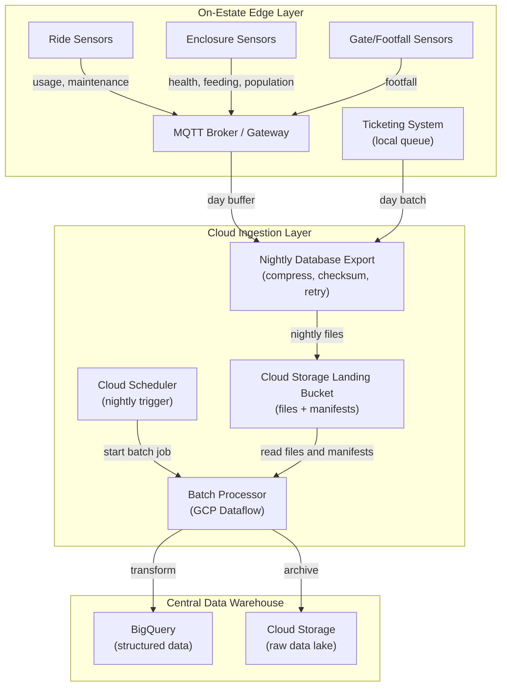

# Data Ingestion Pipeline

> This document describes a batch-first data flow from operational systems into the central Data Warehouse. Data is collected during the day and processed in a scheduled nightly window to control platform cost. Safety-critical alerts remain an explicit near-real-time exception.

---

## 1\. Ingestion Architecture Overview



---

## 2\. Data Sources and Collection Methods

### 2.1 Ticketing System (High Priority, Online)

**Source**: Ticketing Service microservices via API

| Data Entity | Collection Method | Frequency | Volume | Transport |
| --- | --- | --- | --- | --- |
| **Orders** | Nightly export from transactional DB | Once per night | Daily volume | Cloud Storage batch |
| **Tickets** | Nightly export from transactional DB | Once per night | Daily volume | Cloud Storage batch |
| **Entry Logs** | Gate devices and ticketing DB day buffer | Once per night | Daily volume | Cloud Storage batch |
| **Payments** | Nightly export from payment ledger | Once per night | Daily volume | Cloud Storage batch |
| **Loyalty Events** | Nightly export from loyalty DB | Once per night | Daily volume | Cloud Storage batch |
| **Promotions** | Scheduled extract | Once per night | ~50 records | Cloud Storage batch |

**Schema**: Transactional DB (PostgreSQL) → nightly export → Cloud Storage landing bucket → scheduled Dataflow

**Latency Requirement**: Available in the warehouse by 05:00 next day. Ticketing remains operational in its transactional database during the day.

**Data Freshness**: Daily, after the nightly load

---

### 2.2 Ride Monitoring System (High Priority, Edge-based)

**Source**: Ride sensors via MQTT Broker on estate

| Data Entity | Collection Method | Frequency | Volume | Transport |
| --- | --- | --- | --- | --- |
| **Usage Logs** | Edge gateway day buffer | Once per night | Daily volume | Cloud Storage batch |
| **Sensor Readings** | Edge gateway day buffer | Once per night | Daily volume | Cloud Storage batch |
| **Maintenance Records** | Nightly export from Operations DB | Once per night | ~50-200/day | Cloud Storage batch |
| **Inspection Records** | Scheduled export | Once per night | ~40/week | Cloud Storage batch |
| **Safety Alerts** | Operational alert service | On threshold breach | Variable | Existing operations/notification path |

**Schema**: Sensor data (JSON) → local edge buffer → nightly compressed batch → Cloud Storage landing bucket → scheduled Dataflow

**Latency Requirement**: Usage and sensor data available by 05:00 next day; critical safety alerts delivered near real time.

**Data Freshness**: Daily for telemetry; near real time for safety alerts

---

### 2.3 Animal Health Monitoring System (High Priority, Edge-based)

**Source**: Enclosure sensors and cameras via MQTT Broker

| Data Entity | Collection Method | Frequency | Volume | Transport |
| --- | --- | --- | --- | --- |
| **Health Records** | Edge gateway day buffer | Once per night | Daily volume | Cloud Storage batch |
| **Feeding Logs** | Edge gateway day buffer | Once per night | ~300-500/day | Cloud Storage batch |
| **Population Counts** | Edge gateway day buffer | Once per night | Daily volume | Cloud Storage batch |
| **Vet Visits** | Nightly export from Operations DB | Once per night | ~10-50/day | Cloud Storage batch |
| **Health Alerts** | Operational alert service | On threshold breach | Variable | Existing operations/notification path |
| **Camera Feeds** | Camera stream (video) | Continuous 24/7 | ~500GB/day | Direct to GCS |

**Schema**: Sensor data (JSON) → local edge buffer → nightly compressed batch → Cloud Storage landing bucket → scheduled Dataflow. Video remains in Cloud Storage and is processed in scheduled ML jobs.

**Latency Requirement**: Health, feeding, and population data available by 05:00 next day; critical health alerts delivered near real time.

**Data Freshness**: Daily for monitoring data; near real time for critical health alerts

---

### 2.4 Gate and Footfall Sensors (Medium Priority, Edge-based)

**Source**: Smart gate/zone sensors via MQTT

| Data Entity | Collection Method | Frequency | Volume | Transport |
| --- | --- | --- | --- | --- |
| **Entry Count** | Gate device day buffer | Once per night | Daily aggregate | Cloud Storage batch |
| **Exit Count** | Gate device day buffer | Once per night | Daily aggregate | Cloud Storage batch |
| **Zone Footfall** | Edge gateway day buffer | Once per night | Daily aggregate | Cloud Storage batch |

**Schema**: Sensor counters → local edge buffer → nightly compressed batch → Cloud Storage landing bucket → scheduled Dataflow

**Latency Requirement**: Available by 05:00 next day

**Data Freshness**: Daily

---

### 2.5 External Data Sources (Low Priority, Pull-based)

| Data Source | Collection Method | Frequency | Volume | Transport |
| --- | --- | --- | --- | --- |
| **Weather Data** | API: OpenWeatherMap | Once per night | ~100 records/day | REST API batch extract |
| **School Holidays** | API: Government Education Data | Annual | ~250 records/year | REST API |
| **Public Holidays** | API: Local Government | Annual | ~50 records/year | REST API |
| **Promotions Calendar** | Spreadsheet sync | Weekly | ~50 records | Cloud Storage |

**Latency Requirement**: \< 1 hour acceptable

**Data Freshness**: Daily/Weekly

---

## 3\. Ingestion Pipeline Components

### 3.1 Nightly Export and Landing Process

**Purpose**: Export daily data from operational systems into a controlled Cloud Storage landing area for the scheduled Dataflow load.

There is no central ingestion service or messaging layer in the normal warehouse path. Each source system owns its database export job. The export job creates a compressed data file and a manifest, calculates a checksum, and writes both to Cloud Storage. Cloud Scheduler then starts Dataflow, which reads the manifests and loads the files into BigQuery.

**Responsibilities**:

*   Export data using a read replica or database-native export so production transactions are not blocked
*   Authenticate the export job to the Cloud Storage landing bucket using a dedicated service account
*   Validate schema, extract date, row counts, and checksum before marking a batch complete
*   Write a manifest containing `batch_id`, `source_system`, `extract_date`, file paths, row counts, checksum, and `schema_version`
*   Use deterministic object paths and batch identifiers so retries are idempotent
*   Keep incomplete batches under a temporary prefix until the manifest is complete
*   Move invalid files to a quarantine prefix for investigation
*   Allow Dataflow to retry or replay a complete batch without duplicating BigQuery records

**Implementation**:

*   **Technology**: Database-native export or scheduled container job + Cloud Storage
*   **Language**: SQL and Python / Go where orchestration is required
*   **Schedule**: Source exports before the nightly load window, for example 01:00-03:00 local time
*   **Failure Handling**: Invalid or incomplete batches → Cloud Storage quarantine prefix

**Key Logic**:

```
For each source system:
  1. Export the previous operating day's data from a read replica or export view
  2. Write a compressed file to a temporary Cloud Storage prefix
  3. Validate row count, schema, extract date, and checksum
  4. Write a complete manifest and move the batch to the landing prefix
  5. Record the batch in the load-control table or manifest log
  6. Allow the scheduled Dataflow job to discover and process the batch
  7. Quarantine invalid batches and alert the data operations team
```

---

### 3.2 Cloud Storage Landing Contract

Cloud Storage is the hand-off point between source systems and Dataflow. Each source writes compressed files and a manifest for the previous operating day.

**Recommended object layout**:

```
gs://estate-data-landing/{source_system}/{entity}/extract_date=YYYY-MM-DD/
  part-00000.parquet
  manifest.json
```

Dataflow processes only manifests with `status = COMPLETE`. Temporary uploads, incomplete manifests, and invalid files are ignored by the load and moved to a quarantine prefix.

**Manifest fields**:

```
{
  "batch_id": "ticketing-entries-2026-09-15",
  "source_system": "ticketing",
  "entity": "entry_logs",
  "extract_date": "2026-09-15",
  "files": ["gs://estate-data-landing/ticketing/entry_logs/extract_date=2026-09-15/part-00000.parquet"],
  "row_count": 12500,
  "sha256": "...",
  "schema_version": "1.0",
  "status": "COMPLETE"
}
```

---

### 3.3 Scheduled Batch Processing (GCP Dataflow)

**Purpose**: Transform, aggregate, and enrich completed nightly batches. Cloud Scheduler starts Dataflow after the source export window; Dataflow lists complete manifests in Cloud Storage, processes unprocessed batches, and exits when the load succeeds or fails.

**Processing Pipelines**:

**Pipeline 1: Entry Log Processing**

```
Input: complete `ticketing/entry_logs` manifests in the Cloud Storage landing bucket
  ↓
Window: batch extract for the previous operating day
  ↓
Transform:
  - Parse entry timestamp and gate location
  - Map ticket_id to zone_id (lookup from zone table)
  - Derive hour_of_day, day_of_week, is_peak_hour
  ↓
Aggregate:
  - Count entries per gate per minute
  - Count entries per zone per minute
  ↓
Enrich:
  - Join with promotion data
  - Join with weather data (lookup)
  ↓
Output:
  - Write to BigQuery: entry_logs (raw)
  - Write to BigQuery: footfall_aggregates (1-min window)
  - Write daily aggregates to BigQuery; no real-time dashboard cache is required
```

**Pipeline 2: Ride Usage Processing**

```
Input: complete ride usage and sensor manifests in the Cloud Storage landing bucket
  ↓
Window: batch extract for the previous operating day
  ↓
Transform:
  - Parse sensor readings (usage count, cycle time, rider count)
  - Calculate utilization = rider_count / capacity
  - Detect anomalies (unusual patterns)
  ↓
Aggregate:
  - Sum usage per ride per interval
  - Calculate avg rider count per cycle
  - Track operational hours
  ↓
Output:
  - Write to BigQuery: ride_usage_logs (raw)
  - Write to BigQuery: ride_summary_5min (aggregated)
  - Write threshold breaches to the batch alert table for the next operations review
```

**Pipeline 3: Animal Health Processing**

```
Input: complete animal health and feeding manifests in the Cloud Storage landing bucket
  ↓
Window: batch extract for the previous operating day
  ↓
Transform:
  - Parse health metrics (weight, temp, vital signs)
  - Parse feeding logs (qty dispensed, qty consumed %)
  - Compare against normal ranges per species
  - Detect anomalies (e.g., weight drop > 5%)
  ↓
Aggregate:
  - Average health metrics per enclosure per interval
  - Feeding efficiency per enclosure per day
  ↓
Output:
  - Write to BigQuery: health_records (raw)
  - Write to BigQuery: health_summary_5min (aggregated)
  - Write health alerts to the batch alert table for the next keeper/vet review
```

---

### 3.4 Storage Layer

#### BigQuery (Structured Data Warehouse)

**Raw Data Tables** (immutable, append-only):

*   `raw.entry_logs` - individual gate scans
*   `raw.ride_usage_logs` - per-cycle usage
*   `raw.ride_sensor_readings` - sensor telemetry
*   `raw.health_records` - animal health snapshots
*   `raw.feeding_logs` - feeding events
*   `raw.population_counts` - population observations
*   `raw.maintenance_records` - maintenance events
*   `raw.orders` - ticketing orders

**Processed/Aggregated Tables** (optimized for analytics):

*   `processed.entry_logs_hourly` - hourly entry aggregates
*   `processed.footfall_by_zone` - hourly footfall per zone
*   `processed.ride_summary_daily` - daily ride usage summary
*   `processed.ride_summary_hourly` - hourly ride summary
*   `processed.health_summary_daily` - daily health metrics per enclosure
*   `processed.feeding_efficiency_daily` - daily feeding rates
*   `processed.population_by_enclosure` - latest population per enclosure
*   `processed.visitor_journey` - session-level visitor paths

**Dimensional Tables** (reference data):

*   `dim.zones` - zone/location reference
*   `dim.rides` - ride reference with capacity, status
*   `dim.enclosures` - enclosure reference
*   `dim.species` - animal species reference
*   `dim.ticket_types` - ticket catalog
*   `dim.employees` - keeper/staff reference
*   `dim.calendar` - calendar dimensions (date, day of week, holiday flags, school term)
*   `dim.weather` - historical weather data

#### Cloud Storage (Raw Data Lake)

**Buckets**:

*   `gs://estate-data-raw/` - raw sensor data (daily partitions)
*   `gs://estate-data-raw/camera-feeds/` - video files (encrypted, access-controlled)
*   `gs://estate-data-backups/` - BigQuery table backups (weekly)
*   `gs://estate-data-exports/` - data exports for external systems

**Data Format**: Parquet (columnar, compressed) or JSON Lines (batch friendly)

**Retention**:

*   Raw sensor data: 2 years
*   Video feeds: 30 days (with option to archive high-value clips)
*   Backups: 1 year

---

## 4\. Data Quality and Validation

### 4.1 Schema Registry

**Purpose**: Central schema management for all data topics

**Implementation**: Versioned JSON/Avro/Protobuf contracts managed with source control and validated by the source export jobs and Dataflow. Cloud Storage bucket paths, lifecycle policies, and service-account permissions are managed as infrastructure-as-code.

**Schemas Managed**:

```
Topic: ticketing.entries
{
  "type": "record",
  "name": "GateEntry",
  "fields": [
    {"name": "entry_id", "type": "string"},
    {"name": "ticket_id", "type": "string"},
    {"name": "gate_id", "type": "string"},
    {"name": "zone_id", "type": "string"},
    {"name": "scan_time", "type": "string", "logicalType": "timestamp-millis"},
    {"name": "entry_valid", "type": "boolean"},
    {"name": "source_system", "type": "string"}
  ]
}
```

### 4.2 Data Quality Checks

**Ingestion-time Checks**:

*   Schema validation (Avro/Protobuf)
*   Required fields presence
*   Data type validation
*   Range validation (e.g., rider\_count \<= ride\_capacity)
*   Timestamp reasonableness (within ±5 min of current time)

**Processing-time Checks** (GCP Dataflow):

*   Duplicate detection (within 5-min window)
*   Outlier detection (statistical)
*   Missing value imputation for key metrics
*   Referential integrity (e.g., zone\_id exists in dim.zones)
*   Completeness: all expected records arrived within SLA

**Data Quality Metrics** (tracked in BigQuery):

*   `data_quality.ingestion_latency` - time to reach warehouse
*   `data_quality.missing_values` - % of null values per column
*   `data_quality.duplicate_records` - count of duplicates detected
*   `data_quality.anomalies` - count of outliers detected

---

## 5\. Handling Edge Connectivity

### 5.1 Intermittent Connectivity Pattern

**Challenge**: WiFi coverage on estate is patchy

**Solution**: Local buffering and store-and-forward

**Architecture**:

```
Edge Device (Ride/Animal Sensor)
  ↓ (collects data throughout the day)
Local SQLite / Parquet buffer
  ↓ (nightly upload when WiFi is available)
Cloud Storage landing bucket
  ↓ (complete manifest written once per source batch)
Cloud Storage landing bucket (complete manifests)
  ↓
Cloud Scheduler → scheduled Dataflow
```

**MQTT Configuration**:

*   QoS Level: 1 (at-least-once delivery)
*   Session Persistence: Enabled
*   Message Batching: one compressed file per source per operating day
*   Upload Window: 02:00-05:00 local time
*   Reconnection: exponential backoff during the nightly upload window

**Data Recovery**:

*   If disconnected during the upload window: retain the batch locally and retry at the next window
*   If local storage reaches 80%: alert operations and prioritize the oldest batch
*   Periodic reconciliation: compare source manifests with warehouse load manifests

---

## 6\. Ingestion SLAs and Guarantees

| Data Source | Target Latency | Data Freshness | Availability |
| --- | --- | --- | --- |
| **Ticketing (Entry Logs)** | By 05:00 next day | Daily | 99.5% |
| **Ticketing (Orders)** | By 05:00 next day | Daily | 99.5% |
| **Ride Usage and Sensors** | By 05:00 next day | Daily | 99% |
| **Animal Health and Feeding** | By 05:00 next day | Daily | 99% |
| **Gate Footfall** | By 05:00 next day | Daily | 99% |
| **Safety/Health Alerts** | Included in next daily batch | Daily | 99% |
| **External Data** | By 05:00 next day | Daily/weekly | 99% |

**Recovery Procedure**:

1.  If SLA breach detected: Alert data engineering team
2.  Trigger manual reprocessing of missed data
3.  Reconcile with source systems (APIs, local backups)
4.  Update dimension tables and rerun affected ML jobs

---

## 7\. Ingestion Configuration and Monitoring

### 7.1 Configuration Management

**Environment Variables**:

*   `BQ_DATASET_ID` - BigQuery dataset
*   `GCS_BUCKET` - Cloud Storage bucket for raw data
*   `DATA_LANDING_BUCKET` - Cloud Storage bucket for complete source batches
*   `DATA_QUARANTINE_BUCKET` - Cloud Storage location for invalid batches
*   `DATAFLOW_TEMPLATE` - Scheduled Dataflow batch template
*   `NIGHTLY_LOAD_JOB_NAME` - Name of the nightly Dataflow job
*   `BATCH_MAX_FILE_SIZE_MB` - Maximum compressed source file size
*   `NIGHTLY_LOAD_START` - Start of the batch upload window
*   `NIGHTLY_LOAD_END` - End of the batch upload window

### 7.2 Monitoring and Alerting

**Key Metrics** (via Cloud Monitoring / Stackdriver):

*   `ingestion_lag` - seconds behind source
*   `batch_file_rate` - files received per source and load window
*   `processing_latency` - end-to-end latency
*   `dead_letter_queue_size` - failed records
*   `landing_batch_age` - age of the oldest complete unprocessed batch
*   `quarantine_batch_count` - invalid batches awaiting investigation
*   `dataflow_job_status` - status of the nightly Dataflow job

**Alerts**:

*   Nightly batch not received by 03:00
*   Error rate > 1%
*   Quarantine prefix contains any complete-looking batch
*   Batch completeness check fails

---

## 8\. Example: Complete Entry Log Flow

```
1. Visitor scans QR code at gate
  ↓
2. Gate Scanner Device validates the ticket locally and appends the entry to its day buffer
  ↓
3. At the nightly close, the ticketing system exports the day's entry logs
  ↓
4. Batch file is compressed, checksummed, and uploaded to Cloud Storage
  ↓
5. The scheduled load validates the manifest and deduplicates the batch
  ↓
6. Cloud Scheduler starts the nightly Dataflow batch job
  ↓
7. Nightly Dataflow batch job processes the previous day's data
  - Enrich: zone_id lookup
  - Aggregate: footfall by zone and hour
  - Detect: data-quality and volume anomalies
  ↓
8. Write outputs:
  a) BigQuery raw.entry_logs (raw batch records)
  b) BigQuery processed.entry_logs_hourly (daily backfill)
  c) BigQuery processed.visitor_daily_summary
  d) Write data-quality exceptions to the batch alert table
  ↓
9. Dashboards and ML feature tables refresh after the nightly load
```

---

This batch-first ingestion pipeline reduces platform and network costs by avoiding continuous streaming and messaging infrastructure. Source systems write daily files to Cloud Storage, and Cloud Scheduler starts Dataflow to load BigQuery. Safety-critical ride and animal alerts remain in the operational alerting systems and are outside the warehouse batch path.