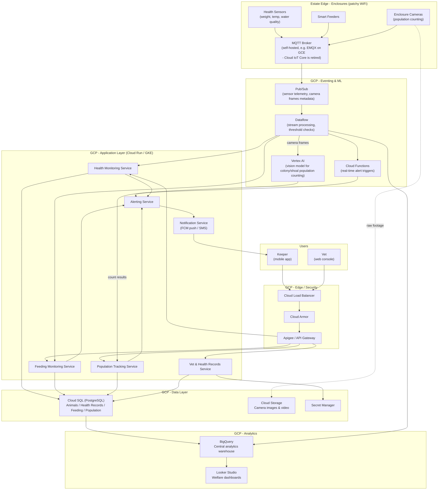

# Infra

> This file contains the GCP infra required to run the Animal health monitoring system.

```mermaid
flowchart TB

    subgraph EDGE["Estate Edge - Enclosures (patchy WiFi)"]
        HEALTHSENSOR["Health Sensors\n(weight, temp, water quality)"]
        FEEDER["Smart Feeders"]
        CAMERA["Enclosure Cameras\n(population counting)"]
        MQTTBROKER["MQTT Broker\n(self-hosted, e.g. EMQX on GCE\n- Cloud IoT Core is retired)"]
    end

    subgraph USERS["Users"]
        KEEPER["Keeper\n(mobile app)"]
        VET["Vet\n(web console)"]
    end

    subgraph GCPEDGE["GCP - Edge / Security"]
        LB["Cloud Load Balancer"]
        ARMOR["Cloud Armor"]
        APIGW["Apigee / API Gateway"]
    end

    subgraph GCPSTREAM["GCP - Eventing & ML"]
        PUBSUB["Pub/Sub\n(sensor telemetry, camera frames metadata)"]
        DATAFLOW["Dataflow\n(stream processing, threshold checks)"]
        VERTEXAI["Vertex AI\n(vision model for colony/shoal population counting)"]
        FUNCTIONS["Cloud Functions\n(real-time alert triggers)"]
    end

    subgraph GCPCOMPUTE["GCP - Application Layer (Cloud Run / GKE)"]
        SVC_HEALTH["Health Monitoring Service"]
        SVC_FEED["Feeding Monitoring Service"]
        SVC_POP["Population Tracking Service"]
        SVC_VET["Vet & Health Records Service"]
        SVC_ALERT["Alerting Service"]
        SVC_NOTIFY["Notification Service\n(FCM push / SMS)"]
    end

    subgraph GCPDATA["GCP - Data Layer"]
        CLOUDSQL["Cloud SQL (PostgreSQL)\nAnimals / Health Records / Feeding / Population"]
        GCS["Cloud Storage\nCamera images & video"]
        SECRETS["Secret Manager"]
    end

    subgraph GCPANALYTICS["GCP - Analytics"]
        BQ["BigQuery\nCentral analytics warehouse"]
        LOOKER["Looker Studio\nWelfare dashboards"]
    end

    HEALTHSENSOR --> MQTTBROKER
    FEEDER --> MQTTBROKER
    CAMERA --> MQTTBROKER
    MQTTBROKER --> PUBSUB

    KEEPER --> LB
    VET --> LB
    LB --> ARMOR --> APIGW

    APIGW --> SVC_HEALTH
    APIGW --> SVC_FEED
    APIGW --> SVC_POP
    APIGW --> SVC_VET

    PUBSUB --> DATAFLOW
    DATAFLOW --> SVC_HEALTH
    DATAFLOW --> SVC_FEED
    DATAFLOW -->|"camera frames"| VERTEXAI
    VERTEXAI -->|"count results"| SVC_POP
    CAMERA -.->|"raw footage"| GCS

    DATAFLOW --> FUNCTIONS
    FUNCTIONS --> SVC_ALERT
    SVC_HEALTH --> SVC_ALERT
    SVC_FEED --> SVC_ALERT
    SVC_POP --> SVC_ALERT
    SVC_ALERT --> SVC_NOTIFY
    SVC_NOTIFY --> KEEPER

    SVC_HEALTH --> CLOUDSQL
    SVC_FEED --> CLOUDSQL
    SVC_POP --> CLOUDSQL
    SVC_VET --> CLOUDSQL
    SVC_VET --> SECRETS

    CLOUDSQL --> BQ
    DATAFLOW --> BQ
    BQ --> LOOKER
```
