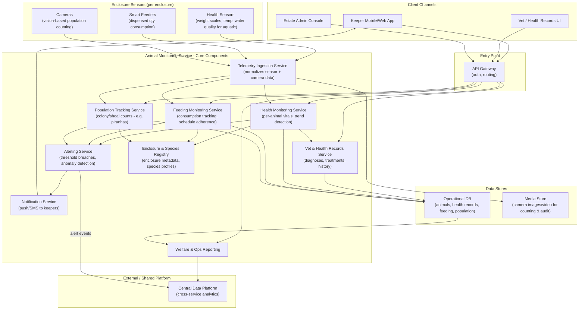

# Services

> This file contains the services required to run the Animal Monitoring System.

```mermaid
flowchart TB

    subgraph CLIENTS["Client Channels"]
        KEEPERAPP["Keeper Mobile/Web App"]
        VETUI["Vet / Health Records UI"]
        ADMINUI["Estate Admin Console"]
    end

    subgraph EDGE_ENTRY["Entry Point"]
        APIGW["API Gateway\n(auth, routing)"]
    end

    subgraph SENSORS["Enclosure Sensors (per enclosure)"]
        HEALTHSENSOR["Health Sensors\n(weight scales, temp, water quality for aquatic)"]
        FEEDER["Smart Feeders\n(dispensed qty, consumption)"]
        CAMERA["Cameras\n(vision-based population counting)"]
    end

    subgraph CORE["Animal Monitoring Service - Core Components"]
        INGEST["Telemetry Ingestion Service\n(normalizes sensor + camera data)"]
        HEALTHSVC["Health Monitoring Service\n(per-animal vitals, trend detection)"]
        FEEDSVC["Feeding Monitoring Service\n(consumption tracking, schedule adherence)"]
        POPSVC["Population Tracking Service\n(colony/shoal counts - e.g. piranhas)"]
        VETRECORDS["Vet & Health Records Service\n(diagnoses, treatments, history)"]
        ALERTSVC["Alerting Service\n(threshold breaches, anomaly detection)"]
        ENCLOSURESVC["Enclosure & Species Registry\n(enclosure metadata, species profiles)"]
        NOTIFY["Notification Service\n(push/SMS to keepers)"]
        REPORTING["Welfare & Ops Reporting"]
    end

    subgraph EXTERNAL["External / Shared Platform"]
        DATAPLATFORM["Central Data Platform\n(cross-service analytics)"]
    end

    subgraph STORE["Data Stores"]
        OPSDB["Operational DB\n(animals, health records, feeding, population)"]
        MEDIASTORE["Media Store\n(camera images/video for counting & audit)"]
    end

    HEALTHSENSOR --> INGEST
    FEEDER --> INGEST
    CAMERA --> INGEST

    KEEPERAPP --> APIGW
    VETUI --> APIGW
    ADMINUI --> APIGW

    APIGW --> HEALTHSVC
    APIGW --> FEEDSVC
    APIGW --> POPSVC
    APIGW --> VETRECORDS
    APIGW --> REPORTING

    INGEST --> HEALTHSVC
    INGEST --> FEEDSVC
    INGEST --> POPSVC
    INGEST --> MEDIASTORE

    HEALTHSVC --> ENCLOSURESVC
    FEEDSVC --> ENCLOSURESVC
    POPSVC --> ENCLOSURESVC

    HEALTHSVC --> ALERTSVC
    FEEDSVC --> ALERTSVC
    POPSVC --> ALERTSVC
    ALERTSVC --> NOTIFY
    NOTIFY --> KEEPERAPP

    HEALTHSVC --> VETRECORDS
    VETRECORDS --> OPSDB
    HEALTHSVC --> OPSDB
    FEEDSVC --> OPSDB
    POPSVC --> OPSDB

    OPSDB --> REPORTING
    REPORTING --> DATAPLATFORM
    ALERTSVC -->|"alert events"| DATAPLATFORM
```
