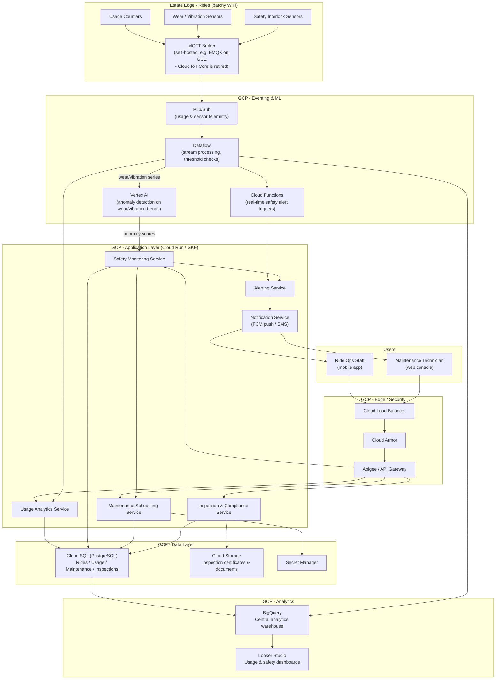

# Infra

> This file contains the cloud infra components needed to run the microservice for operating the ride monitoring service.

```mermaid
flowchart TB

    subgraph EDGE["Estate Edge - Rides (patchy WiFi)"]
        USAGESENSOR["Usage Counters"]
        WEARSENSOR["Wear / Vibration Sensors"]
        SAFETYSENSOR["Safety Interlock Sensors"]
        MQTTBROKER["MQTT Broker\n(self-hosted, e.g. EMQX on GCE\n- Cloud IoT Core is retired)"]
    end

    subgraph USERS["Users"]
        RIDEOPS["Ride Ops Staff\n(mobile app)"]
        MAINT["Maintenance Technician\n(web console)"]
    end

    subgraph GCPEDGE["GCP - Edge / Security"]
        LB["Cloud Load Balancer"]
        ARMOR["Cloud Armor"]
        APIGW["Apigee / API Gateway"]
    end

    subgraph GCPSTREAM["GCP - Eventing & ML"]
        PUBSUB["Pub/Sub\n(usage & sensor telemetry)"]
        DATAFLOW["Dataflow\n(stream processing, threshold checks)"]
        VERTEXAI["Vertex AI\n(anomaly detection on wear/vibration trends)"]
        FUNCTIONS["Cloud Functions\n(real-time safety alert triggers)"]
    end

    subgraph GCPCOMPUTE["GCP - Application Layer (Cloud Run / GKE)"]
        SVC_USAGE["Usage Analytics Service"]
        SVC_SAFETY["Safety Monitoring Service"]
        SVC_MAINT["Maintenance Scheduling Service"]
        SVC_INSPECT["Inspection & Compliance Service"]
        SVC_ALERT["Alerting Service"]
        SVC_NOTIFY["Notification Service\n(FCM push / SMS)"]
    end

    subgraph GCPDATA["GCP - Data Layer"]
        CLOUDSQL["Cloud SQL (PostgreSQL)\nRides / Usage / Maintenance / Inspections"]
        GCS["Cloud Storage\nInspection certificates & documents"]
        SECRETS["Secret Manager"]
    end

    subgraph GCPANALYTICS["GCP - Analytics"]
        BQ["BigQuery\nCentral analytics warehouse"]
        LOOKER["Looker Studio\nUsage & safety dashboards"]
    end

    USAGESENSOR --> MQTTBROKER
    WEARSENSOR --> MQTTBROKER
    SAFETYSENSOR --> MQTTBROKER
    MQTTBROKER --> PUBSUB

    RIDEOPS --> LB
    MAINT --> LB
    LB --> ARMOR --> APIGW

    APIGW --> SVC_USAGE
    APIGW --> SVC_SAFETY
    APIGW --> SVC_MAINT
    APIGW --> SVC_INSPECT

    PUBSUB --> DATAFLOW
    DATAFLOW --> SVC_USAGE
    DATAFLOW -->|"wear/vibration series"| VERTEXAI
    VERTEXAI -->|"anomaly scores"| SVC_SAFETY

    DATAFLOW --> FUNCTIONS
    FUNCTIONS --> SVC_ALERT
    SVC_SAFETY --> SVC_ALERT
    SVC_ALERT --> SVC_NOTIFY
    SVC_NOTIFY --> RIDEOPS
    SVC_NOTIFY --> MAINT

    SVC_SAFETY --> SVC_MAINT

    SVC_USAGE --> CLOUDSQL
    SVC_SAFETY --> CLOUDSQL
    SVC_MAINT --> CLOUDSQL
    SVC_INSPECT --> CLOUDSQL
    SVC_INSPECT --> GCS
    SVC_MAINT --> SECRETS

    CLOUDSQL --> BQ
    DATAFLOW --> BQ
    BQ --> LOOKER
```
