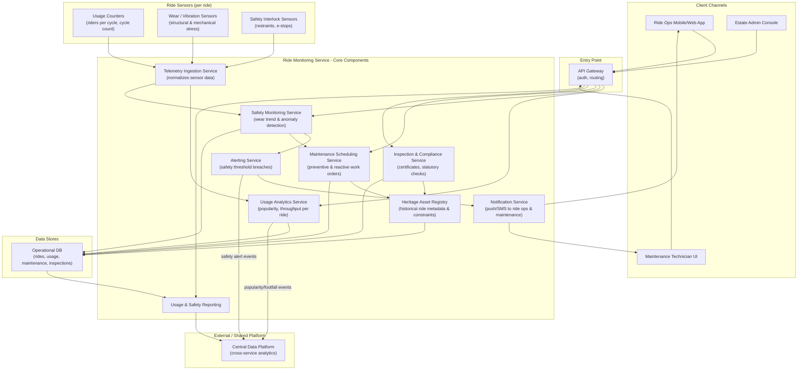

# Services

> This file contains various microservices needed to operate the ride monitoring system.

```mermaid
flowchart TB

    subgraph CLIENTS["Client Channels"]
        RIDEOPSAPP["Ride Ops Mobile/Web App"]
        MAINTUI["Maintenance Technician UI"]
        ADMINUI["Estate Admin Console"]
    end

    subgraph EDGE_ENTRY["Entry Point"]
        APIGW["API Gateway\n(auth, routing)"]
    end

    subgraph SENSORS["Ride Sensors (per ride)"]
        USAGESENSOR["Usage Counters\n(riders per cycle, cycle count)"]
        WEARSENSOR["Wear / Vibration Sensors\n(structural & mechanical stress)"]
        SAFETYSENSOR["Safety Interlock Sensors\n(restraints, e-stops)"]
    end

    subgraph CORE["Ride Monitoring Service - Core Components"]
        INGEST["Telemetry Ingestion Service\n(normalizes sensor data)"]
        USAGESVC["Usage Analytics Service\n(popularity, throughput per ride)"]
        SAFETYSVC["Safety Monitoring Service\n(wear trend & anomaly detection)"]
        MAINTSVC["Maintenance Scheduling Service\n(preventive & reactive work orders)"]
        INSPECTIONSVC["Inspection & Compliance Service\n(certificates, statutory checks)"]
        HERITAGESVC["Heritage Asset Registry\n(historical ride metadata & constraints)"]
        ALERTSVC["Alerting Service\n(safety threshold breaches)"]
        NOTIFY["Notification Service\n(push/SMS to ride ops & maintenance)"]
        REPORTING["Usage & Safety Reporting"]
    end

    subgraph EXTERNAL["External / Shared Platform"]
        DATAPLATFORM["Central Data Platform\n(cross-service analytics)"]
    end

    subgraph STORE["Data Stores"]
        OPSDB["Operational DB\n(rides, usage, maintenance, inspections)"]
    end

    USAGESENSOR --> INGEST
    WEARSENSOR --> INGEST
    SAFETYSENSOR --> INGEST

    RIDEOPSAPP --> APIGW
    MAINTUI --> APIGW
    ADMINUI --> APIGW

    APIGW --> USAGESVC
    APIGW --> SAFETYSVC
    APIGW --> MAINTSVC
    APIGW --> INSPECTIONSVC
    APIGW --> REPORTING

    INGEST --> USAGESVC
    INGEST --> SAFETYSVC

    SAFETYSVC --> ALERTSVC
    SAFETYSVC --> MAINTSVC
    MAINTSVC --> HERITAGESVC
    INSPECTIONSVC --> HERITAGESVC

    ALERTSVC --> NOTIFY
    NOTIFY --> RIDEOPSAPP
    NOTIFY --> MAINTUI

    USAGESVC --> OPSDB
    SAFETYSVC --> OPSDB
    MAINTSVC --> OPSDB
    INSPECTIONSVC --> OPSDB
    HERITAGESVC --> OPSDB

    OPSDB --> REPORTING
    REPORTING --> DATAPLATFORM
    ALERTSVC -->|"safety alert events"| DATAPLATFORM
    USAGESVC -->|"popularity/footfall events"| DATAPLATFORM
```
