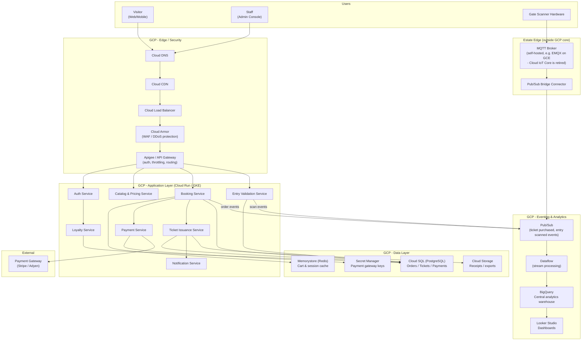

# Infra diagram

> Infra diagram for runnign the different services of the ticketing system

```mermaid
flowchart TB

    subgraph USERS["Users"]
        VISITOR["Visitor\n(Web/Mobile)"]
        STAFF["Staff\n(Admin Console)"]
        GATE["Gate Scanner Hardware"]
    end

    subgraph GCPEDGE["GCP - Edge / Security"]
        DNS["Cloud DNS"]
        CDN["Cloud CDN"]
        LB["Cloud Load Balancer"]
        ARMOR["Cloud Armor\n(WAF / DDoS protection)"]
        APIGW["Apigee / API Gateway\n(auth, throttling, routing)"]
    end

    subgraph GCPCOMPUTE["GCP - Application Layer (Cloud Run / GKE)"]
        SVC_AUTH["Auth Service"]
        SVC_CATALOG["Catalog & Pricing Service"]
        SVC_BOOKING["Booking Service"]
        SVC_PAYMENT["Payment Service"]
        SVC_ISSUANCE["Ticket Issuance Service"]
        SVC_VALIDATE["Entry Validation Service"]
        SVC_LOYALTY["Loyalty Service"]
        SVC_NOTIFY["Notification Service"]
    end

    subgraph GCPDATA["GCP - Data Layer"]
        CLOUDSQL["Cloud SQL (PostgreSQL)\nOrders / Tickets / Payments"]
        MEMSTORE["Memorystore (Redis)\nCart & session cache"]
        SECRETS["Secret Manager\nPayment gateway keys"]
        GCS["Cloud Storage\nReceipts / exports"]
    end

    subgraph GCPSTREAM["GCP - Eventing & Analytics"]
        PUBSUB["Pub/Sub\n(ticket purchased, entry scanned events)"]
        DATAFLOW["Dataflow\n(stream processing)"]
        BQ["BigQuery\nCentral analytics warehouse"]
        LOOKER["Looker Studio\nDashboards"]
    end

    subgraph GCPEDGEIOT["Estate Edge (outside GCP core)"]
        MQTTBROKER["MQTT Broker\n(self-hosted, e.g. EMQX on GCE\n- Cloud IoT Core is retired)"]
        IOTBRIDGE["Pub/Sub Bridge Connector"]
    end

    subgraph EXTPAY["External"]
        PAYGATEWAY["Payment Gateway\n(Stripe / Adyen)"]
    end

    VISITOR --> DNS --> CDN --> LB
    STAFF --> DNS
    LB --> ARMOR --> APIGW

    APIGW --> SVC_AUTH
    APIGW --> SVC_CATALOG
    APIGW --> SVC_BOOKING
    APIGW --> SVC_VALIDATE

    SVC_BOOKING --> MEMSTORE
    SVC_BOOKING --> SVC_PAYMENT
    SVC_PAYMENT --> SECRETS
    SVC_PAYMENT --> PAYGATEWAY
    SVC_BOOKING --> SVC_ISSUANCE
    SVC_ISSUANCE --> CLOUDSQL
    SVC_ISSUANCE --> SVC_NOTIFY
    SVC_ISSUANCE --> GCS

    SVC_AUTH --> SVC_LOYALTY
    SVC_LOYALTY --> CLOUDSQL
    SVC_VALIDATE --> CLOUDSQL
    SVC_BOOKING --> CLOUDSQL

    GATE --> MQTTBROKER --> IOTBRIDGE --> PUBSUB
    SVC_VALIDATE -->|"scan events"| PUBSUB
    SVC_BOOKING -->|"order events"| PUBSUB

    PUBSUB --> DATAFLOW --> BQ --> LOOKER
```
