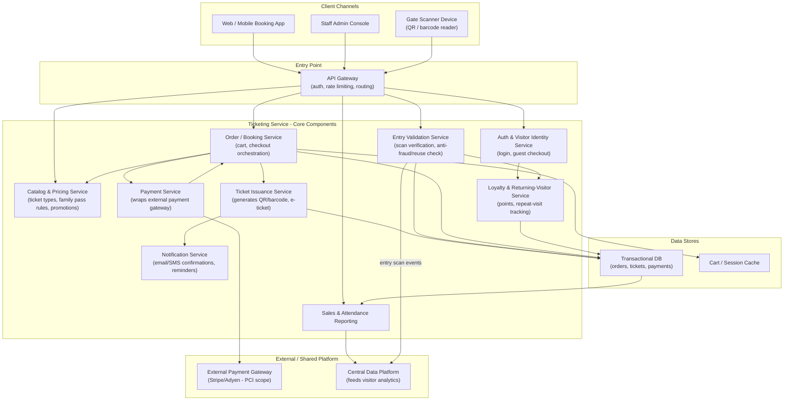

# Service

> This file list microservices running to facilitate the ticketing system.

Different micoservices and their purpose is listed in table below

| # | Service Name                    | Service Description                            |
| - | ------------------------------- | ---------------------------------------------- |
| 1 | Auth and Visitor Identity Check | For Authenticating the logged in user or Guest |
|   |                                 |                                                |

---

#### Below diagram denotes the interaction between these services

---

